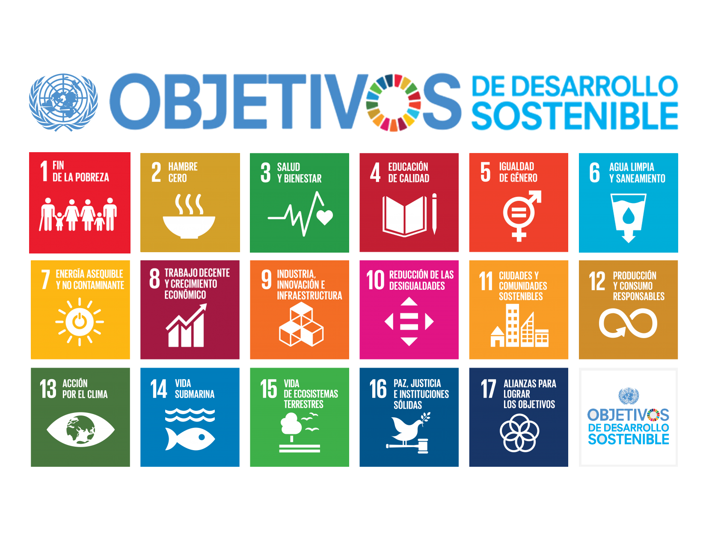

# México y los Objetivos de Desarrollo Sostenible: Una Deuda Sistémica

  
  

Los Objetivos de Desarrollo Sostenible son el plan maestro para conseguir un futuro sostenible para todos. 
Se interrelacionan entre sí e incorporan los desafíos globales a los que nos enfrentamos día a día, 
como la pobreza, la desigualdad, el clima, la degradación ambiental, la prosperidad, la paz y la justicia. 
Para no dejar a nadie atrás, es importante que logremos cumplir con cada uno de estos objetivos para 2030 (ONU, 2026).

 

## Objetivos de Desarrollo Sostenible y realidad mexicana: un análisis desde la evidencia

Este proyecto tuvo como objetivo analizar datos relacionados con los Objetivos de Desarrollo Sostenible (ODS) para identificar relaciones relevantes entre distintos indicadores y problemáticas en México. A través del uso de técnicas de análisis de datos, como el cálculo de correlaciones entre indicadores, se busca explorar cómo diferentes dimensiones sociales, económicas y ambientales se interrelacionan. El proyecto integra procesamiento de datos, análisis en Jupyter Notebook y desarrollo de un dashboard, con el fin de generar herramientas que permitan comprender mejor los desafíos asociados a los ODS.

El propósito es comprender las interrelaciones existentes entre distintas problemáticas a nivel social, económico y ambiental. A partir de este análisis general, se identificaron patrones y vínculos relevantes entre indicadores, lo que permitió focalizar el estudio en áreas específicas de mayor impacto. En particular, se profundiza en los ODS relacionados con la salud y la pobreza, debido a su alta relevancia en el contexto actual y a su estrecha conexión con otras dimensiones del desarrollo sostenible, lo que los convierte en ejes clave para la interpretación y construcción de la narrativa del proyecto.

Los 333 indicadores ODS de México (INEGI, 1970–2026) revelan cinco problemáticas interconectadas que no pueden entenderse por separado: cada una alimenta a las demás en un ciclo que el dato aislado no logra mostrar.

El sistema no colapsó de golpe. Colapsó en silencio, indicador por indicador, año tras año. 

| # | Problemática | ODS | Mecanismo de contagio |
| :--- | :--- | :--- | :--- |
| **01** | Colapso sanitario | ODS 3 | Retracción presupuestal + epidemiología ambiental |
| **02** | Trilema consumo-agua-salud | ODS 6, 8, 12 | Crecimiento que destruye recursos vitales |
| **03** | Desigualdad no medida | ODS 10, 1, 5 | Sistema estadístico que invisibiliza brechas |
| **04** | Rezago educativo-institucional | ODS 4, 16 | Violencia y corrupción como techos estructurales |
| **05** | Vacío de monitoreo | ODS 2, 14 | Decisiones políticas sobre qué registrar |

 

## Conocenos

Preocupados y ODSiosos por la creciente complejidad de los desafíos sociales y su impacto en la calidad de vida de la población, este proyecto busca aportar una perspectiva basada en datos que permita comprender mejor la interrelación entre distintos factores asociados a los ODS. A través de un enfoque analítico y visual, se pretende no solo evidenciar problemáticas, sino también contribuir a la reflexión y al desarrollo de estrategias que favorezcan un futuro más equitativo y sostenible.

 

 ODSiosos
    Metztli Donaji Pablo Aparicio   Estudiante de Maestría en Ciencias de Computación por el CIC - IPN
   Gustavo Mandujano Rojas   Estudiante de Maestría en Ingeniería de Cómputo, del Lab RyM, por el CIC - IPN
   Rubén Oropeza Sánchez   Estudiante de Doctorado en Genética y Biología Molecular por el CINVESTAV

 

## Fuentes de datos

Los datos utilizados en este proyecto son públicos y abiertos, provistos por instituciones oficiales:

| Fuente | Descripción | Enlace |
| :--- | :--- | :--- |
| **INEGI / Agenda 2030 México** | 333 indicadores ODS de México — series de tiempo nacionales y estatales (1970–2026) | [agenda2030.mx — Indicadores ODS](https://agenda2030.mx/ODSopc.html?ti=T&goal=0&lang=es#/ind) |
| **ONU / IAEG-SDGs** | Marco global de indicadores ODS (metadata y definiciones oficiales) | [unstats.un.org/sdgs/indicators](https://unstats.un.org/sdgs/indicators/indicators-list/) |

> Los datos se distribuyen de forma pública y abierta a través del portal oficial **Agenda 2030 México**, operado por el INEGI.

 

Este trabajo está bajo una Licencia Creative Commons Atribución-CompartirIgual 4.0 Internacional.

