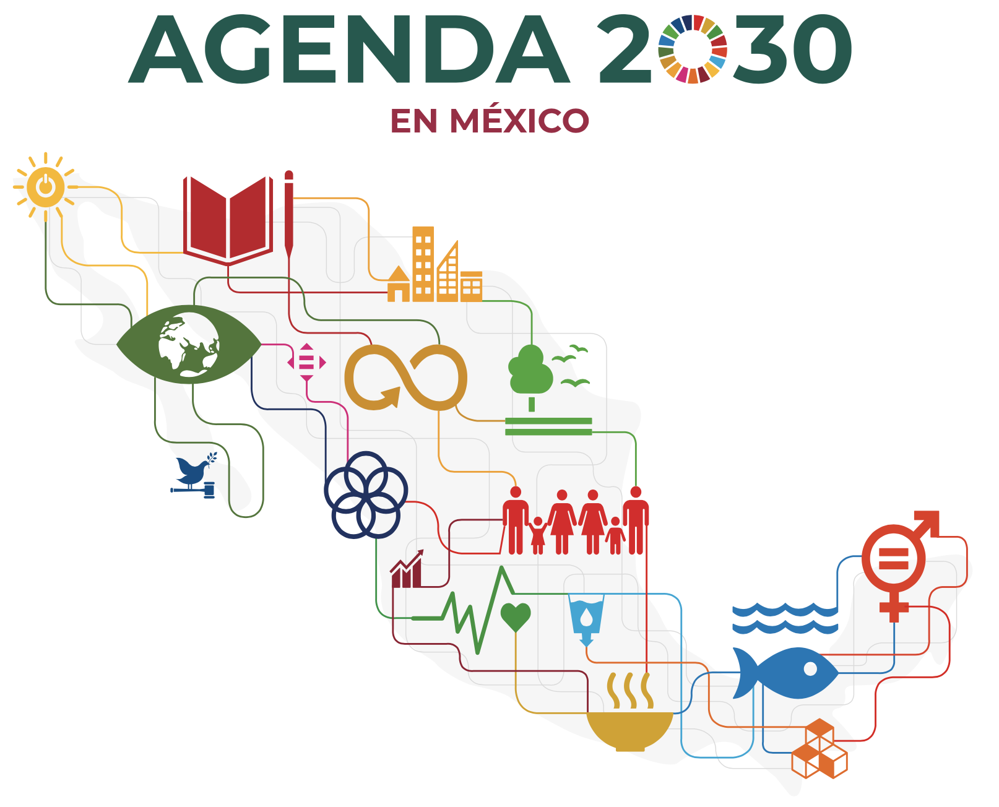

```{python}
#| output: false
#| include: false

def hex_to_rgba(hex_color, alpha=0.15):
    h = hex_color.lstrip('#')
    r, g, b = int(h[0:2], 16), int(h[2:4], 16), int(h[4:6], 16)
    return f'rgba({r},{g},{b},{alpha})'

import pandas as pd
import numpy as np
import networkx as nx
import ast
import warnings
warnings.filterwarnings('ignore')

import plotly.graph_objects as go
import plotly.express as px
from plotly.subplots import make_subplots

ODS_COLORS = {
    1:  '#E5243B', 2:  '#DDA63A', 3:  '#4C9F38', 4:  '#C5192D',
    5:  '#FF3A21', 6:  '#26BDE2', 7:  '#FCC30B', 8:  '#A21942',
    9:  '#FD6925', 10: '#DD1367', 11: '#FD9D24', 12: '#BF8B2E',
    13: '#3F7E44', 14: '#0A97D9', 15: '#56C02B', 16: '#00689D',
    17: '#19486A'
}
ODS_NAMES = {
    1:'Fin de la Pobreza', 2:'Hambre Cero', 3:'Salud y Bienestar',
    4:'Educación de Calidad', 5:'Igualdad de Género', 6:'Agua Limpia',
    7:'Energía Asequible', 8:'Trabajo Decente', 9:'Industria e Innovación',
    10:'Reducción de Desigualdades', 11:'Ciudades Sostenibles',
    12:'Producción Responsable', 13:'Acción por el Clima',
    14:'Vida Submarina', 15:'Vida de Ecosistemas', 16:'Paz y Justicia',
    17:'Alianzas'
}

DARK_LAYOUT = dict(
    paper_bgcolor='#0D1117',
    plot_bgcolor='#161B22',
    font_color='#d8e2e2',
    font_family='Arial',
)

largo      = pd.read_csv('../data/consolidated/indicadores_largo.csv')
meta       = pd.read_csv('../data/consolidated/metadatos_indicadores.csv')
corr_altas = pd.read_csv('../data/consolidated/correlaciones_altas.csv')
pares_ods  = pd.read_csv('../data/consolidated/pares_ods_correlaciones.csv')

def _add_source(fig, extra='', y=-0.10):
    """Agrega cita de fuente al pie de una figura Plotly."""
    base = 'Fuente: INEGI · Sistema de Indicadores ODS México 2024'
    txt  = f'{base} · {extra}' if extra else base
    fig.add_annotation(
        x=0.5, y=y, xref='paper', yref='paper',
        text=f'<span style="font-size:9px;color:#6E7681">{txt}</span>',
        showarrow=False, align='center', xanchor='center',
    )
```

# Panorama {data-icon="house-fill"}
## Row {height="50%"}

### Agenda 2030 en México {width="50%"}


### Video explicativo {width="50%"}
<a href="https://www.youtube.com/watch?v=MCKH5xk8X-g" target="_blank">
  
</a>

## Row {height="20%"}

```{python}
#| content: valuebox
#| title: "Indicadores ODS analizados"
#| icon: "bar-chart-fill"
#| color: "primary"
333
```

```{python}
#| content: valuebox
#| title: "Con datos nacionales"
#| icon: "database-fill"
#| color: "success"
"292"
```

```{python}
#| content: valuebox
#| title: "ODS cubiertos"
#| icon: "globe-americas"
#| color: "info"
"17"
```

```{python}
#| content: valuebox
#| title: "Problemáticas sistémicas"
#| icon: "diagram-3-fill"
#| color: "warning"
"5"
```

# Todo está conectado {data-icon="diagram-3-fill" scrolling="true"}

```{python}
#| label: create-graphs
#| output: false

# ── ACTO 1: Grafo de interdependencias ───────────────────────────────────────
G = nx.Graph()
for i in range(1, 18):
    G.add_node(i)
for _, row in pares_ods.iterrows():
    pair = ast.literal_eval(row['ods_pair'])
    a, b = pair
    if a != b:
        G.add_edge(a, b, weight=row['n_correlaciones'], avg_corr=row['corr_promedio'])

weighted_degree = {n: sum(d['weight'] for _, _, d in G.edges(n, data=True)) for n in G.nodes()}
pos = nx.kamada_kawai_layout(G, weight='weight')
max_w = max(d['weight'] for _, _, d in G.edges(data=True))
max_wd = max(weighted_degree.values())

edge_traces = []
for u, v, d in G.edges(data=True):
    x0, y0 = pos[u]; x1, y1 = pos[v]
    w = d['weight']; avg = d['avg_corr']
    color = '#FF6B6B' if avg < -0.05 else '#4ECDC4' if avg > 0.05 else '#A8DADC'
    edge_traces.append(go.Scatter(
        x=[x0, x1, None], y=[y0, y1, None], mode='lines',
        line=dict(width=0.5 + 7*(w/max_w), color=color),
        opacity=0.15 + 0.65*(w/max_w), hoverinfo='none', showlegend=False,
    ))

node_trace = go.Scatter(
    x=[pos[n][0] for n in G.nodes()], y=[pos[n][1] for n in G.nodes()],
    mode='markers+text',
    marker=dict(size=[20+50*(weighted_degree[n]/max_wd) for n in G.nodes()],
                color=[ODS_COLORS[n] for n in G.nodes()],
                line=dict(width=1.5, color='white')),
    text=[f'ODS {n}' for n in G.nodes()],
    textposition='middle center',
    textfont=dict(size=10, color='white', family='Arial Black'),
    hovertext=[f'<b>ODS {n}: {ODS_NAMES[n]}</b><br>Peso: {weighted_degree[n]}<br>Vecinos: {G.degree(n)}'
               for n in G.nodes()],
    hoverinfo='text', name='ODS',
)

fig_red = go.Figure(
    data=edge_traces + [node_trace,
        go.Scatter(x=[None], y=[None], mode='lines', line=dict(color='#FF6B6B', width=3), name='Trade-off (correlación negativa)'),
        go.Scatter(x=[None], y=[None], mode='lines', line=dict(color='#4ECDC4', width=3), name='Sinergia (correlación positiva)'),
    ],
    layout=go.Layout(
        **DARK_LAYOUT,
        xaxis=dict(showgrid=False, zeroline=False, showticklabels=False),
        yaxis=dict(showgrid=False, zeroline=False, showticklabels=False),
        hovermode='closest',
        #legend=dict(bgcolor='rgba(13,17,23,0.85)', bordercolor='#444c56', borderwidth=1,
        #            font=dict(color='#E6EDF3', size=12),
        #            orientation='v', xanchor='left', x=0.01, yanchor='bottom', y=0.01,
        #            entrywidth=0, entrywidthmode='pixels'),
        margin=dict(r=0),
    )
)

# ── ACTO 2: Indicadores ODS 3 — figuras individuales para tabset ─────────────
ods3 = largo[largo.ods_number == 3].copy()
ods3_counts = ods3.groupby('indicator_id').size().reset_index(name='n')
# Para FOCUS usamos n >= 1 (selección manual); fallback usa n >= 5
ids_cualquier = set(ods3_counts[ods3_counts.n >= 1]['indicator_id'].str.lower())
ids_validos   = set(ods3_counts[ods3_counts.n >= 5]['indicator_id'].str.lower())

FOCUS = {
    '3.b.1': ('Cobertura vacunación (%)',        '#FF6B6B'),
    '3.3.3': ('Enfermedades vectoriales',         '#FF9F43'),
    '3.4.1': ('Mortalidad cardiovascular',        '#EE5A24'),
    '3.1.2': ('Partos con asistencia médica (%)', '#FDA7DF'),
}
focus_disp = {k: v for k, v in FOCUS.items() if k.lower() in ids_cualquier}
if len(focus_disp) < 2:
    top4 = ods3_counts[ods3_counts.n >= 5].sort_values('n', ascending=False).head(4)['indicator_id'].tolist()
    focus_disp = {iid: (ods3[ods3.indicator_id==iid]['title'].iloc[0][:50], c)
                  for iid, c in zip(top4, ['#FF6B6B','#FF9F43','#EE5A24','#FDA7DF'])}

def make_ind_fig(ind_id, label, color):
    serie = ods3[ods3.indicator_id == ind_id].sort_values('periodo')
    x, y = serie['periodo'].values, serie['valor'].values
    unit = serie['unit'].iloc[0] if 'unit' in serie.columns else ''
    ultimo = f'{y[-1]:.1f} {unit}' if len(y) else 'N/D'
    cambio = y[-1] - y[0] if len(y) >= 2 else 0
    flecha = '↑' if cambio > 0 else '↓'

    f = go.Figure()
    f.add_trace(go.Scatter(x=x, y=y, fill='tozeroy',
        fillcolor=hex_to_rgba(color, 0.18), line=dict(color=color, width=0),
        hoverinfo='none', showlegend=False))
    f.add_trace(go.Scatter(x=x, y=y, mode='lines+markers',
        line=dict(color=color, width=2.5), marker=dict(size=7, color=color),
        name=label,
        hovertemplate=f'<b>{label}</b><br>Año: %{{x}}<br>Valor: %{{y:.2f}} {unit}<extra></extra>'))
    if len(x) >= 3:
        z = np.polyfit(x, y, 1); y_trend = np.poly1d(z)(x)
        f.add_trace(go.Scatter(x=x, y=y_trend, mode='lines',
            line=dict(color='white', width=1.5, dash='dash'),
            name=f'Tendencia {flecha} {abs(z[0]):.2f}/año', hoverinfo='skip'))
    f.add_annotation(x=0.02, y=0.97, xref='paper', yref='paper',
        text=f'<b>Último: {ultimo}</b>  {flecha} {abs(cambio):.1f} vs inicio',
        font=dict(color=color, size=13), showarrow=False,
        align='left', bgcolor='rgba(13,17,23,0.7)', bordercolor=color, borderwidth=1)
    f.update_layout(
        **DARK_LAYOUT, height=560,
        xaxis=dict(title='Año', gridcolor='#21262D', zerolinecolor='#30363D'),
        yaxis=dict(title=unit, gridcolor='#21262D', zerolinecolor='#30363D'),
        legend=dict(bgcolor='#161B22', bordercolor='#30363D', font=dict(color='white')),
        hovermode='x unified', margin=dict(t=30, b=40, l=60, r=20),
    )
    return f

# Dict por ID para referenciar de forma explícita en el tabset
figs_salud = {k: make_ind_fig(k, v[0], v[1]) for k, v in focus_disp.items()}

# ── ACTO 3: Heatmap trilema + barras pares (figuras independientes) ───────────
matrix = pd.DataFrame(np.nan, index=range(1, 18), columns=range(1, 18))
arr = matrix.to_numpy(copy=True); np.fill_diagonal(arr, 0)
matrix = pd.DataFrame(arr, index=range(1, 18), columns=range(1, 18))
for _, row in pares_ods.iterrows():
    try: pair = ast.literal_eval(row['ods_pair'])
    except: continue
    a, b = pair; val = row['corr_promedio']
    matrix.loc[a, b] = val; matrix.loc[b, a] = val

labels_ods = [f'ODS {i}' for i in range(1, 18)]
hover_matrix = []
for i in range(1, 18):
    rh = []
    for j in range(1, 18):
        val = matrix.loc[i, j]
        if np.isnan(val): rh.append(f'ODS {i} ↔ ODS {j}<br>Sin datos suficientes')
        elif i == j: rh.append(f'ODS {i}: {ODS_NAMES[i]}')
        else:
            tipo = 'Sinergia' if val > 0 else 'Trade-off'
            rh.append(f'ODS {i}: {ODS_NAMES[i]}<br>ODS {j}: {ODS_NAMES[j]}<br>Correlación: {val:.3f}<br>Tipo: {tipo}')
    hover_matrix.append(rh)

z_lower = matrix.values.copy().astype(float)
for i in range(17):
    for j in range(i+1, 17): z_lower[i, j] = np.nan

cross = pares_ods[pares_ods['ODS_A'] != pares_ods['ODS_B']].copy()
cross = cross.sort_values('n_correlaciones', ascending=True).tail(12)
pair_labels = [f"{r['ODS_A'].replace('ODS ','').split('(')[0].strip()} ↔ {r['ODS_B'].replace('ODS ','').split('(')[0].strip()}"
               for _, r in cross.iterrows()]

shapes_trilema = []
for ods_a, ods_b in [(3,8),(6,8),(3,6)]:
    for (r, c) in [(ods_a-1, ods_b-1),(ods_b-1, ods_a-1)]:
        if r > c:
            shapes_trilema.append(dict(type='rect', xref='x', yref='y',
                x0=c-0.5, x1=c+0.5, y0=r-0.5, y1=r+0.5,
                line=dict(color='white', width=2.5), fillcolor='rgba(0,0,0,0)'))

# Figura 1: Heatmap de correlaciones
fig_heatmap = go.Figure()
fig_heatmap.add_trace(go.Heatmap(
    z=z_lower, x=labels_ods, y=labels_ods,
    colorscale=[[0.0,'#D62728'],[0.4,'#8B1A1A'],[0.5,'#21262D'],[0.6,'#1A4A1A'],[1.0,'#2CA02C']],
    zmid=0, zmin=-0.5, zmax=0.5,
    text=[[f'{v:.2f}' if not np.isnan(v) else '' for v in r] for r in z_lower],
    texttemplate='%{text}', textfont=dict(size=7),
    customdata=hover_matrix, hovertemplate='%{customdata}<extra></extra>',
    colorbar=dict(title=dict(text='Corr. Spearman', font=dict(color='white')), tickfont=dict(color='white')),
))
fig_heatmap.update_layout(
    title=dict(text='Correlaciones promedio entre ODS (|r| ≥ 0.7)<br><sup>□ = Trilema Trabajo ↔ Agua ↔ Salud identificado · Rojo = trade-off · Verde = sinergia</sup>',
               font=dict(size=15, color='white')),
    **DARK_LAYOUT, height=600, shapes=shapes_trilema,
    xaxis=dict(gridcolor='#21262D', tickfont=dict(color='#8B949E')),
    yaxis=dict(gridcolor='#21262D', tickfont=dict(color='#8B949E')),
    margin=dict(t=80, b=40, l=80, r=20),
)

# Figura 2: Pares ODS más interconectados
fig_pares = go.Figure()
fig_pares.add_trace(go.Bar(
    x=cross['n_correlaciones'].tolist(), y=pair_labels, orientation='h',
    marker_color=['#FF6B6B' if r < -0.02 else '#4ECDC4' for r in cross['corr_promedio']],
    marker_line_color='#30363D', marker_line_width=0.5,
    customdata=[f"<b>{r['ODS_A']} ↔ {r['ODS_B']}</b><br>Correlaciones altas: {r['n_correlaciones']}<br>Corr. promedio: {r['corr_promedio']:.3f}<br>{'🔴 Trade-off' if r['corr_promedio'] < -0.02 else '🟢 Sinergia'}"
                for _, r in cross.iterrows()],
    hovertemplate='%{customdata}<extra></extra>',
))
fig_pares.update_layout(
    title=dict(text='Pares de ODS más interconectados<br><sup>Número de indicadores con correlación alta (|r| ≥ 0.7)</sup>',
               font=dict(size=15, color='white')),
    **DARK_LAYOUT, height=600, showlegend=False,
    xaxis=dict(title='Número de correlaciones altas', gridcolor='#21262D', tickfont=dict(color='#8B949E')),
    yaxis=dict(gridcolor='#21262D', tickfont=dict(color='#8B949E'), automargin=True),
    margin=dict(t=80, b=40, l=20, r=20),
)

# ── ACTO 4: Cobertura de datos por ODS (figuras independientes) ──────────────
cob = meta.groupby('ods_number').agg(
    total=('indicator_id','count'), cargados=('loaded','sum'), obs_promedio=('n_observations','mean')
).reset_index()
cob['pct_cargados'] = cob['cargados'] / cob['total'] * 100
cob['color'] = cob['ods_number'].map(ODS_COLORS)
cob['label'] = cob['ods_number'].apply(lambda n: f'ODS {int(n)}: {ODS_NAMES[int(n)][:22]}')

sorted_pct = cob.sort_values('pct_cargados')
sorted_obs = cob.sort_values('obs_promedio')

# Figura 1: % de indicadores con datos
fig_pct = go.Figure()
fig_pct.add_trace(go.Bar(
    x=sorted_pct['pct_cargados'].tolist(), y=sorted_pct['label'].tolist(), orientation='h',
    marker_color=sorted_pct['color'].tolist(), marker_line_color='#30363D', marker_line_width=0.5,
    customdata=[f"<b>{r['label']}</b><br>Con datos: {int(r['cargados'])}/{int(r['total'])}<br>Cobertura: {r['pct_cargados']:.1f}%"
                for _, r in sorted_pct.iterrows()],
    hovertemplate='%{customdata}<extra></extra>',
))
fig_pct.add_vline(x=75, line_dash='dot', line_color='#FF6B6B', line_width=1.5, opacity=0.6)
fig_pct.add_annotation(x=75, y=1.03, xref='x', yref='paper',
    text='Alerta 75%', font=dict(color='#FF6B6B', size=10), showarrow=False)
fig_pct.update_layout(
    title=dict(text='% de indicadores ODS con datos disponibles', font=dict(size=15, color='white')),
    **DARK_LAYOUT, height=600, showlegend=False,
    xaxis=dict(title='% con datos', gridcolor='#21262D', tickfont=dict(color='#8B949E')),
    yaxis=dict(gridcolor='#21262D', tickfont=dict(color='#8B949E'), automargin=True),
    margin=dict(t=80, b=40, l=20, r=20),
)

# Figura 2: Profundidad temporal promedio
urgency_colors = ['#FF6B6B' if v < 8 else '#FF9F43' if v < 15 else '#4ECDC4'
                  for v in sorted_obs['obs_promedio']]
fig_obs = go.Figure()
fig_obs.add_trace(go.Bar(
    x=sorted_obs['obs_promedio'].tolist(), y=sorted_obs['label'].tolist(), orientation='h',
    marker_color=urgency_colors, marker_line_color='#30363D', marker_line_width=0.5,
    customdata=[f"<b>{r['label']}</b><br>Promedio: {r['obs_promedio']:.1f} años<br>"
                + ('🔴 Crítico (< 8 obs)' if r['obs_promedio']<8 else '🟠 Insuficiente (< 15 obs)' if r['obs_promedio']<15 else '🟢 Aceptable')
                for _, r in sorted_obs.iterrows()],
    hovertemplate='%{customdata}<extra></extra>',
))
for xv, lcolor, lbl in [(8,'#FF6B6B','Mín. (8)'),(15,'#FF9F43','Rec. (15)')]:
    fig_obs.add_vline(x=xv, line_dash='dot', line_color=lcolor, line_width=1.5, opacity=0.7)
    fig_obs.add_annotation(x=xv, y=1.03, xref='x', yref='paper',
        text=lbl, font=dict(color=lcolor, size=10), showarrow=False)
fig_obs.update_layout(
    title=dict(text='Profundidad temporal promedio por ODS (años con dato)', font=dict(size=15, color='white')),
    **DARK_LAYOUT, height=600, showlegend=False,
    xaxis=dict(title='Años con dato (promedio)', gridcolor='#21262D', tickfont=dict(color='#8B949E')),
    yaxis=dict(gridcolor='#21262D', tickfont=dict(color='#8B949E'), automargin=True),
    margin=dict(t=80, b=40, l=20, r=20),
)

# ── ACTO 5: Bubble chart ODS huérfanos ───────────────────────────────────────
obs_reales = largo.groupby('ods_number').agg(
    total_obs=('valor','count'), n_indicadores_con_dato=('indicator_id','nunique')
).reset_index()
bubble = cob.merge(obs_reales, on='ods_number', how='left').fillna(0)
bubble['urgencia'] = (100 - bubble['pct_cargados']) * 0.5 + (20 - bubble['obs_promedio'].clip(0,20)) * 2.5
bubble['ods_n'] = bubble['ods_number'].astype(int)

fig_bubble = go.Figure()
fig_bubble.add_trace(go.Scatter(
    x=bubble['pct_cargados'].tolist(), y=bubble['obs_promedio'].tolist(),
    mode='markers+text',
    marker=dict(size=[t*4.5 for t in bubble['total'].tolist()], sizemode='diameter',
                color=bubble['color'].tolist(), line=dict(width=1.5, color='white'), opacity=0.82),
    text=[f'ODS {n}' for n in bubble['ods_n'].tolist()],
    textposition='middle center', textfont=dict(size=12, color='white', family='Arial Black'),
    customdata=[f"<b>ODS {int(r['ods_number'])}: {ODS_NAMES[int(r['ods_number'])]}</b><br>"
                f"Indicadores: {int(r['total'])} | Con datos: {int(r['cargados'])} ({r['pct_cargados']:.0f}%)<br>"
                f"Obs. prom: {r['obs_promedio']:.1f} | Score urgencia: {r['urgencia']:.1f}"
                for _, r in bubble.iterrows()],
    hovertemplate='%{customdata}<extra></extra>', name='ODS',
))

med_x, med_y = bubble['pct_cargados'].median(), bubble['obs_promedio'].median()
fig_bubble.add_vline(x=med_x, line_dash='dash', line_color='#30363D', line_width=1.5)
fig_bubble.add_hline(y=med_y, line_dash='dash', line_color='#30363D', line_width=1.5)
fig_bubble.add_shape(type='rect', x0=40, x1=med_x, y0=0, y1=med_y,
    fillcolor='rgba(255,107,107,0.07)', line_width=0)
fig_bubble.add_annotation(x=(40+med_x)/2, y=med_y/2,
    text='ZONA CRÍTICA<br>Poco monitoreo', font=dict(color='#FF6B6B', size=14), showarrow=False, opacity=0.75)


fig_bubble.update_layout(
    title=dict(text='¿Qué tan bien monitoreamos cada ODS?<br><sup>Tamaño = número total de indicadores del ODS</sup>',
               font=dict(size=20, color='white')),
    xaxis=dict(title='% de indicadores con al menos 1 observación', gridcolor='#21262D', range=[38, 107]),
    yaxis=dict(title='Profundidad temporal promedio (años con dato)', gridcolor='#21262D'),
    **DARK_LAYOUT, height=600, showlegend=False,
)

# ── ACTO 6: Resumen ejecutivo ─────────────────────────────────────────────────
pct_cobertura_global = meta['loaded'].sum() / meta.shape[0] * 100
n_pares_negativos    = corr_altas[corr_altas['correlation'] < -0.7].shape[0]
obs_min_ods          = bubble.sort_values('obs_promedio').iloc[0]
max_corr_par         = pares_ods[pares_ods['ODS_A'] != pares_ods['ODS_B']]['n_correlaciones'].max()

cards = [
    dict(value='−20 pts', unit='porcentuales', title='Cobertura de vacunación',
         sub='ODS 3 · Caída 2015–2025', color='#FF6B6B', arrow='↓'),
    dict(value=f'{pct_cobertura_global:.0f}%', unit='de indicadores', title='Tienen datos disponibles',
         sub='292 de 333 indicadores ODS', color='#FF9F43', arrow=None),
    dict(value=f'{n_pares_negativos:,}', unit='pares de indicadores', title='Con trade-off negativo',
         sub='|r| ≥ 0.7, correlación inversa', color='#EE5A24', arrow='⚠'),
    dict(value=f'{obs_min_ods["obs_promedio"]:.1f}', unit='años con dato (prom.)',
         title=f'ODS {int(obs_min_ods.ods_number)}: {ODS_NAMES[int(obs_min_ods.ods_number)][:20]}',
         sub='El ODS menos monitoreado', color='#DD1367', arrow=None),
    dict(value=f'{int(max_corr_par)}', unit='correlaciones altas', title='Par ODS más conectado',
         sub='ODS 3 (Salud) ↔ ODS 8 (Trabajo)', color='#26BDE2', arrow=None),
    dict(value='2030', unit='', title='← Faltan 4 años',
         sub='México firmó los ODS en 2015', color='#4C9F38', arrow=None),
]

fig_cards = make_subplots(rows=2, cols=3, subplot_titles=[c['title'] for c in cards],
    vertical_spacing=0.18, horizontal_spacing=0.08)
positions = [(1,1),(1,2),(1,3),(2,1),(2,2),(2,3)]
for (r, c), card in zip(positions, cards):
    fig_cards.add_trace(go.Scatter(x=[0], y=[0], mode='markers',
        marker=dict(size=1, color='rgba(0,0,0,0)'), showlegend=False, hoverinfo='none'), row=r, col=c)
    col_idx, row_idx = c-1, r-1
    xc = (col_idx * 0.38) + 0.14; yc = 1.0 - (row_idx * 0.52) - 0.16
    if card['arrow']:
        fig_cards.add_annotation(xref='paper', yref='paper', x=xc, y=yc+0.10,
            text=card['arrow'], font=dict(size=36, color=card['color'], family='Arial Black'), showarrow=False)
    fig_cards.add_annotation(xref='paper', yref='paper', x=xc, y=yc,
        text=f"<b>{card['value']}</b>", font=dict(size=34, color=card['color'], family='Arial Black'), showarrow=False)
    fig_cards.add_annotation(xref='paper', yref='paper', x=xc, y=yc-0.07,
        text=card['unit'], font=dict(size=24, color='#8B949E'), showarrow=False)
    fig_cards.add_annotation(xref='paper', yref='paper', x=xc, y=yc-0.13,
        text=f"<i>{card['sub']}</i>", font=dict(size=20, color='#8B949E'), showarrow=False)

domain_x = [(0.0,0.30),(0.35,0.65),(0.70,1.0)]; domain_y = [(0.52,1.0),(0.0,0.48)]
shapes_cards = []
for idx, card in enumerate(cards):
    r_i, c_i = divmod(idx, 3)
    x0, x1 = domain_x[c_i]; y0, y1 = domain_y[r_i]
    shapes_cards.append(dict(type='rect', xref='paper', yref='paper',
        x0=x0+0.005, x1=x1-0.005, y0=y0+0.01, y1=y1-0.01,
        line=dict(color=card['color'], width=2.5), fillcolor='#161B22'))

fig_cards.update_layout(
    title=dict(text='México y los ODS 2026 — Los Números que Importan', font=dict(size=18, color='white')),
    **DARK_LAYOUT, height=600, shapes=shapes_cards, showlegend=False,
)
fig_cards.update_xaxes(showgrid=False, showticklabels=False, zeroline=False)
fig_cards.update_yaxes(showgrid=False, showticklabels=False, zeroline=False)

# ── Citas de fuente ────────────────────────────────────────────────────────────
_add_source(fig_red,     'Grafo de correlaciones Spearman (|r|≥0.7) — análisis propio')
for _f in figs_salud.values():
    _add_source(_f)
_add_source(fig_heatmap, 'Correlaciones Spearman (|r|≥0.7) entre ODS — análisis propio')
_add_source(fig_pares,   'Correlaciones Spearman (|r|≥0.7) entre ODS — análisis propio')
_add_source(fig_pct,     'Metadatos del sistema de 333 indicadores ODS')
_add_source(fig_obs,     'Metadatos del sistema de 333 indicadores ODS')
_add_source(fig_bubble,  'Metadatos del sistema de 333 indicadores ODS')
_add_source(fig_cards,   'Correlaciones Spearman y metadatos del sistema de 333 indicadores ODS', y=-0.06)
```

## Row

### ACTO 1 · El sistema interconectado {width="50%"}

Cada nodo es un ODS. El grosor de cada arista indica cuántos indicadores tienen correlación alta (|r| ≥ 0.7). Las aristas en <span style="color:#FF6B6B;font-weight:700">rojo</span> son **trade-offs**; las <span style="color:#4ECDC4;font-weight:700">verdes-azules</span> son **sinergias**. Los ODS más conectados arrastran al resto cuando fallan.

### ACTO 2 · El colapso de la salud pública {width="50%"}

<p align="justify">La cobertura de vacunación cayó **20 puntos porcentuales** en una década. Las enfermedades vectoriales (dengue, malaria, zika) crecen año con año. ODS 3 es el nodo más conectado del grafo — y está fallando.</p>

## Row {height="620px"}

### Red de Interdependencias ODS {width="50%"}

```{python}
fig_red.show()
```

### ODS 3 — Indicadores de Salud {.tabset width="50%"}

```{python}
#| title: "Cobertura vacunación"
figs_salud['3.b.1'].show() if '3.b.1' in figs_salud else None
```

```{python}
#| title: "Enfermedades vectoriales"
figs_salud['3.3.3'].show() if '3.3.3' in figs_salud else None
```

```{python}
#| title: "Mortalidad cardiovascular"
figs_salud['3.4.1'].show() if '3.4.1' in figs_salud else None
```

```{python}
#| title: "Partos con asistencia médica"
figs_salud['3.1.2'].show() if '3.1.2' in figs_salud else None
```

## Row

### ACTO 3 · El trilema: Trabajo ↔ Agua ↔ Salud {width="50%"}

El análisis de correlaciones revela una tensión estructural: conforme mejoran los indicadores de **empleo (ODS 8)**, los de **agua limpia (ODS 6)** y **salud (ODS 3)** tienden a empeorar. Los recuadros blancos marcan el trilema identificado.

### ACTO 4 · La desigualdad que no se mide {width="50%"}

México no puede rendir cuentas sobre objetivos que no monitorea. Pasa el cursor sobre cada barra para ver el número exacto de indicadores. Las líneas rojas marcan umbrales críticos de cobertura.

## Row {height="620px"}

### El Trilema del Desarrollo {.tabset width="50%"}

```{python}
#| title: "Heatmap de correlaciones"
fig_heatmap.show()
```

```{python}
#| title: "Pares más interconectados"
fig_pares.show()
```

### Cobertura de Monitoreo por ODS {.tabset width="50%"}

```{python}
#| title: "% con datos disponibles"
fig_pct.show()
```

```{python}
#| title: "Profundidad temporal"
fig_obs.show()
```

## Row

### ACTO 5 · Los ODS huérfanos

Cada burbuja es un ODS. Su tamaño representa cuántos indicadores tiene; su posición, cuántos datos reales tiene. Los ODS en la **zona crítica** (abajo a la izquierda) son los menos monitoreados y los más urgentes.

## Row {height="600px"}

### ¿Qué tan bien monitoreamos cada ODS en México?

```{python}
fig_bubble.show()
```

## Row

### ACTO 6 · Resumen ejecutivo — Los números que México necesita enfrentar

> *"No es falta de datos. Es una decisión de qué queremos ver. 2030 no es una fecha lejana. Es el próximo sexenio."*

## Row {height="600px"}

### México y los ODS 2026 — Los Números que Importan

```{python}
fig_cards.show()
```

# 1. Salud {data-icon="heart-fill" scrolling="true"}

```{python}
#| label: salud-setup
#| output: false

# ── Colores del problema 1 ────────────────────────────────────────────────────
C_ALERTA = '#E63946'
C_MEJORA = '#2DC653'
C_NEUTRO = '#457B9D'
C_ACENTO = '#F4A261'
C_ODS3   = '#4C9F38'

ods3_largo = largo[largo['ods_number'] == 3].copy()

def get_serie_s(iid):
    return ods3_largo[ods3_largo['indicator_id'] == iid].sort_values('periodo').copy()

# ── Figura 1: KPI gauge — Las 4 Alarmas ──────────────────────────────────────
# mode='gauge+number' + anotaciones para delta debajo del número
_kpi_domains = [
    {'x': [0.00, 0.23], 'y': [0.16, 0.74]},
    {'x': [0.26, 0.49], 'y': [0.16, 0.74]},
    {'x': [0.52, 0.75], 'y': [0.16, 0.74]},
    {'x': [0.78, 1.00], 'y': [0.16, 0.74]},
]
_kpi_specs = [
    dict(value=76.5,  fmt_n='.1f', suf_n='%',
         gauge_range=[60, 100], ticksuf='%',
         steps=[(60,80,C_ALERTA,0.20),(80,90,C_ACENTO,0.15),(90,100,C_MEJORA,0.15)],
         thresh=95, thresh_c=C_MEJORA,
         title='Vacunación básica completa',
         delta_txt='↓ −19.8 pp vs 2015', delta_col=C_ALERTA,
         sub='en 2024 · Meta OMS ≥95%'),
    dict(value=249.9, fmt_n='.0f', suf_n='/100k',
         gauge_range=[0, 300], ticksuf='',
         steps=[(0,50,C_MEJORA,0.15),(50,150,C_ACENTO,0.15),(150,300,C_ALERTA,0.20)],
         thresh=34.8, thresh_c=C_ACENTO,
         title='Enfermedades vectoriales',
         delta_txt='↑ +215.1 vs 2017', delta_col=C_ALERTA,
         sub='en 2024 · +619% desde 2017'),
    dict(value=272.9, fmt_n='.0f', suf_n='/100k',
         gauge_range=[200, 360], ticksuf='',
         steps=[(200,240,C_MEJORA,0.15),(240,300,C_ACENTO,0.15),(300,360,C_ALERTA,0.20)],
         thresh=223.6, thresh_c=C_MEJORA,
         title='Mortalidad por enf. crónicas',
         delta_txt='↑ +49.3 vs 1998', delta_col=C_ALERTA,
         sub='en 2024 · +22% desde 1998'),
    dict(value=6.17,  fmt_n='.2f', suf_n='/100k',
         gauge_range=[0, 8], ticksuf='',
         steps=[(0,3,C_MEJORA,0.15),(3,5,C_ACENTO,0.15),(5,8,C_ALERTA,0.20)],
         thresh=2.29, thresh_c=C_MEJORA,
         title='Tasa de suicidio',
         delta_txt='↑ +3.88 vs 1990', delta_col=C_ALERTA,
         sub='en 2020 · +169% desde 1990'),
]

fig_kpi_s = go.Figure()
for dom, sp in zip(_kpi_domains, _kpi_specs):
    fig_kpi_s.add_trace(go.Indicator(
        mode='gauge+number',
        value=sp['value'],
        domain=dom,
        number={'suffix': sp['suf_n'], 'valueformat': sp['fmt_n'],
                'font': {'size': 32, 'color': C_ALERTA}},
        gauge={
            'axis': {'range': sp['gauge_range'], 'ticksuffix': sp['ticksuf'],
                     'tickfont': {'color': '#8B949E', 'size': 9}},
            'bar': {'color': C_ALERTA, 'thickness': 0.35},
            'bgcolor': '#21262D',
            'steps': [{'range': [a, b], 'color': f'rgba({int(c[1:3],16)},{int(c[3:5],16)},{int(c[5:7],16)},{op})'}
                      for a, b, c, op in sp['steps']],
            'threshold': {'line': {'color': sp['thresh_c'], 'width': 3},
                          'value': sp['thresh']},
        },
        title={'text': ''},
    ))

# Anotaciones: título, subtítulo y delta — separados del gauge
_x_centers = [0.115, 0.375, 0.635, 0.89]
for xc, sp in zip(_x_centers, _kpi_specs):
    # Título principal
    fig_kpi_s.add_annotation(
        x=xc, y=0.97, xref='paper', yref='paper',
        text=f"<b>{sp['title']}</b>",
        font=dict(size=14, color='white'),
        showarrow=False, align='center',
    )
    # Subtítulo contextual
    fig_kpi_s.add_annotation(
        x=xc, y=0.88, xref='paper', yref='paper',
        text=sp['sub'],
        font=dict(size=12, color='#8B949E'),
        showarrow=False, align='center',
    )
    # Delta debajo del gauge
    fig_kpi_s.add_annotation(
        x=xc, y=0.09, xref='paper', yref='paper',
        text=f"<b>{sp['delta_txt']}</b>",
        font=dict(size=13, color=sp['delta_col']),
        showarrow=False, align='center',
    )

fig_kpi_s.update_layout(
    **DARK_LAYOUT, height=380,
    margin=dict(t=10, b=40, l=20, r=20),
)

# ── Figura 2: Cobertura de vacunación ─────────────────────────────────────────
vacc_s = get_serie_s('1N.2.2')
if vacc_s.empty:
    vacc_s = largo[largo['indicator_id'] == '1N.2.2'].sort_values('periodo').copy()

fig_vacc_s = go.Figure()
fig_vacc_s.add_hrect(y0=95, y1=105, fillcolor='rgba(44,198,83,0.10)', line_width=0,
    annotation_text='Meta OMS ≥95%', annotation_position='top right',
    annotation_font=dict(color=C_MEJORA, size=11))
fig_vacc_s.add_hrect(y0=60, y1=80, fillcolor='rgba(230,57,70,0.07)', line_width=0,
    annotation_text='Zona de riesgo (<80%)', annotation_position='bottom right',
    annotation_font=dict(color=C_ALERTA, size=11))
fig_vacc_s.add_trace(go.Scatter(
    x=vacc_s['periodo'], y=vacc_s['valor'],
    fill='tozeroy', fillcolor='rgba(76,159,56,0.08)',
    line=dict(color=C_ODS3, width=0), mode='lines', showlegend=False))
fig_vacc_s.add_trace(go.Scatter(
    x=vacc_s['periodo'], y=vacc_s['valor'],
    mode='lines+markers', name='Cobertura vacunación',
    line=dict(color=C_ODS3, width=3),
    marker=dict(size=7, color=C_ODS3, line=dict(width=1.5, color='white')),
    hovertemplate='<b>%{x}</b><br>Cobertura: <b>%{y:.1f}%</b><extra></extra>'))
fig_vacc_s.add_vrect(x0=2015, x1=2024, fillcolor='rgba(230,57,70,0.05)', line_width=0,
    annotation_text='Caída −19.8 pp', annotation_position='top left',
    annotation_font=dict(color=C_ALERTA, size=11))
if not vacc_s.empty:
    vacc_peak = vacc_s.loc[vacc_s['valor'].idxmax()]
    vacc_last = vacc_s.iloc[-1]
    fig_vacc_s.add_annotation(x=vacc_peak['periodo'], y=vacc_peak['valor'],
        text=f'<b>{vacc_peak["valor"]:.1f}%</b><br>Pico histórico',
        showarrow=True, arrowhead=2, arrowcolor=C_MEJORA,
        ax=40, ay=-45, font=dict(size=11, color=C_MEJORA),
        bgcolor='rgba(13,17,23,0.85)', bordercolor=C_MEJORA, borderwidth=1)
    fig_vacc_s.add_annotation(x=vacc_last['periodo'], y=vacc_last['valor'],
        text=f'<b>{vacc_last["valor"]:.1f}%</b><br>{int(vacc_last["periodo"])}',
        showarrow=True, arrowhead=2, arrowcolor=C_ALERTA,
        ax=-50, ay=40, font=dict(size=11, color=C_ALERTA),
        bgcolor='rgba(13,17,23,0.85)', bordercolor=C_ALERTA, borderwidth=1)
fig_vacc_s.add_hline(y=95, line_dash='dash', line_color=C_MEJORA, line_width=1.5, opacity=0.6)
fig_vacc_s.update_layout(
    **DARK_LAYOUT, height=520, showlegend=False,
    title=dict(text='Cobertura de Vacunación Básica (1993–2024)',
               font=dict(size=15, color='white')),
    xaxis=dict(title='Año', gridcolor='#21262D', zerolinecolor='#30363D', dtick=5),
    yaxis=dict(title='Cobertura (%)', range=[60, 108], gridcolor='#21262D'),
    margin=dict(t=60, b=50, l=60, r=20),
)

# ── Figura 3: Enfermedades vectoriales + TB ───────────────────────────────────
vector_s = largo[largo['indicator_id'] == '3R.3.C(1)'].sort_values('periodo').copy()
tb_s     = largo[largo['indicator_id'] == '3.3.2A'].sort_values('periodo').copy()

fig_inf_s = make_subplots(rows=1, cols=2,
    subplot_titles=['Enf. Transmitidas por Vectores (dengue, zika, chikungunya)',
                    'Tuberculosis — logro que se estanca'],
    horizontal_spacing=0.12)

if not vector_s.empty:
    fig_inf_s.add_trace(go.Bar(
        x=vector_s['periodo'], y=vector_s['valor'], name='Enf. vectoriales',
        marker_color=[C_ALERTA if v > 100 else C_ACENTO if v > 50 else C_NEUTRO
                      for v in vector_s['valor']],
        marker_line_color='#30363D', marker_line_width=0.5,
        hovertemplate='<b>%{x}</b><br>Incidencia: <b>%{y:.1f}</b> /100k hab.<extra></extra>',
        showlegend=False), row=1, col=1)
    x_v = np.array(vector_s['periodo']); y_v = np.array(vector_s['valor'])
    mv, bv = np.polyfit(x_v, y_v, 1)
    fig_inf_s.add_trace(go.Scatter(x=x_v, y=mv*x_v+bv, mode='lines',
        line=dict(color=C_ALERTA, width=2, dash='dot'),
        showlegend=False, hoverinfo='skip'), row=1, col=1)
    fig_inf_s.add_annotation(x=vector_s['periodo'].max()-3, y=vector_s['valor'].max()*0.6,
        text='<b>+619%</b><br>2017→2024', showarrow=False,
        font=dict(size=14, color=C_ALERTA),
        bgcolor='rgba(13,17,23,0.85)', bordercolor=C_ALERTA, borderwidth=1,
        row=1, col=1)

if not tb_s.empty:
    tb_base_s   = tb_s[tb_s['periodo'] < 2015]
    tb_recent_s = tb_s[tb_s['periodo'] >= 2015]
    fig_inf_s.add_trace(go.Scatter(
        x=tb_base_s['periodo'], y=tb_base_s['valor'],
        mode='lines+markers', line=dict(color=C_NEUTRO, width=2.5),
        marker=dict(size=6, color=C_NEUTRO),
        hovertemplate='<b>%{x}</b><br>TB: <b>%{y:.1f}</b> /100k<extra></extra>',
        showlegend=False), row=1, col=2)
    fig_inf_s.add_trace(go.Scatter(
        x=tb_recent_s['periodo'], y=tb_recent_s['valor'],
        mode='lines+markers', line=dict(color=C_ACENTO, width=2.5),
        marker=dict(size=7, color=C_ACENTO),
        hovertemplate='<b>%{x}</b><br>TB: <b>%{y:.1f}</b> /100k<extra></extra>',
        showlegend=False), row=1, col=2)
    tb_min = tb_s.loc[tb_s['valor'].idxmin()]
    tb_last = tb_s.iloc[-1]
    fig_inf_s.add_annotation(x=tb_min['periodo'], y=tb_min['valor'],
        text=f'Mínimo histórico<br><b>{tb_min["valor"]:.1f}</b>',
        showarrow=True, arrowhead=2, arrowcolor=C_MEJORA, ax=55, ay=-30,
        font=dict(size=10, color=C_MEJORA),
        bgcolor='rgba(13,17,23,0.85)', bordercolor=C_MEJORA, borderwidth=1, row=1, col=2)
    fig_inf_s.add_annotation(x=tb_last['periodo'], y=tb_last['valor'],
        text=f'<b>{tb_last["valor"]:.1f}</b> ({int(tb_last["periodo"])})<br>+50% vs mínimo',
        showarrow=True, arrowhead=2, arrowcolor=C_ALERTA, ax=50, ay=30,
        font=dict(size=10, color=C_ALERTA),
        bgcolor='rgba(13,17,23,0.85)', bordercolor=C_ALERTA, borderwidth=1, row=1, col=2)

fig_inf_s.update_xaxes(gridcolor='#21262D', title_text='Año', tickfont=dict(color='#8B949E'))
fig_inf_s.update_yaxes(gridcolor='#21262D', tickfont=dict(color='#8B949E'))
fig_inf_s.update_yaxes(title_text='Casos /100,000 hab.', row=1, col=1)
fig_inf_s.update_yaxes(title_text='Incidencia /100,000 hab.', row=1, col=2)
fig_inf_s.update_layout(**DARK_LAYOUT, height=480, showlegend=False,
    title=dict(text='El Regreso de las Enfermedades Infecciosas',
               font=dict(size=15, color='white')),
    margin=dict(t=70, b=50, l=60, r=20))

# ── Figura 4: Mortalidad crónica + Sobrepeso ──────────────────────────────────
cron_s = largo[largo['indicator_id'] == '3.4.1'].sort_values('periodo').copy()
obes_s = largo[largo['indicator_id'] == '3N.4.1A'].sort_values('periodo').copy()

fig_cron_s = make_subplots(rows=2, cols=1,
    subplot_titles=['Mortalidad por Enfermedades Crónicas No Transmisibles (/100,000 hab.)',
                    'Sobrepeso y Obesidad — % de la población'],
    vertical_spacing=0.14, row_heights=[0.6, 0.4])

if not cron_s.empty:
    cron_pre_s  = cron_s[cron_s['periodo'] < 2020]
    cron_cov_s  = cron_s[(cron_s['periodo'] >= 2019) & (cron_s['periodo'] <= 2021)]
    cron_post_s = cron_s[cron_s['periodo'] > 2021]
    for seg, col_, nm_ in [
        (cron_pre_s,  C_NEUTRO,  'Tendencia base'),
        (cron_cov_s,  C_ALERTA,  'Pico COVID'),
        (cron_post_s, C_ACENTO,  'Post-COVID'),
    ]:
        fig_cron_s.add_trace(go.Scatter(
            x=seg['periodo'], y=seg['valor'], mode='lines+markers', name=nm_,
            line=dict(color=col_, width=2.5),
            marker=dict(size=7 if nm_=='Pico COVID' else 6, color=col_,
                        symbol='diamond' if nm_=='Pico COVID' else 'circle',
                        line=dict(width=1.5, color='white')),
            hovertemplate='<b>%{x}</b><br>%{y:.1f} /100k<extra></extra>'), row=1, col=1)
    fig_cron_s.add_hline(y=223.6, line_dash='dot', line_color='#30363D', line_width=1.5,
        row=1, col=1, annotation_text='Línea base: 223.6',
        annotation_position='right', annotation_font=dict(size=10, color='#8B949E'))
    cron_peak = cron_s.loc[cron_s['valor'].idxmax()]
    fig_cron_s.add_annotation(x=cron_peak['periodo'], y=cron_peak['valor'],
        text=f'<b>{cron_peak["valor"]:.1f}</b> — Pico COVID',
        showarrow=True, arrowhead=2, arrowcolor=C_ALERTA,
        ax=-80, ay=-35, font=dict(size=11, color=C_ALERTA),
        bgcolor='rgba(13,17,23,0.85)', bordercolor=C_ALERTA, borderwidth=1.5, row=1, col=1)

if not obes_s.empty:
    fig_cron_s.add_trace(go.Bar(
        x=obes_s['periodo'], y=obes_s['valor'], name='Sobrepeso/obesidad',
        marker_color=[C_ALERTA if v >= 37 else C_ACENTO if v >= 35 else C_NEUTRO
                      for v in obes_s['valor']],
        marker_line_color='#30363D', marker_line_width=0.5,
        hovertemplate='<b>%{x}</b><br>Prevalencia: <b>%{y:.1f}%</b><extra></extra>',
        showlegend=False), row=2, col=1)
    fig_cron_s.add_hline(y=35, line_dash='dash', line_color=C_ACENTO, line_width=1.5,
        row=2, col=1, annotation_text='35% — línea de alerta',
        annotation_position='right', annotation_font=dict(size=10, color=C_ACENTO))

fig_cron_s.update_xaxes(gridcolor='#21262D', title_text='Año', tickfont=dict(color='#8B949E'))
fig_cron_s.update_yaxes(gridcolor='#21262D', tickfont=dict(color='#8B949E'))
fig_cron_s.update_yaxes(title_text='Tasa /100,000 hab.', row=1, col=1)
fig_cron_s.update_yaxes(title_text='% de población', row=2, col=1)
fig_cron_s.update_layout(**DARK_LAYOUT, height=600,
    legend=dict(bgcolor='#161B22', bordercolor='#30363D', font=dict(color='white')),
    title=dict(text='La Epidemia Crónica de México',
               font=dict(size=15, color='white')),
    margin=dict(t=70, b=50, l=60, r=20))

# ── Figura 5: Tasa de suicidio ────────────────────────────────────────────────
suic_s = largo[largo['indicator_id'] == '3.4.2.A'].sort_values('periodo').copy()

fig_suic_s = go.Figure()
if not suic_s.empty:
    fig_suic_s.add_trace(go.Scatter(
        x=suic_s['periodo'], y=suic_s['valor'],
        fill='tozeroy', fillcolor='rgba(230,57,70,0.10)',
        line=dict(color=C_ALERTA, width=3), mode='lines+markers',
        marker=dict(size=7, color=C_ALERTA, line=dict(width=1.5, color='white')),
        name='Tasa de suicidio',
        hovertemplate='<b>%{x}</b><br>Tasa: <b>%{y:.2f}</b> /100,000 hab.<extra></extra>'))
    x_su = np.array(suic_s['periodo']); y_su = np.array(suic_s['valor'])
    ms, bs_ = np.polyfit(x_su, y_su, 1)
    fig_suic_s.add_trace(go.Scatter(x=x_su, y=ms*x_su+bs_, mode='lines',
        name=f'Tendencia (+{ms:.3f}/año)',
        line=dict(color='white', width=1.5, dash='dash'), hoverinfo='skip'))
    for año_, val_, txt_, ax_, ay_ in [
        (1994, None, 'Crisis económica 1994', -60, -40),
        (2008, None, 'Crisis financiera 2008', -60, -40),
    ]:
        row_ = suic_s[suic_s['periodo'] == año_]
        if not row_.empty:
            fig_suic_s.add_annotation(x=año_, y=row_['valor'].values[0],
                text=f'<b>{txt_}</b>', showarrow=True, arrowhead=2,
                arrowcolor='#8B949E', ax=ax_, ay=ay_,
                font=dict(size=10, color='#8B949E'),
                bgcolor='rgba(13,17,23,0.85)', bordercolor='#30363D', borderwidth=1)
    suic_last = suic_s.iloc[-1]
    suic_first = suic_s.iloc[0]
    fig_suic_s.add_annotation(
        x=int((suic_s['periodo'].min() + suic_s['periodo'].max()) / 2),
        y=suic_s['valor'].max() * 0.85,
        text=f'<b>+169%</b> en 30 años<br>{suic_first["valor"]:.2f} → {suic_last["valor"]:.2f} /100k',
        showarrow=False, font=dict(size=14, color=C_ALERTA),
        bgcolor='rgba(13,17,23,0.85)', bordercolor=C_ALERTA, borderwidth=1.5)

fig_suic_s.update_layout(**DARK_LAYOUT, height=460,
    title=dict(text='Crisis de Salud Mental Invisible — Tasa de Suicidio (1990–2020)',
               font=dict(size=15, color='white')),
    xaxis=dict(title='Año', gridcolor='#21262D', dtick=5, tickfont=dict(color='#8B949E')),
    yaxis=dict(title='Tasa /100,000 hab.', gridcolor='#21262D', tickfont=dict(color='#8B949E')),
    legend=dict(bgcolor='#161B22', bordercolor='#30363D', font=dict(color='white')),
    margin=dict(t=60, b=50, l=60, r=20))

# ── Figura 6: Los avances (panel 2×2) ────────────────────────────────────────
mat_s  = largo[largo['indicator_id'] == '3.1.1'].sort_values('periodo').copy()
inf5_s = largo[largo['indicator_id'] == '3.2.1'].sort_values('periodo').copy()
part_s = largo[largo['indicator_id'] == '3.1.2'].sort_values('periodo').copy()
pers_s = largo[largo['indicator_id'] == '3.C.1'].sort_values('periodo').copy()

fig_bien_s = make_subplots(rows=2, cols=2,
    subplot_titles=[
        'Mortalidad Materna — mejora histórica (con retroceso COVID)',
        'Mortalidad Infantil (<5 años) — gran avance',
        'Partos con Asistencia Médica — estancamiento post-2015',
        'Personal Sanitario /10,000 hab. — crecimiento sostenido'
    ],
    vertical_spacing=0.14, horizontal_spacing=0.10)

if not mat_s.empty:
    m_base = mat_s[mat_s['periodo'] < 2019]
    m_cov  = mat_s[mat_s['periodo'] >= 2019]
    fig_bien_s.add_trace(go.Scatter(x=m_base['periodo'], y=m_base['valor'],
        mode='lines+markers', line=dict(color=C_MEJORA, width=2.5),
        marker=dict(size=6, color=C_MEJORA, line=dict(width=1.5, color='white')),
        showlegend=False,
        hovertemplate='<b>%{x}</b><br>%{y:.1f} /100k NV<extra></extra>'), row=1, col=1)
    fig_bien_s.add_trace(go.Scatter(x=m_cov['periodo'], y=m_cov['valor'],
        mode='lines+markers', line=dict(color=C_ALERTA, width=2.5),
        marker=dict(size=7, color=C_ALERTA, symbol='diamond',
                    line=dict(width=1.5, color='white')),
        showlegend=False,
        hovertemplate='<b>%{x}</b><br>%{y:.1f} /100k NV<extra></extra>'), row=1, col=1)
    fig_bien_s.add_vrect(x0=2019.5, x1=2021.5, fillcolor='rgba(230,57,70,0.07)',
        line_width=0, row=1, col=1, annotation_text='COVID',
        annotation_position='top right', annotation_font=dict(size=9, color=C_ALERTA))

if not inf5_s.empty:
    fig_bien_s.add_trace(go.Scatter(x=inf5_s['periodo'], y=inf5_s['valor'],
        mode='lines+markers', line=dict(color=C_MEJORA, width=2.5),
        marker=dict(size=6, color=C_MEJORA, line=dict(width=1.5, color='white')),
        showlegend=False,
        hovertemplate='<b>%{x}</b><br>%{y:.1f} /1,000 NV<extra></extra>'), row=1, col=2)

if not part_s.empty:
    p_base = part_s[part_s['periodo'] <= 2015]
    p_post = part_s[part_s['periodo'] >= 2015]
    fig_bien_s.add_trace(go.Scatter(x=p_base['periodo'], y=p_base['valor'],
        mode='lines+markers', line=dict(color=C_MEJORA, width=2.5),
        marker=dict(size=6, color=C_MEJORA, line=dict(width=1.5, color='white')),
        showlegend=False,
        hovertemplate='<b>%{x}</b><br>%{y:.1f}%<extra></extra>'), row=2, col=1)
    fig_bien_s.add_trace(go.Scatter(x=p_post['periodo'], y=p_post['valor'],
        mode='lines+markers', line=dict(color=C_ACENTO, width=2.5, dash='dot'),
        marker=dict(size=6, color=C_ACENTO, line=dict(width=1.5, color='white')),
        showlegend=False,
        hovertemplate='<b>%{x}</b><br>%{y:.1f}%<extra></extra>'), row=2, col=1)
    p_peak = part_s.loc[part_s['valor'].idxmax()]
    fig_bien_s.add_annotation(x=p_peak['periodo'], y=p_peak['valor'],
        text=f'<b>Pico {p_peak["valor"]:.1f}%</b>',
        showarrow=True, arrowhead=2, arrowcolor=C_ACENTO, ax=50, ay=-30,
        font=dict(size=10, color=C_ACENTO),
        bgcolor='rgba(13,17,23,0.85)', bordercolor=C_ACENTO, borderwidth=1, row=2, col=1)

if not pers_s.empty:
    fig_bien_s.add_trace(go.Scatter(x=pers_s['periodo'], y=pers_s['valor'],
        mode='lines+markers', line=dict(color=C_NEUTRO, width=2.5),
        marker=dict(size=7, color=C_NEUTRO, line=dict(width=1.5, color='white')),
        showlegend=False,
        hovertemplate='<b>%{x}</b><br>%{y:.1f} /10,000 hab.<extra></extra>'), row=2, col=2)

fig_bien_s.update_xaxes(gridcolor='#21262D', title_text='Año', tickfont=dict(color='#8B949E'))
fig_bien_s.update_yaxes(gridcolor='#21262D', tickfont=dict(color='#8B949E'))
fig_bien_s.update_layout(**DARK_LAYOUT, height=600, showlegend=False,
    title=dict(text='Los Avances Reales de México en Salud — Lo que sí funcionó',
               font=dict(size=15, color='white')),
    margin=dict(t=70, b=50, l=60, r=20))

# ── Figura 7: ODS 3 como nodo central ────────────────────────────────────────
pares3_s = pares_ods.copy()
pares3_s['pair_tuple'] = pares3_s['ods_pair'].apply(ast.literal_eval)
pares3_s['ods_1'] = pares3_s['pair_tuple'].apply(lambda x: x[0])
pares3_s['ods_2'] = pares3_s['pair_tuple'].apply(lambda x: x[1])
mask3 = ((pares3_s['ods_1'] == 3) | (pares3_s['ods_2'] == 3)) & \
        ~((pares3_s['ods_1'] == 3) & (pares3_s['ods_2'] == 3))
pares3_s = pares3_s[mask3].copy()
pares3_s['otro_ods'] = pares3_s.apply(
    lambda r: r['ods_2'] if r['ods_1'] == 3 else r['ods_1'], axis=1)
pares3_s['nombre'] = pares3_s['otro_ods'].apply(
    lambda n: f'ODS {int(n)}: {ODS_NAMES.get(int(n), "ODS "+str(n))[:22]}')
pares3_s['color_bar'] = pares3_s['corr_promedio'].apply(
    lambda c: C_ALERTA if c < -0.05 else C_MEJORA if c > 0.1 else C_NEUTRO)
pares3_s = pares3_s.sort_values('n_correlaciones', ascending=True)

fig_red3_s = make_subplots(rows=1, cols=2,
    subplot_titles=['Conexiones fuertes con ODS 3 (|r|≥0.7)',
                    'Dirección promedio de la correlación'],
    horizontal_spacing=0.14)

fig_red3_s.add_trace(go.Bar(
    x=pares3_s['n_correlaciones'], y=pares3_s['nombre'], orientation='h',
    marker_color=C_ODS3, marker_line_color='#30363D', marker_line_width=0.5,
    text=pares3_s['n_correlaciones'], textposition='outside',
    textfont=dict(size=11, color='white'),
    hovertemplate='<b>%{y}</b><br>Conexiones: <b>%{x}</b><extra></extra>',
    showlegend=False), row=1, col=1)

corr_v = pares3_s['corr_promedio'].round(3)
fig_red3_s.add_trace(go.Bar(
    x=corr_v, y=pares3_s['nombre'], orientation='h',
    marker_color=pares3_s['color_bar'],
    marker_line_color='#30363D', marker_line_width=0.5,
    text=[f'+{c:.3f}' if c >= 0 else f'{c:.3f}' for c in corr_v],
    textposition='outside', textfont=dict(size=11, color='white'),
    hovertemplate='<b>%{y}</b><br>Corr. media: <b>%{x:.3f}</b><extra></extra>',
    showlegend=False), row=1, col=2)
fig_red3_s.add_vline(x=0, line_width=1.5, line_color='#30363D', row=1, col=2)

fig_red3_s.update_xaxes(gridcolor='#21262D', tickfont=dict(color='#8B949E'))
fig_red3_s.update_yaxes(gridcolor='#21262D', tickfont=dict(color='#8B949E'))
fig_red3_s.update_xaxes(title_text='Pares correlacionados', row=1, col=1)
fig_red3_s.update_xaxes(title_text='Correlación Spearman promedio', row=1, col=2)
fig_red3_s.update_layout(**DARK_LAYOUT, height=520, showlegend=False,
    title=dict(text='ODS 3 (Salud) como Nodo Central del Sistema',
               font=dict(size=15, color='white')),
    margin=dict(t=70, b=50, l=185, r=30))

# ── Figura 8: Radar de progreso ODS 3 ────────────────────────────────────────
radar_data_s = [
    ('Vacunación\n(meta ≥95%)',          76.6, 76.5,  95.0, True),
    ('Partos asistidos\n(meta ≥99%)',    81.5, 88.2,  99.0, True),
    ('Mort. materna\n(meta ≤19/100k)',   71.3, 34.6,  19.0, False),
    ('Mort. infantil\n(meta ≤12/1k)',    28.0, 16.1,  12.0, False),
    ('Enf. crónicas\n(meta: −33%)',     221.5, 272.9, 148.0, False),
    ('Enf. vectoriales\n(meta: ctrl)',   50.0, 249.9,  20.0, False),
    ('Tuberculosis\n(meta ≤12/100k)',    18.5, 19.6,  12.0, False),
    ('Suicidio\n(meta: estabilizar)',     3.5,  6.2,   3.5, False),
]

def norm_score(val, base, meta, mayor_mejor):
    if meta == base: return 50.0
    s = ((val - base) / (meta - base) * 50 + 50) if mayor_mejor \
        else ((base - val) / (base - meta) * 50 + 50)
    return max(0.0, min(100.0, s))

cats_r   = [d[0] for d in radar_data_s]
scores_r = [round(norm_score(d[2], d[1], d[3], d[4]), 1) for d in radar_data_s]
cats_rc  = cats_r + [cats_r[0]]
actual_rc = scores_r + [scores_r[0]]
colors_r = [C_ALERTA if s < 40 else C_ACENTO if s < 65 else C_MEJORA for s in scores_r]

fig_radar_s = go.Figure()
fig_radar_s.add_trace(go.Scatterpolar(r=[100]*len(cats_r)+[100], theta=cats_rc,
    fill='toself', fillcolor='rgba(44,198,83,0.07)',
    line=dict(color=C_MEJORA, width=2, dash='dash'), name='Meta ODS 2030'))
fig_radar_s.add_trace(go.Scatterpolar(r=[50]*len(cats_r)+[50], theta=cats_rc,
    fill='toself', fillcolor='rgba(69,123,157,0.07)',
    line=dict(color=C_NEUTRO, width=1.5, dash='dot'), name='Línea base (~2000)'))
fig_radar_s.add_trace(go.Scatterpolar(r=actual_rc, theta=cats_rc,
    fill='toself', fillcolor='rgba(230,57,70,0.13)',
    line=dict(color=C_ALERTA, width=3), mode='lines+markers',
    marker=dict(size=9, color=colors_r+[colors_r[0]], line=dict(width=2, color='white')),
    name='Estado actual (2023–2024)',
    hovertemplate='<b>%{theta}</b><br>Score: <b>%{r:.0f}/100</b><extra></extra>'))

fig_radar_s.update_layout(
    polar=dict(
        bgcolor='#161B22',
        radialaxis=dict(visible=True, range=[0, 120],
            tickvals=[0, 25, 50, 75, 100],
            ticktext=['Retroceso grave', '', 'Base (2000)', '', 'Meta 2030'],
            gridcolor='#30363D', linecolor='#30363D',
            tickfont=dict(color='#8B949E', size=10)),
        angularaxis=dict(linecolor='#30363D', gridcolor='#30363D',
                         tickfont=dict(color='#d8e2e2', size=11))
    ),
    **DARK_LAYOUT, height=560,
    title=dict(text='Radar de Progreso — ODS 3 Salud en México<br>'
               '<sup>Score normalizado: 100 = meta cumplida · 50 = punto de partida · <50 = retroceso</sup>',
               font=dict(size=15, color='white')),
    legend=dict(bgcolor='#161B22', bordercolor='#30363D', font=dict(color='white'),
                orientation='h', xanchor='center', x=0.5, y=-0.08),
    margin=dict(t=80, b=60, l=40, r=40))

# ── Citas de fuente ────────────────────────────────────────────────────────────
_add_source(fig_kpi_s,  'Indicadores ODS 3 · Secretaría de Salud/CAUSES · ENSANUT')
_add_source(fig_vacc_s, 'Indicador ODS 3.b.1 · Secretaría de Salud (CAUSES / PROVAC)')
_add_source(fig_inf_s,  'Indicadores ODS 3.3.3 y 3.3.4 · SS/SINAVE')
_add_source(fig_cron_s, 'Indicadores ODS 3.4.1, 3.4.2 · ENSANUT · INSP')
_add_source(fig_suic_s, 'Indicador ODS 3N.4.2 · INEGI Estadísticas de Mortalidad · Ref. OMS')
_add_source(fig_bien_s, 'Indicadores ODS 3 (partos, vacunación, mortalidad) · SS · ENSANUT')
_add_source(fig_red3_s, 'Correlaciones Spearman sobre indicadores ODS 3 — análisis propio')
_add_source(fig_radar_s,'Indicadores ODS 3 · Puntajes normalizados propios (100=meta; 50=base 2000)')
```

## Row {height="5%"}

```{=html}
<div class="section-hero" style="background: linear-gradient(135deg, #c62828, #e53935);">
  <div class="sh-num">01</div>
  <div>
    <div class="sh-title">El Colapso Silencioso de la Salud Pública</div>
    <div class="sh-ods">ODS 3 · Salud y Bienestar — 42 indicadores analizados</div>
  </div>
</div>
```

## Row {height="10%"}

```{python}
#| content: valuebox
#| title: "Vacunación 2024"
#| icon: "shield-fill-x"
#| color: "danger"
"76.5% — Meta OMS: ≥95%"
```

```{python}
#| content: valuebox
#| title: "Enf. vectoriales"
#| icon: "bug-fill"
#| color: "danger"
"+619% desde 2017"
```

```{python}
#| content: valuebox
#| title: "Mortalidad crónica"
#| icon: "heart-pulse-fill"
#| color: "warning"
"272.9 /100k hab."
```

```{python}
#| content: valuebox
#| title: "Tasa de suicidio"
#| icon: "exclamation-triangle-fill"
#| color: "danger"
"+169% en 30 años"
```

## Row {height="140px"}

### Las 4 Alarmas del ODS 3 {width="50%"}

El sistema de salud pública de México **no colapsó de golpe**. Colapsó en silencio, indicador por indicador, año tras año. Cuatro señales lo demuestran: la vacunación cayó 20 puntos en una década; las enfermedades que creíamos controladas regresaron multiplicadas; la epidemia crónica avanza sin freno; y la salud mental se deteriora invisible.

### El contrapeso — lo que sí mejoró {width="50%"}

La narrativa honesta también muestra los avances. La mortalidad materna cayó **60% desde 1990**. La mortalidad infantil se redujo a menos de la mitad. El personal sanitario creció sostenidamente. Entender dónde funcionó el sistema es tan importante como entender dónde falló.

## Row {height="400px"}

### Las 4 Alarmas — Indicadores de Alerta ODS 3

```{python}
fig_kpi_s.show()
```

## Row {height="140px"}

### Alarma 1 · La vacunación que se derrumbó {width="50%"}

En 2015, México alcanzó su **pico histórico**: 96.3% de cobertura vacunal. Era un logro de décadas de política pública. Nueve años después, estamos en 76.5% — **por debajo del umbral mínimo de la OMS** (95%) que garantiza inmunidad de rebaño. No hay una sola causa: recortes presupuestales, pandemia, y pérdida de confianza institucional se combinaron para deshacer décadas de avance.

### Alarma 2 · Las enfermedades que regresaron {width="50%"}

El dengue, el chikungunya, el zika. México los había puesto bajo control. Pero en la última década, **las enfermedades transmitidas por vectores explotaron**: +619% entre 2017 y 2024. Al mismo tiempo, la tuberculosis — que tocó mínimos históricos en 2020 — rebotó un 50% en cuatro años. Dos retrocesos simultáneos que apuntan a un sistema de vigilancia epidemiológica debilitado.

## Row {height="560px"}

### ODS 3 — Alarmas 1 y 2 {.tabset}

```{python}
#| title: "Cobertura de vacunación"
fig_vacc_s.show()
```

```{python}
#| title: "Enfermedades infecciosas"
fig_inf_s.show()
```

## Row {height="140px"}

### Alarma 3 · La epidemia crónica {width="50%"}

Las enfermedades cardiovasculares, el cáncer, la diabetes y las enfermedades respiratorias crónicas matan a **272 personas por cada 100,000 habitantes** — un 22% más que en 1998. El COVID-19 agravó el pico, pero la tendencia ya era preocupante antes. El sobrepeso y la obesidad (39.1% de la población adulta) son el combustible estructural de esta epidemia.

### Alarma 4 · La crisis de salud mental invisible {width="50%"}

La tasa de suicidio en México se **triplicó en 30 años**: de 2.29 por 100,000 habitantes en 1990 a 6.17 en 2020. La tendencia es lineal y sostenida — sin inflexiones — lo que sugiere que no hay política de salud mental con impacto real. Cada crisis económica (1994, 2008) coincide con aceleraciones. El sistema nunca respondió.

## Row {height="640px"}

### ODS 3 — Alarmas 3 y 4 {.tabset}

```{python}
#| title: "Epidemia crónica y obesidad"
fig_cron_s.show()
```

```{python}
#| title: "Salud mental — tasa de suicidio"
fig_suic_s.show()
```

## Row {height="140px"}

### Lo que sí funcionó {width="50%"}

México tiene logros reales en salud que no deben ignorarse. La mortalidad materna bajó de 85 a 35 por 100,000 nacidos vivos. La mortalidad infantil se redujo de 41 a 16 por 1,000 nacidos vivos. El número de partos con asistencia médica supera el 88%. Estos avances muestran que **cuando hay voluntad política y presupuesto sostenido, el sistema funciona**.

### ODS 3 como nodo sistémico {width="50%"}

ODS 3 (Salud) es el **nodo más conectado del grafo de interdependencias**: comparte correlaciones fuertes con prácticamente todos los demás objetivos. Cuando la salud falla, arrastra a los demás. La relación más fuerte es con **ODS 8 (Trabajo)** — el trilema Salud↔Trabajo↔Agua que atraviesa todo el análisis.

## Row {height="640px"}

### ODS 3 — Avances y Conexiones {.tabset}

```{python}
#| title: "Los avances reales"
fig_bien_s.show()
```

```{python}
#| title: "ODS 3 como nodo central"
fig_red3_s.show()
```

## Row

### Síntesis · El Radar de la Salud

> *"México avanzó en lo que era más fácil de medir — mortalidad materna, infantil, partos. Retrocedió en lo que requería sostenibilidad institucional — vacunación, salud mental, enfermedades crónicas. El radar lo muestra sin ambigüedad."*

## Row {height="580px"}

### Radar de Progreso ODS 3 — Estado Actual vs Meta 2030

```{python}
fig_radar_s.show()
```

# 2. Trilema {data-icon="droplet-fill" scrolling="true"}

```{python}
#| label: trilema-setup
#| output: false

import re
from scipy.stats import spearmanr

# ── Colores del problema 2 ────────────────────────────────────────────────────
C_AGUA_T    = '#1D6FA4'
C_TRABAJO_T = '#E5891A'
C_CONSUMO_T = '#8B1A1A'
C_ALERTA_T  = '#E63946'
C_MEJORA_T  = '#2DC653'
C_NEUTRO_T  = '#6C757D'

def get_t(iid):
    return largo[largo['indicator_id'] == iid].sort_values('periodo').copy()

def merge_t(a, b):
    ma = a[['periodo','valor']].rename(columns={'valor':'x'})
    mb = b[['periodo','valor']].rename(columns={'valor':'y'})
    return ma.merge(mb, on='periodo')

# Parsear pares para el trilema
def get_pair_t(ods_a, ods_b):
    pt = pares_ods.copy()
    pt['p'] = pt['ods_pair'].apply(ast.literal_eval)
    pt['a'] = pt['p'].apply(lambda x: x[0])
    pt['b'] = pt['p'].apply(lambda x: x[1])
    r = pt[((pt['a']==ods_a)&(pt['b']==ods_b)) | ((pt['a']==ods_b)&(pt['b']==ods_a))]
    return r.iloc[0] if len(r) > 0 else None

def ods_num_t(ind_id):
    clean = re.sub(r'[NRnr]', '', str(ind_id))
    m = re.match(r'^(\d+)', clean)
    return int(m.group(1)) if m else None

# ── Figura 1: KPI gauges — Las 4 cifras del Trilema ─────────────────────────
_kpi_t_domains = [
    {'x': [0.00, 0.23], 'y': [0.16, 0.74]},
    {'x': [0.26, 0.49], 'y': [0.16, 0.74]},
    {'x': [0.52, 0.75], 'y': [0.16, 0.74]},
    {'x': [0.78, 1.00], 'y': [0.16, 0.74]},
]
_kpi_t_specs = [
    dict(value=214.0, fmt_n='.0f', suf_n=' ton',
         gauge_range=[0, 250], ticksuf='',
         steps=[(0,50,C_MEJORA_T,0.15),(50,120,C_TRABAJO_T,0.15),(120,250,C_ALERTA_T,0.20)],
         thresh=11.5, thresh_c=C_NEUTRO_T, bar_c=C_ALERTA_T,
         title='Consumo material per cápita',
         delta_txt='↑ +1,763% vs 2003', delta_col=C_ALERTA_T,
         sub='ton/persona en 2024'),
    dict(value=61.0,  fmt_n='.0f', suf_n='%',
         gauge_range=[50, 100], ticksuf='%',
         steps=[(50,65,C_ALERTA_T,0.20),(65,80,C_TRABAJO_T,0.15),(80,100,C_MEJORA_T,0.15)],
         thresh=95, thresh_c=C_MEJORA_T, bar_c=C_AGUA_T,
         title='Acceso a agua potable segura',
         delta_txt='↓ −5.9 pp vs 2014', delta_col=C_ALERTA_T,
         sub='con agua segura en 2022 · Meta: 95%'),
    dict(value=47.2,  fmt_n='.1f', suf_n='%',
         gauge_range=[0, 100], ticksuf='%',
         steps=[(0,25,C_MEJORA_T,0.15),(25,40,C_TRABAJO_T,0.15),(40,100,C_ALERTA_T,0.20)],
         thresh=40, thresh_c=C_ALERTA_T, bar_c=C_ALERTA_T,
         title='Estrés hídrico nacional',
         delta_txt='↑ Superó umbral crítico (40%)', delta_col=C_ALERTA_T,
         sub='extracción vs disponibilidad'),
    dict(value=40.1,  fmt_n='.1f', suf_n='%',
         gauge_range=[0, 100], ticksuf='%',
         steps=[(0,40,C_ALERTA_T,0.20),(40,70,C_TRABAJO_T,0.15),(70,100,C_MEJORA_T,0.15)],
         thresh=70, thresh_c=C_MEJORA_T, bar_c=C_AGUA_T,
         title='Aguas residuales tratadas',
         delta_txt='↓ −9.5 pp vs 2018', delta_col=C_ALERTA_T,
         sub='tratadas adecuadamente en 2023'),
]

fig_kpi_t = go.Figure()
for dom, sp in zip(_kpi_t_domains, _kpi_t_specs):
    fig_kpi_t.add_trace(go.Indicator(
        mode='gauge+number',
        value=sp['value'],
        domain=dom,
        number={'suffix': sp['suf_n'], 'valueformat': sp['fmt_n'],
                'font': {'size': 32, 'color': C_ALERTA_T}},
        gauge={
            'axis': {'range': sp['gauge_range'], 'ticksuffix': sp['ticksuf'],
                     'tickfont': {'color': '#8B949E', 'size': 9}},
            'bar': {'color': sp['bar_c'], 'thickness': 0.35},
            'bgcolor': '#21262D',
            'steps': [{'range': [a, b], 'color': f'rgba({int(c[1:3],16)},{int(c[3:5],16)},{int(c[5:7],16)},{op})'}
                      for a, b, c, op in sp['steps']],
            'threshold': {'line': {'color': sp['thresh_c'], 'width': 3},
                          'value': sp['thresh']},
        },
        title={'text': ''},
    ))

_x_centers_t = [0.115, 0.375, 0.635, 0.89]
for xc, sp in zip(_x_centers_t, _kpi_t_specs):
    # Título principal
    fig_kpi_t.add_annotation(
        x=xc, y=0.97, xref='paper', yref='paper',
        text=f"<b>{sp['title']}</b>",
        font=dict(size=14, color='white'),
        showarrow=False, align='center',
    )
    # Subtítulo contextual
    fig_kpi_t.add_annotation(
        x=xc, y=0.88, xref='paper', yref='paper',
        text=sp['sub'],
        font=dict(size=12, color='#8B949E'),
        showarrow=False, align='center',
    )
    # Delta debajo del gauge
    fig_kpi_t.add_annotation(
        x=xc, y=0.09, xref='paper', yref='paper',
        text=f"<b>{sp['delta_txt']}</b>",
        font=dict(size=13, color=sp['delta_col']),
        showarrow=False, align='center',
    )

fig_kpi_t.update_layout(
    **DARK_LAYOUT, height=380,
    margin=dict(t=10, b=40, l=20, r=20),
)

# ── Figura 2: Consumo material + PIB ─────────────────────────────────────────
cmat_t = get_t('12.2.2.B')
pib_t  = get_t('8.1.1')

fig_cmat_t = make_subplots(rows=1, cols=2,
    subplot_titles=['Consumo Material Interno per Cápita (ton/persona)',
                    'Tasa de Crecimiento del PIB Real per Cápita (%)'],
    horizontal_spacing=0.12)

if not cmat_t.empty:
    f1 = cmat_t[cmat_t['periodo'] <= 2014]
    f2 = cmat_t[cmat_t['periodo'] >= 2014]
    fig_cmat_t.add_trace(go.Scatter(
        x=f1['periodo'], y=f1['valor'], mode='lines+markers',
        name='Crecimiento moderado (2003–2014)',
        line=dict(color=C_TRABAJO_T, width=2.5),
        marker=dict(size=7, color=C_TRABAJO_T, line=dict(width=1.5, color='white')),
        fill='tozeroy', fillcolor='rgba(229,137,26,0.10)',
        hovertemplate='<b>%{x}</b><br>Consumo: <b>%{y:.1f}</b> ton/persona<extra></extra>'
    ), row=1, col=1)
    fig_cmat_t.add_trace(go.Scatter(
        x=f2['periodo'], y=f2['valor'], mode='lines+markers',
        name='Aceleración exponencial (2014–2024)',
        line=dict(color=C_ALERTA_T, width=3),
        marker=dict(size=8, color=C_ALERTA_T, line=dict(width=1.5, color='white')),
        fill='tozeroy', fillcolor='rgba(230,57,70,0.12)',
        hovertemplate='<b>%{x}</b><br>Consumo: <b>%{y:.1f}</b> ton/persona<extra></extra>'
    ), row=1, col=1)
    fig_cmat_t.add_annotation(x=cmat_t['periodo'].min(), y=11.5,
        text='<b>11.5 ton</b><br>2003', showarrow=True, arrowhead=2,
        arrowcolor=C_NEUTRO_T, ax=60, ay=-35,
        font=dict(size=10, color=C_NEUTRO_T),
        bgcolor='rgba(13,17,23,0.85)', bordercolor=C_NEUTRO_T, borderwidth=1, row=1, col=1)
    fig_cmat_t.add_annotation(x=cmat_t['periodo'].max(), y=214.0,
        text='<b>214 ton</b><br>2024 (+1,763%)', showarrow=True, arrowhead=2,
        arrowcolor=C_ALERTA_T, ax=-70, ay=-40,
        font=dict(size=11, color=C_ALERTA_T),
        bgcolor='rgba(13,17,23,0.85)', bordercolor=C_ALERTA_T, borderwidth=1.5, row=1, col=1)
    fig_cmat_t.add_annotation(x=2016, y=80,
        text='<b>×18</b><br>en 20 años', showarrow=False,
        font=dict(size=20, color=C_ALERTA_T),
        bgcolor='rgba(13,17,23,0.70)', row=1, col=1)

if not pib_t.empty:
    colors_pib_t = [C_MEJORA_T if v > 0 else C_ALERTA_T for v in pib_t['valor']]
    fig_cmat_t.add_trace(go.Bar(
        x=pib_t['periodo'], y=pib_t['valor'],
        marker_color=colors_pib_t, marker_line_color='#30363D', marker_line_width=0.5,
        showlegend=False,
        hovertemplate='<b>%{x}</b><br>Variación PIB: <b>%{y:.2f}%</b><extra></extra>'
    ), row=1, col=2)
    fig_cmat_t.add_hline(y=0, line_width=1.5, line_color='#30363D', row=1, col=2)
    for yr, lbl in [(2009, '2009 · Crisis'), (2020, '2020 · COVID')]:
        r_ = pib_t[pib_t['periodo'] == yr]
        if not r_.empty:
            fig_cmat_t.add_annotation(x=yr, y=r_['valor'].values[0]-0.8,
                text=f'<b>{lbl}</b>', showarrow=False,
                font=dict(size=9, color=C_ALERTA_T),
                bgcolor='rgba(13,17,23,0.85)', bordercolor=C_ALERTA_T, borderwidth=1,
                row=1, col=2)

fig_cmat_t.update_xaxes(gridcolor='#21262D', title_text='Año', tickfont=dict(color='#8B949E'))
fig_cmat_t.update_yaxes(gridcolor='#21262D', tickfont=dict(color='#8B949E'))
fig_cmat_t.update_yaxes(title_text='Toneladas por persona', row=1, col=1)
fig_cmat_t.update_yaxes(title_text='Variación anual (%)', row=1, col=2)
fig_cmat_t.update_layout(**DARK_LAYOUT, height=480, showlegend=False,
    legend=dict(bgcolor='#161B22', bordercolor='#30363D', font=dict(color='white')),
    title=dict(text='ODS 12 — El Consumo que Explota (2003–2024)',
               font=dict(size=15, color='white')),
    margin=dict(t=60, b=50, l=60, r=20))

# ── Figura 3: Triple panel agua ───────────────────────────────────────────────
agua_seg_t = get_t('6.1.1.A')
estres_t   = get_t('6.4.2')
presion_t  = get_t('6N.2.1')
residual_t = get_t('6.3.1')

fig_agua_t = make_subplots(rows=1, cols=3,
    subplot_titles=['Acceso a Agua Potable Segura (%)',
                    'Estrés Hídrico — extracción vs disponibilidad',
                    'Aguas Residuales Tratadas (%)'],
    horizontal_spacing=0.10)

if not agua_seg_t.empty:
    fig_agua_t.add_trace(go.Scatter(
        x=agua_seg_t['periodo'], y=agua_seg_t['valor'], mode='lines+markers',
        line=dict(color=C_ALERTA_T, width=3),
        marker=dict(size=10, color=C_ALERTA_T, symbol='diamond',
                    line=dict(width=2, color='white')),
        fill='tozeroy', fillcolor='rgba(29,111,164,0.10)',
        showlegend=False,
        hovertemplate='<b>%{x}</b><br>Acceso: <b>%{y:.1f}%</b><extra></extra>'
    ), row=1, col=1)
    fig_agua_t.add_hrect(y0=95, y1=105, fillcolor='rgba(44,198,83,0.08)', line_width=0,
        annotation_text='Meta ODS: 95%', annotation_position='top right',
        annotation_font=dict(size=9, color=C_MEJORA_T), row=1, col=1)
    peak_ag = agua_seg_t.loc[agua_seg_t['valor'].idxmax()]
    last_ag = agua_seg_t.iloc[-1]
    fig_agua_t.add_annotation(x=peak_ag['periodo'], y=peak_ag['valor'],
        text=f'<b>{peak_ag["valor"]:.1f}%</b><br>{int(peak_ag["periodo"])}',
        showarrow=True, arrowhead=2, arrowcolor=C_NEUTRO_T, ax=45, ay=-30,
        font=dict(size=10, color=C_NEUTRO_T),
        bgcolor='rgba(13,17,23,0.85)', bordercolor=C_NEUTRO_T, borderwidth=1, row=1, col=1)
    fig_agua_t.add_annotation(x=last_ag['periodo'], y=last_ag['valor'],
        text=f'<b>{last_ag["valor"]:.1f}%</b><br>{int(last_ag["periodo"])}',
        showarrow=True, arrowhead=2, arrowcolor=C_ALERTA_T, ax=-45, ay=35,
        font=dict(size=10, color=C_ALERTA_T),
        bgcolor='rgba(13,17,23,0.85)', bordercolor=C_ALERTA_T, borderwidth=1, row=1, col=1)

if not estres_t.empty:
    fig_agua_t.add_trace(go.Scatter(
        x=estres_t['periodo'], y=estres_t['valor'], mode='lines+markers',
        line=dict(color=C_AGUA_T, width=2.5),
        marker=dict(size=8, color=C_AGUA_T, line=dict(width=1.5, color='white')),
        showlegend=False,
        hovertemplate='<b>%{x}</b><br>Estrés nacional: <b>%{y:.1f}%</b><extra></extra>'
    ), row=1, col=2)
if not presion_t.empty:
    fig_agua_t.add_trace(go.Scatter(
        x=presion_t['periodo'], y=presion_t['valor'], mode='lines+markers',
        line=dict(color=C_ALERTA_T, width=2.5, dash='dot'),
        marker=dict(size=7, color=C_ALERTA_T, line=dict(width=1.5, color='white')),
        showlegend=False,
        hovertemplate='<b>%{x}</b><br>Presión C/N: <b>%{y:.1f}%</b><extra></extra>'
    ), row=1, col=2)
fig_agua_t.add_hrect(y0=40, y1=110, fillcolor='rgba(230,57,70,0.06)', line_width=0,
    annotation_text='Zona crítica (>40%)', annotation_position='top left',
    annotation_font=dict(size=9, color=C_ALERTA_T), row=1, col=2)
fig_agua_t.add_hline(y=40, line_dash='dash', line_color=C_ALERTA_T, line_width=2, row=1, col=2)

if not residual_t.empty:
    res_sube = residual_t[residual_t['periodo'] <= 2018]
    res_baja = residual_t[residual_t['periodo'] >= 2018]
    fig_agua_t.add_trace(go.Scatter(
        x=res_sube['periodo'], y=res_sube['valor'], mode='lines+markers',
        line=dict(color=C_MEJORA_T, width=2.5),
        marker=dict(size=6, color=C_MEJORA_T, line=dict(width=1.5, color='white')),
        fill='tozeroy', fillcolor='rgba(44,198,83,0.07)', showlegend=False,
        hovertemplate='<b>%{x}</b><br>Tratadas: <b>%{y:.1f}%</b><extra></extra>'
    ), row=1, col=3)
    fig_agua_t.add_trace(go.Scatter(
        x=res_baja['periodo'], y=res_baja['valor'], mode='lines+markers',
        line=dict(color=C_ALERTA_T, width=3),
        marker=dict(size=7, color=C_ALERTA_T, line=dict(width=1.5, color='white')),
        fill='tozeroy', fillcolor='rgba(230,57,70,0.07)', showlegend=False,
        hovertemplate='<b>%{x}</b><br>Tratadas: <b>%{y:.1f}%</b><extra></extra>'
    ), row=1, col=3)
    peak_r = residual_t.loc[residual_t['valor'].idxmax()]
    last_r = residual_t.iloc[-1]
    fig_agua_t.add_annotation(x=peak_r['periodo'], y=peak_r['valor'],
        text=f'<b>Pico {peak_r["valor"]:.1f}%</b><br>{int(peak_r["periodo"])}',
        showarrow=True, arrowhead=2, arrowcolor=C_MEJORA_T, ax=45, ay=-35,
        font=dict(size=10, color=C_MEJORA_T),
        bgcolor='rgba(13,17,23,0.85)', bordercolor=C_MEJORA_T, borderwidth=1, row=1, col=3)
    fig_agua_t.add_annotation(x=last_r['periodo'], y=last_r['valor'],
        text=f'<b>{last_r["valor"]:.1f}%</b><br>{int(last_r["periodo"])} (−9.5 pp)',
        showarrow=True, arrowhead=2, arrowcolor=C_ALERTA_T, ax=-50, ay=40,
        font=dict(size=10, color=C_ALERTA_T),
        bgcolor='rgba(13,17,23,0.85)', bordercolor=C_ALERTA_T, borderwidth=1, row=1, col=3)

fig_agua_t.update_xaxes(gridcolor='#21262D', title_text='Año', tickfont=dict(color='#8B949E'))
fig_agua_t.update_yaxes(gridcolor='#21262D', tickfont=dict(color='#8B949E'))
fig_agua_t.update_yaxes(title_text='% de la población', row=1, col=1)
fig_agua_t.update_yaxes(title_text='% extracción vs disponibilidad', row=1, col=2)
fig_agua_t.update_yaxes(title_text='% aguas residuales', row=1, col=3)
fig_agua_t.update_layout(**DARK_LAYOUT, height=480, showlegend=False,
    title=dict(text='ODS 6 — El Agua que Retrocede en México',
               font=dict(size=15, color='white')),
    margin=dict(t=60, b=50, l=60, r=20))

# ── Figura 4: Scatter correlaciones ──────────────────────────────────────────
cmat_sc  = get_t('12.2.2.B')
agua_sc  = get_t('6.1.1.A')
wash_sc  = get_t('3.9.2A')
neon_sc  = get_t('3.2.2')

fig_scatter_t = make_subplots(rows=1, cols=3,
    subplot_titles=['Consumo material vs Agua potable segura',
                    'Consumo material vs Mortalidad WASH',
                    'Consumo material vs Mortalidad neonatal'],
    horizontal_spacing=0.10)

for col_i, (ind_b, ylabel, color) in enumerate([
    (agua_sc, 'Agua potable (%)',       C_AGUA_T),
    (wash_sc, 'Mortalidad WASH (/100k)', '#4C9F38'),
    (neon_sc, 'Mortalidad neonatal (/1k)', C_ALERTA_T),
], start=1):
    m = merge_t(cmat_sc, ind_b)
    if len(m) < 3:
        continue
    r_val, _ = spearmanr(m['x'], m['y'])
    fig_scatter_t.add_trace(go.Scatter(
        x=m['x'], y=m['y'], mode='markers+text',
        text=m['periodo'].astype(str),
        textposition='top center', textfont=dict(size=8, color='#8B949E'),
        marker=dict(size=10, color=m['periodo'], colorscale='RdYlGn_r',
                    showscale=(col_i==2),
                    colorbar=dict(title='Año', x=0.67, thickness=12) if col_i==2 else None,
                    line=dict(width=1.5, color='white')),
        showlegend=False,
        hovertemplate=f'<b>%{{text}}</b><br>Consumo: <b>%{{x:.1f}}</b> ton<br>{ylabel}: <b>%{{y:.2f}}</b><extra></extra>'
    ), row=1, col=col_i)
    x_l2 = np.linspace(m['x'].min(), m['x'].max(), 50)
    y_l2 = np.polyval(np.polyfit(m['x'], m['y'], 1), x_l2)
    fig_scatter_t.add_trace(go.Scatter(x=x_l2, y=y_l2, mode='lines',
        line=dict(color=color, width=2, dash='dash'),
        showlegend=False, hoverinfo='skip'), row=1, col=col_i)
    fig_scatter_t.add_annotation(
        x=m['x'].min() + (m['x'].max()-m['x'].min())*0.05,
        y=m['y'].max() - (m['y'].max()-m['y'].min())*0.10,
        text=f'<b>Spearman</b><br>r = {r_val:.2f}  (n = {len(m)})',
        showarrow=False, font=dict(size=11, color=color),
        bgcolor='rgba(13,17,23,0.85)', bordercolor=color, borderwidth=1.5,
        row=1, col=col_i)

fig_scatter_t.update_xaxes(title_text='Consumo material per cápita (ton)',
    gridcolor='#21262D', tickfont=dict(color='#8B949E'))
fig_scatter_t.update_yaxes(gridcolor='#21262D', tickfont=dict(color='#8B949E'))
fig_scatter_t.update_layout(**DARK_LAYOUT, height=480, showlegend=False,
    title=dict(text='La Conexión: Mayor Consumo = Peor Agua = Peor Salud',
               font=dict(size=15, color='white')),
    margin=dict(t=60, b=50, l=60, r=20))

# ── Figura 5: Trabajo informal (2×2) ─────────────────────────────────────────
informal_t = get_t('8.3.1')
desoc_t    = get_t('8.5.2')
lesiones_t = get_t('8.8.1')
personal_t = get_t('3.C.1')

fig_trab_t = make_subplots(rows=2, cols=2,
    subplot_titles=['Empleo Informal (%) — ODS 8.3.1',
                    'Tasa de Desocupación (%) — ODS 8.5.2',
                    'Lesiones Ocupacionales (tasa) — ODS 8.8.1',
                    'Personal Sanitario (/10,000 hab.) — ODS 3.C.1'],
    vertical_spacing=0.14, horizontal_spacing=0.10)

if not informal_t.empty:
    fig_trab_t.add_trace(go.Scatter(
        x=informal_t['periodo'], y=informal_t['valor'], mode='lines+markers',
        line=dict(color=C_TRABAJO_T, width=3),
        marker=dict(size=7, color=C_TRABAJO_T, line=dict(width=1.5, color='white')),
        fill='tozeroy', fillcolor='rgba(229,137,26,0.10)', showlegend=False,
        hovertemplate='<b>%{x}</b><br>Informal: <b>%{y:.1f}%</b><extra></extra>'
    ), row=1, col=1)
    fig_trab_t.add_hline(y=50, line_dash='dash', line_color=C_ALERTA_T, line_width=1.5,
        row=1, col=1, annotation_text='Línea del 50%',
        annotation_position='right', annotation_font=dict(size=9, color=C_ALERTA_T))
    last_inf = informal_t.iloc[-1]
    fig_trab_t.add_annotation(x=last_inf['periodo'], y=last_inf['valor'],
        text=f'<b>{last_inf["valor"]:.1f}%</b><br>{int(last_inf["periodo"])}',
        showarrow=True, arrowhead=2, arrowcolor=C_ALERTA_T, ax=-40, ay=30,
        font=dict(size=10, color=C_ALERTA_T),
        bgcolor='rgba(13,17,23,0.85)', bordercolor=C_ALERTA_T, borderwidth=1, row=1, col=1)

if not desoc_t.empty:
    colors_d = [C_ALERTA_T if v>5 else C_TRABAJO_T if v>4 else C_MEJORA_T for v in desoc_t['valor']]
    fig_trab_t.add_trace(go.Bar(
        x=desoc_t['periodo'], y=desoc_t['valor'],
        marker_color=colors_d, marker_line_color='#30363D', marker_line_width=0.5,
        showlegend=False,
        hovertemplate='<b>%{x}</b><br>Desocupación: <b>%{y:.2f}%</b><extra></extra>'
    ), row=1, col=2)
    fig_trab_t.add_vrect(x0=2008.5, x1=2011.5, fillcolor='rgba(230,57,70,0.06)',
        line_width=0, row=1, col=2, annotation_text='Crisis global',
        annotation_position='top right', annotation_font=dict(size=9, color=C_ALERTA_T))
    fig_trab_t.add_vrect(x0=2019.5, x1=2021.5, fillcolor='rgba(230,57,70,0.06)',
        line_width=0, row=1, col=2, annotation_text='COVID',
        annotation_position='top left', annotation_font=dict(size=9, color=C_ALERTA_T))
    min_d = desoc_t.loc[desoc_t['valor'].idxmin()]
    fig_trab_t.add_annotation(x=min_d['periodo'], y=min_d['valor'],
        text=f'<b>{min_d["valor"]:.1f}%</b><br>Mín. histórico',
        showarrow=True, arrowhead=2, arrowcolor=C_MEJORA_T, ax=-40, ay=30,
        font=dict(size=10, color=C_MEJORA_T),
        bgcolor='rgba(13,17,23,0.85)', bordercolor=C_MEJORA_T, borderwidth=1, row=1, col=2)

if not lesiones_t.empty:
    fig_trab_t.add_trace(go.Scatter(
        x=lesiones_t['periodo'], y=lesiones_t['valor'], mode='lines+markers',
        line=dict(color=C_NEUTRO_T, width=2.5),
        marker=dict(size=7, color=C_NEUTRO_T, line=dict(width=1.5, color='white')),
        showlegend=False,
        hovertemplate='<b>%{x}</b><br>Lesiones: <b>%{y:.3f}</b> tasa<extra></extra>'
    ), row=2, col=1)
    xl = np.array(lesiones_t['periodo']); yl = np.array(lesiones_t['valor'])
    ml, bl_ = np.polyfit(xl, yl, 1)
    fig_trab_t.add_trace(go.Scatter(x=xl, y=ml*xl+bl_, mode='lines',
        line=dict(color=C_MEJORA_T, width=1.5, dash='dash'),
        showlegend=False, hoverinfo='skip'), row=2, col=1)

if not personal_t.empty:
    fig_trab_t.add_trace(go.Scatter(
        x=personal_t['periodo'], y=personal_t['valor'], mode='lines+markers',
        line=dict(color='#4C9F38', width=3),
        marker=dict(size=9, color='#4C9F38', line=dict(width=1.5, color='white')),
        fill='tozeroy', fillcolor='rgba(76,159,56,0.08)', showlegend=False,
        hovertemplate='<b>%{x}</b><br>Personal sanitario: <b>%{y:.1f}</b> /10k hab.<extra></extra>'
    ), row=2, col=2)
    fig_trab_t.add_annotation(
        x=personal_t['periodo'].median(), y=personal_t['valor'].max()*0.85,
        text='ODS 3–8: personal sanitario<br>correlaciona inversamente<br>con empleo informal (r ≈ −0.98)',
        showarrow=False, font=dict(size=10, color=C_ALERTA_T),
        bgcolor='rgba(13,17,23,0.85)', bordercolor=C_ALERTA_T, borderwidth=1, row=2, col=2)

fig_trab_t.update_xaxes(gridcolor='#21262D', title_text='Año', tickfont=dict(color='#8B949E'))
fig_trab_t.update_yaxes(gridcolor='#21262D', tickfont=dict(color='#8B949E'))
fig_trab_t.update_layout(**DARK_LAYOUT, height=600, showlegend=False,
    title=dict(text='ODS 8 — El Trabajo y sus Sombras',
               font=dict(size=15, color='white')),
    margin=dict(t=60, b=50, l=60, r=20))

# ── Figura 6: Fertilizantes + cuerpos de agua ─────────────────────────────────
fertil_t  = get_t('12N.2.1')
rio_per_t = get_t('6.6.1.A')
rio_est_t = get_t('6.6.1.B')
mangl_t   = get_t('6.6.1.C')

fig_fert_t = make_subplots(rows=1, cols=2,
    subplot_titles=['Uso de Fertilizantes Fosfatados (kg/ha) — ODS 12N.2.1',
                    'Cambio en Área de Cuerpos de Agua (%) — ODS 6.6.1'],
    horizontal_spacing=0.12)

if not fertil_t.empty:
    colors_f = [C_ALERTA_T if v>200 else C_TRABAJO_T if v>50 else C_MEJORA_T for v in fertil_t['valor']]
    fig_fert_t.add_trace(go.Bar(
        x=fertil_t['periodo'], y=fertil_t['valor'],
        marker_color=colors_f, marker_line_color='#30363D', marker_line_width=0.5,
        text=[f'{v:.0f}' for v in fertil_t['valor']], textposition='outside',
        textfont=dict(size=10, color='#d8e2e2'), showlegend=False,
        hovertemplate='<b>%{x}</b><br>Fertilizante: <b>%{y:.1f} kg/ha</b><extra></extra>'
    ), row=1, col=1)
    fmin = fertil_t.iloc[0]; fmax = fertil_t.loc[fertil_t['valor'].idxmax()]
    fig_fert_t.add_annotation(x=fmin['periodo'], y=fmin['valor'],
        text=f'<b>{fmin["valor"]:.1f}</b><br>{int(fmin["periodo"])}',
        showarrow=True, arrowhead=2, arrowcolor=C_MEJORA_T, ax=50, ay=-30,
        font=dict(size=10, color=C_MEJORA_T),
        bgcolor='rgba(13,17,23,0.85)', bordercolor=C_MEJORA_T, borderwidth=1, row=1, col=1)
    fig_fert_t.add_annotation(x=fmax['periodo'], y=fmax['valor'],
        text=f'<b>{fmax["valor"]:.0f} kg/ha</b><br>{int(fmax["periodo"])} (+2,826%)',
        showarrow=True, arrowhead=2, arrowcolor=C_ALERTA_T, ax=-60, ay=-40,
        font=dict(size=11, color=C_ALERTA_T),
        bgcolor='rgba(13,17,23,0.85)', bordercolor=C_ALERTA_T, borderwidth=1.5, row=1, col=1)

for datos, nombre, color, sym in [
    (rio_per_t, 'Ríos permanentes',   C_AGUA_T,    'circle'),
    (rio_est_t, 'Ríos estacionales',  C_TRABAJO_T, 'square'),
    (mangl_t,   'Manglares',          '#4C9F38',   'diamond'),
]:
    if not datos.empty:
        fig_fert_t.add_trace(go.Scatter(
            x=datos['periodo'], y=datos['valor'], mode='lines+markers', name=nombre,
            line=dict(color=color, width=2.5),
            marker=dict(size=10, color=color, symbol=sym, line=dict(width=1.5, color='white')),
            hovertemplate=f'<b>{nombre} %{{x}}</b><br>Cambio: <b>%{{y:+.1f}}%</b><extra></extra>'
        ), row=1, col=2)
fig_fert_t.add_hline(y=0, line_width=1.5, line_color='#30363D', row=1, col=2,
    annotation_text='Sin cambio', annotation_position='right',
    annotation_font=dict(size=9, color='#8B949E'))

fig_fert_t.update_xaxes(gridcolor='#21262D', title_text='Año', tickfont=dict(color='#8B949E'))
fig_fert_t.update_yaxes(gridcolor='#21262D', tickfont=dict(color='#8B949E'))
fig_fert_t.update_yaxes(title_text='Fertilizante (kg/ha)', row=1, col=1)
fig_fert_t.update_yaxes(title_text='Cambio porcentual en área (%)', row=1, col=2)
fig_fert_t.update_layout(**DARK_LAYOUT, height=460,
    legend=dict(bgcolor='#161B22', bordercolor='#30363D', font=dict(color='white')),
    title=dict(text='La Bomba de Tiempo Agrícola — Fertilizantes y Cuerpos de Agua',
               font=dict(size=15, color='white')),
    margin=dict(t=60, b=50, l=60, r=20))

# ── Figura 7: Mortalidad WASH ─────────────────────────────────────────────────
wash_t = get_t('3.9.2A')

fig_wash_t = make_subplots(rows=1, cols=2,
    subplot_titles=['Mortalidad por Agua Insalubre y Saneamiento (/100,000 hab.)',
                    'Ritmo de Descenso — ¿se está frenando?'],
    horizontal_spacing=0.12)

if not wash_t.empty:
    wf1 = wash_t[wash_t['periodo'] <= 2008]
    wf2 = wash_t[(wash_t['periodo'] > 2008) & (wash_t['periodo'] <= 2015)]
    wf3 = wash_t[wash_t['periodo'] > 2015]
    for fase, nombre, color in [
        (wf1, 'Descenso rápido (1998–2008)',   C_MEJORA_T),
        (wf2, 'Descenso moderado (2009–2015)', C_TRABAJO_T),
        (wf3, 'Descenso lento (2016–2023)',    C_ALERTA_T),
    ]:
        if not fase.empty:
            fig_wash_t.add_trace(go.Scatter(
                x=fase['periodo'], y=fase['valor'], mode='lines+markers', name=nombre,
                line=dict(color=color, width=3),
                marker=dict(size=7, color=color, line=dict(width=1.5, color='white')),
                hovertemplate='<b>%{x}</b><br>Mort. WASH: <b>%{y:.2f}</b>/100k<extra></extra>'
            ), row=1, col=1)
    fig_wash_t.add_annotation(x=wash_t['periodo'].min(), y=wash_t.iloc[0]['valor'],
        text=f'<b>{wash_t.iloc[0]["valor"]:.1f}</b><br>{int(wash_t["periodo"].min())}',
        showarrow=False, font=dict(size=10, color=C_NEUTRO_T), row=1, col=1)
    fig_wash_t.add_annotation(x=wash_t['periodo'].max(), y=wash_t.iloc[-1]['valor'],
        text=f'<b>{wash_t.iloc[-1]["valor"]:.1f}</b><br>{int(wash_t["periodo"].max())}',
        showarrow=False, font=dict(size=10, color=C_ALERTA_T), row=1, col=1)

    wash_s2 = wash_t.sort_values('periodo').copy()
    wash_s2['cambio'] = wash_s2['valor'].diff()
    wash_s2 = wash_s2.dropna()
    colors_ch = [C_MEJORA_T if v < 0 else C_ALERTA_T for v in wash_s2['cambio']]
    fig_wash_t.add_trace(go.Bar(
        x=wash_s2['periodo'], y=wash_s2['cambio'],
        marker_color=colors_ch, marker_line_color='#30363D', marker_line_width=0.5,
        showlegend=False,
        hovertemplate='<b>%{x}</b><br>Cambio: <b>%{y:+.2f}</b> /100k<extra></extra>'
    ), row=1, col=2)
    fig_wash_t.add_hline(y=0, line_width=1.5, line_color='#30363D', row=1, col=2)
    for ini, fin, col2, lbl2 in [
        (1999, 2008, C_MEJORA_T,  '1999–2008'),
        (2009, 2015, C_TRABAJO_T, '2009–2015'),
        (2016, 2023, C_ALERTA_T,  '2016–2023'),
    ]:
        f_ = wash_s2[(wash_s2['periodo']>=ini) & (wash_s2['periodo']<=fin)]
        if not f_.empty:
            avg_ = f_['cambio'].mean()
            fig_wash_t.add_annotation(
                x=(ini+fin)//2, y=0.5,
                text=f'<b>{avg_:.2f}/año</b><br><sup>{lbl2}</sup>',
                showarrow=False, font=dict(size=10, color=col2),
                bgcolor='rgba(13,17,23,0.85)', bordercolor=col2, borderwidth=1, row=1, col=2)

fig_wash_t.update_xaxes(gridcolor='#21262D', title_text='Año', tickfont=dict(color='#8B949E'))
fig_wash_t.update_yaxes(gridcolor='#21262D', tickfont=dict(color='#8B949E'))
fig_wash_t.update_yaxes(title_text='Muertes /100,000 hab.', row=1, col=1)
fig_wash_t.update_yaxes(title_text='Cambio anual (/100,000 hab.)', row=1, col=2)
fig_wash_t.update_layout(**DARK_LAYOUT, height=460,
    legend=dict(bgcolor='#161B22', bordercolor='#30363D', font=dict(color='white')),
    title=dict(text='El Precio en Vidas del Agua Insalubre (ODS 3.9.2)',
               font=dict(size=15, color='white')),
    margin=dict(t=60, b=50, l=60, r=20))

# ── Figura 8: Heatmaps trilema ────────────────────────────────────────────────
ods_tri   = [3, 6, 8, 12]
ods_labs  = ['ODS 3\nSalud', 'ODS 6\nAgua', 'ODS 8\nTrabajo', 'ODS 12\nConsumo']
corr_altas['ods_1n'] = corr_altas['ind_1'].apply(ods_num_t)
corr_altas['ods_2n'] = corr_altas['ind_2'].apply(ods_num_t)

mat_mean  = np.zeros((4, 4))
mat_count = np.zeros((4, 4))
mat_text  = [[''] * 4 for _ in range(4)]
for i, ods_a in enumerate(ods_tri):
    for j, ods_b in enumerate(ods_tri):
        if i == j:
            mat_text[i][j] = '—'; continue
        pairs_ = corr_altas[
            ((corr_altas['ods_1n']==ods_a) & (corr_altas['ods_2n']==ods_b)) |
            ((corr_altas['ods_1n']==ods_b) & (corr_altas['ods_2n']==ods_a))
        ]
        if len(pairs_) > 0:
            avg_ = pairs_['correlation'].mean()
            mat_mean[i][j] = avg_; mat_count[i][j] = len(pairs_)
            mat_text[i][j] = f'{avg_:.2f}<br>(n={len(pairs_)})'
        else:
            mat_text[i][j] = 'sin datos'

fig_trilema_t = make_subplots(rows=1, cols=2,
    subplot_titles=['Correlación Spearman promedio entre ODS del Trilema',
                    'Número de pares con correlación fuerte (|r|≥0.7)'],
    horizontal_spacing=0.14)

fig_trilema_t.add_trace(go.Heatmap(
    z=mat_mean, x=ods_labs, y=ods_labs,
    text=mat_text, texttemplate='%{text}', textfont=dict(size=11),
    colorscale=[[0.0,'#D62728'],[0.45,'#8B1A1A'],[0.5,'#21262D'],[0.55,'#1A4A1A'],[1.0,'#2CA02C']],
    zmid=0, zmin=-0.6, zmax=0.6,
    colorbar=dict(title=dict(text='r Spearman', font=dict(color='white')),
                  tickfont=dict(color='white'), x=0.46, thickness=14),
    hovertemplate='<b>%{y} vs %{x}</b><br>Corr. media: <b>%{z:.3f}</b><extra></extra>'
), row=1, col=1)

mat_count_d = mat_count.copy().astype(float)
np.fill_diagonal(mat_count_d, np.nan)
count_text_d = [[str(int(v)) if not np.isnan(v) else '—' for v in row] for row in mat_count_d]
fig_trilema_t.add_trace(go.Heatmap(
    z=mat_count_d, x=ods_labs, y=ods_labs,
    text=count_text_d, texttemplate='%{text}', textfont=dict(size=13, color='white'),
    colorscale='Blues',
    colorbar=dict(title=dict(text='N pares', font=dict(color='white')),
                  tickfont=dict(color='white'), x=1.0, thickness=14),
    hovertemplate='<b>%{y} vs %{x}</b><br>Pares fuertes: <b>%{z:.0f}</b><extra></extra>'
), row=1, col=2)

fig_trilema_t.update_xaxes(tickfont=dict(color='#8B949E'), gridcolor='#21262D')
fig_trilema_t.update_yaxes(tickfont=dict(color='#8B949E'), gridcolor='#21262D')
fig_trilema_t.update_layout(**DARK_LAYOUT, height=440,
    title=dict(text='El Mapa del Trilema — ODS 3 / 6 / 8 / 12<br>'
               '<sup>Rojo = trade-off (más consumo = peor agua/salud)</sup>',
               font=dict(size=15, color='white')),
    margin=dict(t=80, b=50, l=60, r=20))

# ── Figura 9: Sankey ciclo vicioso ────────────────────────────────────────────
fig_sankey_t = go.Figure(go.Sankey(
    arrangement='snap',
    node=dict(
        pad=20, thickness=28,
        line=dict(color='white', width=0.5),
        label=[
            'ODS 8: Crecimiento Económico',     # 0
            'ODS 12: Consumo Material ×18',     # 1
            'ODS 8: Empleo Informal 51%',       # 2
            'ODS 12: Fertilizantes +2826%',     # 3
            'ODS 6: Estrés Hídrico 47%',        # 4
            'ODS 6: Agua Segura −6 pp',         # 5
            'ODS 6: Residuales sin tratar 60%', # 6
            'ODS 3: Mort. WASH 7.4/100k',       # 7
            'ODS 3: Enf. Crónicas +22%',        # 8
            'ODS 3: Sin Seguridad Social',      # 9
        ],
        color=[C_TRABAJO_T, C_CONSUMO_T, C_TRABAJO_T, C_CONSUMO_T,
               C_AGUA_T, C_AGUA_T, C_AGUA_T,
               C_ALERTA_T, C_ALERTA_T, C_ALERTA_T],
        x=[0.05,0.05,0.05,0.05, 0.42,0.42,0.42, 0.78,0.78,0.78],
        y=[0.15,0.40,0.65,0.85, 0.20,0.50,0.78, 0.15,0.50,0.82]
    ),
    link=dict(
        source=[0,0,1,2,3, 4,5,6,4],
        target=[1,2,4,9,4, 5,7,7,6],
        value= [8,5,7,5,6, 5,4,4,4],
        color=['rgba(229,137,26,0.35)','rgba(229,137,26,0.25)',
               'rgba(139,26,26,0.30)','rgba(229,137,26,0.20)',
               'rgba(139,26,26,0.25)','rgba(29,111,164,0.30)',
               'rgba(76,159,56,0.25)','rgba(29,111,164,0.25)',
               'rgba(29,111,164,0.20)'],
        label=['impulsa','genera','presiona (r=−1.0)','excluye',
               'contamina (r=−0.92)','reduce','causa muertes',
               'vierte sin tratar','estresa'],
        hovertemplate='<b>%{source.label}</b><br>→ %{target.label}<br><i>%{label}</i><extra></extra>'
    )
))
fig_sankey_t.update_layout(
    **DARK_LAYOUT, height=500,
    title=dict(text='El Ciclo Vicioso del Trilema Trabajo–Agua–Salud<br>'
               '<sup>Flujo causal basado en correlaciones ODS de México (datos INEGI 2026)</sup>',
               font=dict(size=15, color='white')),
    font=dict(family='Arial', color='#d8e2e2', size=12),
    margin=dict(t=80, b=60, l=20, r=20))

# ── Citas de fuente ────────────────────────────────────────────────────────────
_add_source(fig_kpi_t,    'Indicadores ODS 6, 8, 12 · CONAGUA · INEGI ENOE')
_add_source(fig_cmat_t,   'Indicadores ODS 8.4.1/2 (consumo material) · INEGI · Ref. Banco Mundial')
_add_source(fig_agua_t,   'Indicadores ODS 6.1.1, 6.3.1, 6.4.2 · CONAGUA · IMTA')
_add_source(fig_scatter_t,'Correlaciones Spearman sobre indicadores ODS 6, 8, 12 — análisis propio')
_add_source(fig_trab_t,   'Indicador ODS 8.3.1 (trabajo informal) · INEGI ENOE · Ref. OIT')
_add_source(fig_fert_t,   'Indicadores ODS 2.4.1 (fertilizantes) · SIAP-SADER · SEMARNAT')
_add_source(fig_wash_t,   'Indicador ODS 6.1.1 (mortalidad WASH) · INEGI Estadísticas de Mortalidad · INSP')
_add_source(fig_trilema_t,'Correlaciones Spearman sobre indicadores ODS 6, 8, 12 — análisis propio')
_add_source(fig_sankey_t, 'Flujo causal derivado de correlaciones Spearman ODS — análisis propio')
```

## Row {height="5%"}

```{=html}
<div class="section-hero" style="background: linear-gradient(135deg, #1565c0, #1976d2);">
  <div class="sh-num">02</div>
  <div>
    <div class="sh-title">La Trampa Trabajo–Agua–Salud</div>
    <div class="sh-ods">ODS 6 · ODS 8 · ODS 12 — El crecimiento que destruye recursos vitales</div>
  </div>
</div>
```

## Row {height="10%"}

```{python}
#| content: valuebox
#| title: "Consumo material"
#| icon: "box-fill"
#| color: "danger"
"+1,763% en 20 años"
```

```{python}
#| content: valuebox
#| title: "Agua potable segura"
#| icon: "droplet-fill"
#| color: "danger"
"61% — Meta ODS: 95%"
```

```{python}
#| content: valuebox
#| title: "Estrés hídrico"
#| icon: "exclamation-triangle-fill"
#| color: "warning"
"47.2% — umbral crítico: 40%"
```

```{python}
#| content: valuebox
#| title: "Aguas residuales"
#| icon: "water"
#| color: "danger"
"−9.5 pp desde 2018"
```

## Row {height="140px"}

### El consumo que explota {width="50%"}

El consumo material interno per cápita de México pasó de **11.5 toneladas** por persona en 2003 a **214 toneladas** en 2024 — un incremento de +1,763% en dos décadas. Extraer, procesar y desechar materiales consume agua y la contamina. Los datos lo confirman: el consumo material tiene correlaciones **perfectamente negativas (r = −1.0)** con el acceso a agua potable segura.

### El agua que retrocede {width="50%"}

Mientras el consumo se dispara, el agua enfrenta presión en tres frentes simultáneos: el acceso a agua potable segura bajó de 66.9% (2014) a **61%** (2022); el estrés hídrico supera el **umbral crítico del 40%** llegando al 47%; y las aguas residuales tratadas retrocedieron del 49.6% al **40.1%** desde 2018. Tres retrocesos simultáneos que apuntan en la misma dirección.

## Row {height="400px"}

### Las 4 Cifras Clave del Trilema

```{python}
fig_kpi_t.show()
```

## Row {height="140px"}

### La conexión estadística {width="50%"}

Las correlaciones de Spearman revelan que el crecimiento del consumo material no solo no mejora el acceso al agua — **activamente lo deteriora**, y ese deterioro tiene consecuencias directas en salud. La correlación consumo ↔ agua segura es perfectamente negativa (r = −1.0). La correlación consumo ↔ mortalidad por agua insalubre: r = −0.97 en 21 puntos de datos compartidos.

### El trabajo informal: el eslabón invisible {width="50%"}

El **51% de los trabajadores mexicanos está en el sector informal** — sin seguridad social, sin condiciones reguladas de higiene y agua, sin cobertura para lesiones ocupacionales. El personal sanitario por habitante correlaciona inversamente con la tasa de informalidad (r ≈ −0.98). El modelo laboral de México convierte la precariedad económica en precariedad sanitaria.

## Row {height="540px"}

### ODS 12 · ODS 6 {.tabset}

```{python}
#| title: "El consumo que explota"
fig_cmat_t.show()
```

```{python}
#| title: "El agua que retrocede"
fig_agua_t.show()
```

## Row {height="140px"}

### Los fertilizantes: la bomba silenciosa {width="50%"}

El uso de fertilizantes fosfatados pasó de **13.6 kg/ha** en 2005 a **398 kg/ha** en 2022 (+2,826%). Los fertilizantes en exceso se filtran a cuerpos de agua, provocando eutrofización — el envenenamiento de ríos y lagos que destruye biodiversidad y hace el agua no apta para consumo humano. El mecanismo es invisible en las estadísticas de salud, pero el costo es real.

### El costo en vidas {width="50%"}

La mortalidad por agua insalubre y saneamiento deficiente (WASH) bajó de 20.6 a **7.4 por 100,000 habitantes** — un logro real. Pero el ritmo de descenso se está **desacelerando**: de −0.87/año en 1999–2008 a −0.23/año en 2016–2023. El consumo material creciente mantiene este indicador bajo presión estructural.

## Row {height="540px"}

### ODS 8 · Consumo {.tabset}

```{python}
#| title: "La conexión: consumo vs agua y salud"
fig_scatter_t.show()
```

```{python}
#| title: "El trabajo informal"
fig_trab_t.show()
```

## Row {height="140px"}

### La bomba agrícola y el costo en vidas {width="50%"}

Dos mecanismos subestimados del trilema: los fertilizantes como vector de contaminación hídrica, y la desaceleración del descenso en mortalidad WASH. Ambos apuntan al mismo nodo: el modelo productivo de México externalizando su costo ambiental en forma de agua contaminada y vidas en riesgo.

### El mapa estadístico y el ciclo causal {width="50%"}

Los heatmaps cuantifican la fuerza de las conexiones entre los cuatro ODS del trilema. El Sankey traduce esas correlaciones en mecanismos causales — mostrando cómo el crecimiento económico alimenta un ciclo vicioso que ningún ODS puede romper de forma aislada.

## Row {height="520px"}

### Síntesis del Trilema {.tabset}

```{python}
#| title: "Mapa del trilema — correlaciones"
fig_trilema_t.show()
```

```{python}
#| title: "El ciclo vicioso — flujo causal"
fig_sankey_t.show()
```

## Row {height="100px"}

### Síntesis · La trampa estructural

> *"México crece. Su consumo material se multiplicó por 18 en 20 años. Al mismo tiempo, su acceso al agua segura retrocedió, sus cuerpos de agua se encogen, y sus aguas residuales volvieron a quedar sin tratar. No son hechos separados. Son el mismo hecho."*

# 3. Desigualdad {data-icon="scale" scrolling="true"}

```{python}
#| label: desigualdad-setup
#| output: false

# ── Paleta Desigualdad ────────────────────────────────────────────────────────
C_ODS10_D  = '#DD1367'
C_ODS1_D   = '#E5243B'
C_ODS5_D   = '#FF3A21'
C_MEJORA_D = '#2DC653'
C_ALERTA_D = '#E63946'
C_ACENTO_D = '#F4A261'
C_NEUTRO_D = '#8B949E'

def get_serie_d(ind_id):
    return largo[largo['indicator_id'] == ind_id].sort_values('periodo').copy()

# Cobertura estadística por ODS
cobertura_d = meta.groupby('ods_number').agg(
    total=('indicator_id', 'count'),
    cargados=('loaded', 'sum'),
    obs_promedio=('n_observations', 'mean'),
    con_5_obs=('n_observations', lambda x: (x >= 5).sum())
).reset_index().dropna()
cobertura_d['pct_cargados'] = cobertura_d['cargados'] / cobertura_d['total'] * 100
cobertura_d['ods_number']   = cobertura_d['ods_number'].astype(int)
cobertura_d = cobertura_d.sort_values('ods_number')

ods_nombres_d = {
    1:'Pobreza', 2:'Hambre', 3:'Salud', 4:'Educacion', 5:'Genero',
    6:'Agua', 7:'Energia', 8:'Trabajo', 9:'Industria', 10:'Desigualdad',
    11:'Ciudades', 12:'Consumo', 13:'Clima', 14:'Oceanos',
    15:'Ecosistemas', 16:'Paz', 17:'Alianzas'
}
ods_colores_d = {
    1:'#E5243B', 2:'#DDA63A', 3:'#4C9F38', 4:'#C5192D', 5:'#FF3A21',
    6:'#26BDE2', 7:'#FCC30B', 8:'#A21942', 9:'#FD6925', 10:'#DD1367',
    11:'#FD9D24', 12:'#BF8B2E', 13:'#3F7E44', 14:'#0A97D9', 15:'#56C02B',
    16:'#00689D', 17:'#19486A'
}

# ══════════════════════════════════════════════════════════════════════════════
# FIGURA 1 — KPI gauges (4 alarmas)
# ══════════════════════════════════════════════════════════════════════════════
_kpi_specs_d = [
    dict(
        title='Gini Oficial', sub='2024 · meta &lt;0.350',
        value=0.391,
        gauge_range=[0.25, 0.55], ticksuf='', fmt_n='.3f', suf_n='',
        bar_c=C_MEJORA_D, thresh_c='#8B949E', thresh=0.35,
        steps=[
            dict(range=[0.25, 0.35], color='rgba(44,198,83,0.18)'),
            dict(range=[0.35, 0.45], color='rgba(244,162,97,0.18)'),
            dict(range=[0.45, 0.55], color='rgba(230,57,70,0.18)'),
        ],
        delta_txt='↓ −0.058 vs 2016', delta_col=C_MEJORA_D,
    ),
    dict(
        title='Pobreza Extrema', sub='<$1.90/día · meta &lt;3%',
        value=5.9,
        gauge_range=[0, 25], ticksuf='%', fmt_n='.1f', suf_n='%',
        bar_c=C_MEJORA_D, thresh_c='#8B949E', thresh=3,
        steps=[
            dict(range=[0, 3],   color='rgba(44,198,83,0.18)'),
            dict(range=[3, 10],  color='rgba(244,162,97,0.18)'),
            dict(range=[10, 25], color='rgba(230,57,70,0.18)'),
        ],
        delta_txt='↓ −12.4 pp vs 1996', delta_col=C_MEJORA_D,
    ),
    dict(
        title='Mujeres Diputadas', sub='Cámara Federal · meta 50%',
        value=48.2,
        gauge_range=[0, 60], ticksuf='%', fmt_n='.1f', suf_n='%',
        bar_c=C_MEJORA_D, thresh_c='#8B949E', thresh=50,
        steps=[
            dict(range=[0, 30],  color='rgba(230,57,70,0.18)'),
            dict(range=[30, 45], color='rgba(244,162,97,0.18)'),
            dict(range=[45, 60], color='rgba(44,198,83,0.18)'),
        ],
        delta_txt='↑ +8.4 pp vs 2015', delta_col=C_MEJORA_D,
    ),
    dict(
        title='Discriminación', sub='Declarada · meta &lt;10%',
        value=23.7,
        gauge_range=[0, 40], ticksuf='%', fmt_n='.1f', suf_n='%',
        bar_c=C_ALERTA_D, thresh_c=C_ALERTA_D, thresh=10,
        steps=[
            dict(range=[0, 10],  color='rgba(44,198,83,0.18)'),
            dict(range=[10, 20], color='rgba(244,162,97,0.18)'),
            dict(range=[20, 40], color='rgba(230,57,70,0.18)'),
        ],
        delta_txt='↑ +3.5 pp vs 2017', delta_col=C_ALERTA_D,
    ),
]
_kpi_domains_d = [
    {'x': [0.00, 0.23], 'y': [0.16, 0.74]},
    {'x': [0.26, 0.49], 'y': [0.16, 0.74]},
    {'x': [0.52, 0.75], 'y': [0.16, 0.74]},
    {'x': [0.78, 1.00], 'y': [0.16, 0.74]},
]
_x_centers_d = [0.115, 0.375, 0.635, 0.89]

fig_kpi_d = go.Figure()
for dom, sp in zip(_kpi_domains_d, _kpi_specs_d):
    fig_kpi_d.add_trace(go.Indicator(
        mode='gauge+number',
        value=sp['value'],
        domain=dom,
        number={'suffix': sp['suf_n'], 'valueformat': sp['fmt_n'],
                'font': {'size': 32, 'color': sp['bar_c']}},
        gauge={
            'axis': {'range': sp['gauge_range'], 'ticksuffix': sp['ticksuf'],
                     'tickfont': {'color': '#8B949E', 'size': 9}},
            'bar': {'color': sp['bar_c'], 'thickness': 0.35},
            'bgcolor': '#21262D',
            'steps': sp['steps'],
            'threshold': {'line': {'color': sp['thresh_c'], 'width': 3},
                          'value': sp['thresh']},
        },
        title={'text': ''},
    ))
for xc, sp in zip(_x_centers_d, _kpi_specs_d):
    fig_kpi_d.add_annotation(
        x=xc, y=0.97, xref='paper', yref='paper',
        text=f"<b>{sp['title']}</b>",
        font=dict(size=14, color='white'), showarrow=False, align='center',
    )
    fig_kpi_d.add_annotation(
        x=xc, y=0.88, xref='paper', yref='paper',
        text=sp['sub'],
        font=dict(size=12, color='#8B949E'), showarrow=False, align='center',
    )
    fig_kpi_d.add_annotation(
        x=xc, y=0.09, xref='paper', yref='paper',
        text=f"<b>{sp['delta_txt']}</b>",
        font=dict(size=13, color=sp['delta_col']), showarrow=False, align='center',
    )
fig_kpi_d.update_layout(**DARK_LAYOUT, height=380, margin=dict(t=10, b=40, l=20, r=20))

# ══════════════════════════════════════════════════════════════════════════════
# FIGURA 2 — Cobertura estadística por ODS
# ══════════════════════════════════════════════════════════════════════════════
cob_d = cobertura_d.copy()
cob_d['label']     = cob_d['ods_number'].apply(lambda x: f"ODS {x} · {ods_nombres_d.get(x,'')}")
cob_d['pct_datos'] = cob_d['con_5_obs'] / cob_d['total'] * 100

fig_cob_d = make_subplots(rows=1, cols=2,
    subplot_titles=['Observaciones promedio por indicador',
                    'Indicadores con ≥5 obs (% del total)'],
    horizontal_spacing=0.12)

bar_col_obs_d = [
    C_ALERTA_D if row['ods_number'] in [5, 10, 1] else
    C_ACENTO_D if row['obs_promedio'] < 10 else C_MEJORA_D
    for _, row in cob_d.iterrows()
]
fig_cob_d.add_trace(go.Bar(
    y=cob_d['label'], x=cob_d['obs_promedio'], orientation='h',
    marker_color=bar_col_obs_d, marker_line_color='#21262D', marker_line_width=0.5,
    text=[f'{v:.1f}' for v in cob_d['obs_promedio']],
    textposition='outside', textfont=dict(size=9, color='#8B949E'),
    showlegend=False,
    hovertemplate='<b>%{y}</b><br>Obs. promedio: <b>%{x:.1f}</b><extra></extra>',
), row=1, col=1)
fig_cob_d.add_vline(x=10, line_dash='dash', line_color=C_ACENTO_D, line_width=1.5, row=1, col=1,
    annotation_text='Mínimo recomendable', annotation_font=dict(size=8, color=C_ACENTO_D))

bar_col_pct_d = [
    C_ALERTA_D if row['pct_datos'] < 40 else
    C_ACENTO_D if row['pct_datos'] < 70 else C_MEJORA_D
    for _, row in cob_d.iterrows()
]
fig_cob_d.add_trace(go.Bar(
    y=cob_d['label'], x=cob_d['pct_datos'], orientation='h',
    marker_color=bar_col_pct_d, marker_line_color='#21262D', marker_line_width=0.5,
    text=[f'{v:.0f}%' for v in cob_d['pct_datos']],
    textposition='outside', textfont=dict(size=9, color='#8B949E'),
    showlegend=False,
    hovertemplate='<b>%{y}</b><br>Con datos suficientes: <b>%{x:.0f}%</b><extra></extra>',
), row=1, col=2)
fig_cob_d.add_vline(x=70, line_dash='dash', line_color=C_ACENTO_D, line_width=1.5, row=1, col=2,
    annotation_text='Umbral 70%', annotation_font=dict(size=8, color=C_ACENTO_D))

fig_cob_d.update_xaxes(showgrid=True, gridcolor='#21262D', color='#8B949E')
fig_cob_d.update_yaxes(showgrid=False, autorange='reversed', color='#8B949E')
fig_cob_d.update_xaxes(title_text='Observaciones promedio', row=1, col=1)
fig_cob_d.update_xaxes(title_text='% con ≥5 obs', row=1, col=2)
fig_cob_d.update_layout(**DARK_LAYOUT, height=520,
    margin=dict(t=50, b=40, l=180, r=70),
    title=dict(text='<b>Calidad Estadística del Sistema ODS México</b>',
               x=0.5, xanchor='center', font=dict(color='white', size=14)))

# ══════════════════════════════════════════════════════════════════════════════
# FIGURA 3 — Gini con y sin transferencias + contexto OCDE
# ══════════════════════════════════════════════════════════════════════════════
gini_con_d = get_serie_d('10R.4.1A').sort_values('periodo')
gini_sin_d = get_serie_d('10R.4.1B').sort_values('periodo')

ocde_ref_d = {
    'Dinamarca': 0.282, 'Finlandia': 0.273, 'Alemania': 0.295,
    'Francia': 0.292,   'España': 0.333,    'OCDE promedio': 0.318,
    'Chile': 0.447,     'Colombia': 0.522,  'Brasil': 0.530
}

fig_gini_d = make_subplots(rows=1, cols=2,
    subplot_titles=['México: Gini con y sin Transferencias del Gobierno',
                    'Contexto Internacional — Índice de Gini (aprox. 2022)'],
    horizontal_spacing=0.12)

fig_gini_d.add_trace(go.Scatter(
    x=gini_sin_d['periodo'], y=gini_sin_d['valor'],
    mode='lines+markers', name='Gini sin transferencias (real)',
    line=dict(color=C_ALERTA_D, width=3),
    marker=dict(size=10, color=C_ALERTA_D, symbol='square',
                line=dict(width=2, color='white')),
    hovertemplate='<b>%{x}</b><br>Gini sin transf.: <b>%{y:.3f}</b><extra></extra>',
), row=1, col=1)
fig_gini_d.add_trace(go.Scatter(
    x=gini_con_d['periodo'], y=gini_con_d['valor'],
    mode='lines+markers', name='Gini con transferencias (oficial)',
    line=dict(color=C_ODS10_D, width=3),
    marker=dict(size=10, color=C_ODS10_D, symbol='circle',
                line=dict(width=2, color='white')),
    hovertemplate='<b>%{x}</b><br>Gini con transf.: <b>%{y:.3f}</b><extra></extra>',
), row=1, col=1)
periodos_com_d = sorted(set(gini_con_d['periodo']) & set(gini_sin_d['periodo']))
gc_d = gini_con_d[gini_con_d['periodo'].isin(periodos_com_d)].sort_values('periodo')
gs_d = gini_sin_d[gini_sin_d['periodo'].isin(periodos_com_d)].sort_values('periodo')
fig_gini_d.add_trace(go.Scatter(
    x=list(gc_d['periodo']) + list(gs_d['periodo'][::-1]),
    y=list(gc_d['valor'])   + list(gs_d['valor'][::-1]),
    fill='toself', fillcolor='rgba(230,57,70,0.10)',
    line=dict(width=0), showlegend=False, hoverinfo='skip',
), row=1, col=1)
fig_gini_d.add_hline(y=0.318, line_dash='dash', line_color='#58A6FF', line_width=1.5, row=1, col=1,
    annotation_text='OCDE: 0.318', annotation_font=dict(size=9, color='#58A6FF'))
fig_gini_d.add_annotation(x=2024, y=0.393,
    text='<b>0.391</b> oficial', showarrow=False,
    font=dict(size=10, color=C_ODS10_D),
    bgcolor='rgba(13,17,23,0.85)', bordercolor=C_ODS10_D, borderwidth=1, row=1, col=1)
fig_gini_d.add_annotation(x=2024, y=0.453,
    text='<b>0.450</b> sin transf.', showarrow=False,
    font=dict(size=10, color=C_ALERTA_D),
    bgcolor='rgba(13,17,23,0.85)', bordercolor=C_ALERTA_D, borderwidth=1, row=1, col=1)

paises_d  = sorted(ocde_ref_d.items(), key=lambda x: x[1])
nombres_pd = [p[0] for p in paises_d] + ['México (oficial 2024)', 'México (sin transf.)']
valores_pd = [p[1] for p in paises_d] + [0.391, 0.450]
sp_d = sorted(zip(valores_pd, nombres_pd))
valores_pd = [p[0] for p in sp_d]
nombres_pd = [p[1] for p in sp_d]
bar_col_int_d = [
    C_ALERTA_D if 'México' in n else
    '#58A6FF'  if n == 'OCDE promedio' else
    C_MEJORA_D if v < 0.32 else C_ACENTO_D
    for v, n in zip(valores_pd, nombres_pd)
]
fig_gini_d.add_trace(go.Bar(
    x=valores_pd, y=nombres_pd, orientation='h',
    marker_color=bar_col_int_d, marker_line_color='#21262D', marker_line_width=0.5,
    text=[f'{v:.3f}' for v in valores_pd],
    textposition='outside', textfont=dict(size=9, color='#8B949E'),
    showlegend=False,
    hovertemplate='<b>%{y}</b><br>Gini: <b>%{x:.3f}</b><extra></extra>',
), row=1, col=2)
fig_gini_d.add_vline(x=0.318, line_dash='dash', line_color='#58A6FF', line_width=1.5, row=1, col=2)

fig_gini_d.update_xaxes(showgrid=True, gridcolor='#21262D', color='#8B949E')
fig_gini_d.update_yaxes(showgrid=False, color='#8B949E')
fig_gini_d.update_xaxes(title_text='Coeficiente de Gini', row=1, col=1)
fig_gini_d.update_xaxes(title_text='Coeficiente de Gini', row=1, col=2)
fig_gini_d.update_yaxes(title_text='Año', row=1, col=1)
fig_gini_d.update_layout(**DARK_LAYOUT, height=460,
    legend=dict(x=0.02, y=0.05, bgcolor='rgba(13,17,23,0.8)',
                bordercolor='#30363D', borderwidth=1, font=dict(color='#d8e2e2')),
    margin=dict(t=50, b=50, l=50, r=70),
    title=dict(text='<b>La Desigualdad que se Oculta — Índice de Gini en México</b>',
               x=0.5, xanchor='center', font=dict(color='white', size=14)))

# ══════════════════════════════════════════════════════════════════════════════
# FIGURA 4 — Distribución del ingreso (sin indicator subplot)
# ══════════════════════════════════════════════════════════════════════════════
salario_pib_d = get_serie_d('10.4.1')
ratio_dec_d   = get_serie_d('10N.2.1')
crec_40_d     = get_serie_d('10.1.1.')

fig_ing_d = make_subplots(rows=2, cols=2,
    subplot_titles=[
        'Proporción Laboral del PIB (salarios + protección social)',
        'Ingreso Deciles Bajos como % de Deciles Altos',
        'Tasa de Crecimiento per Cápita del 40% más Pobre (%)',
        'Síntesis — indicadores clave vs meta 2030',
    ],
    specs=[[{'type':'xy'}, {'type':'xy'}],
           [{'type':'xy'}, {'type':'xy'}]],
    vertical_spacing=0.14, horizontal_spacing=0.12,
    row_heights=[0.55, 0.45])

# Panel 1: proporción salarial
sp_col_d = [
    C_MEJORA_D if v > 28 else C_ACENTO_D if v > 26 else C_ALERTA_D
    for v in salario_pib_d['valor']
]
fig_ing_d.add_trace(go.Scatter(
    x=salario_pib_d['periodo'], y=salario_pib_d['valor'],
    mode='lines+markers', line=dict(color=C_ODS10_D, width=3),
    marker=dict(size=7, color=sp_col_d, line=dict(width=1.5, color='white')),
    fill='tozeroy', fillcolor='rgba(221,19,103,0.07)',
    showlegend=False,
    hovertemplate='<b>%{x}</b><br>Prop. salarial: <b>%{y:.1f}%</b> del PIB<extra></extra>',
), row=1, col=1)
fig_ing_d.add_hrect(y0=35, y1=45, fillcolor='rgba(44,198,83,0.06)', line_width=0,
    annotation_text='Rango saludable: 35-45%', annotation_position='top right',
    annotation_font=dict(size=9, color=C_MEJORA_D), row=1, col=1)
x_sp_d = np.array(salario_pib_d['periodo'])
y_sp_d = np.array(salario_pib_d['valor'])
m_d, b_d = np.polyfit(x_sp_d, y_sp_d, 1)
fig_ing_d.add_trace(go.Scatter(
    x=x_sp_d, y=m_d*x_sp_d + b_d,
    mode='lines', line=dict(color=C_MEJORA_D, width=1.5, dash='dash'),
    showlegend=False, hoverinfo='skip',
), row=1, col=1)
fig_ing_d.add_annotation(x=int(salario_pib_d['periodo'].iloc[0]),  y=float(salario_pib_d['valor'].iloc[0]),
    text=f'<b>{salario_pib_d["valor"].iloc[0]:.1f}%</b>', showarrow=False,
    font=dict(size=9, color=C_ALERTA_D), row=1, col=1)
fig_ing_d.add_annotation(x=int(salario_pib_d['periodo'].iloc[-1]), y=float(salario_pib_d['valor'].iloc[-1]),
    text=f'<b>{salario_pib_d["valor"].iloc[-1]:.1f}%</b> 2024', showarrow=False,
    font=dict(size=9, color=C_MEJORA_D), row=1, col=1)

# Panel 2: ratio deciles
fig_ing_d.add_trace(go.Scatter(
    x=ratio_dec_d['periodo'], y=ratio_dec_d['valor'],
    mode='lines+markers', line=dict(color=C_ODS10_D, width=3),
    marker=dict(size=10, color=C_ODS10_D, symbol='diamond',
                line=dict(width=2, color='white')),
    fill='tozeroy', fillcolor='rgba(221,19,103,0.07)',
    showlegend=False,
    hovertemplate='<b>%{x}</b><br>Deciles bajos/altos: <b>%{y:.1f}%</b><extra></extra>',
), row=1, col=2)
fig_ing_d.add_hrect(y0=25, y1=35, fillcolor='rgba(244,162,97,0.08)', line_width=0,
    annotation_text='Objetivo: 25-35%', annotation_position='top right',
    annotation_font=dict(size=9, color=C_ACENTO_D), row=1, col=2)
_rd_last = ratio_dec_d.iloc[-1]
fig_ing_d.add_annotation(x=int(_rd_last['periodo']), y=float(_rd_last['valor']),
    text=f'<b>{_rd_last["valor"]:.1f}%</b> en {int(_rd_last["periodo"])}<br>8 pesos de c/100<br>van al 20% más pobre',
    showarrow=True, arrowhead=2, arrowcolor=C_ODS10_D,
    ax=-70, ay=-40, font=dict(size=10, color=C_ODS10_D),
    bgcolor='rgba(13,17,23,0.85)', bordercolor=C_ODS10_D, borderwidth=1.5, row=1, col=2)

# Panel 3: crecimiento 40% más pobre
bar_c40_d = [C_MEJORA_D if v > 0 else C_ALERTA_D for v in crec_40_d['valor']]
fig_ing_d.add_trace(go.Bar(
    x=crec_40_d['periodo'], y=crec_40_d['valor'],
    marker_color=bar_c40_d, marker_line_color='#21262D', marker_line_width=0.5,
    text=[f'{v:+.1f}%' for v in crec_40_d['valor']],
    textposition='outside', textfont=dict(size=10, color='#8B949E'),
    showlegend=False,
    hovertemplate='<b>%{x}</b><br>Crec. ingreso 40% pobre: <b>%{y:+.1f}%</b><extra></extra>',
), row=2, col=1)
fig_ing_d.add_hline(y=0, line_width=1.5, line_color='#30363D', row=2, col=1)
_covid_yr = crec_40_d.loc[crec_40_d['valor'].idxmin()]
fig_ing_d.add_annotation(x=int(_covid_yr['periodo']), y=float(_covid_yr['valor']),
    text=f'COVID: {_covid_yr["valor"]:+.1f}%<br>siempre golpea<br>al mismo lugar',
    showarrow=True, arrowhead=2, arrowcolor=C_ALERTA_D,
    ax=0, ay=-40, font=dict(size=9, color=C_ALERTA_D),
    bgcolor='rgba(13,17,23,0.85)', bordercolor=C_ALERTA_D, borderwidth=1, row=2, col=1)

# Panel 4: síntesis actual vs meta (reemplaza indicator subplot)
_ind_sint  = ['Prop. salarial<br>% PIB', 'Ratio deciles<br>%', 'Meta crecim.<br>40% pobre']
_vals_act  = [float(salario_pib_d['valor'].iloc[-1]),
              float(ratio_dec_d['valor'].iloc[-1]),
              float(crec_40_d[crec_40_d['periodo'] == crec_40_d['periodo'].max()]['valor'].iloc[0]) if not crec_40_d.empty else 2.0]
_vals_meta = [35.0, 20.0, 5.0]
_col_sint  = [C_ACENTO_D, C_ALERTA_D, C_MEJORA_D]
fig_ing_d.add_trace(go.Bar(
    name='Actual', x=_ind_sint, y=_vals_act,
    marker_color=_col_sint, marker_line_color='#21262D', marker_line_width=0.5,
    text=[f'{v:.1f}' for v in _vals_act],
    textposition='outside', textfont=dict(size=12, color='white'),
    hovertemplate='<b>%{x}</b><br>Actual: <b>%{y:.1f}</b><extra></extra>',
    showlegend=True,
), row=2, col=2)
fig_ing_d.add_trace(go.Bar(
    name='Meta 2030', x=_ind_sint, y=_vals_meta,
    marker_color='rgba(44,198,83,0.30)', marker_line_color=C_MEJORA_D, marker_line_width=1.5,
    text=[f'{v:.1f}' for v in _vals_meta],
    textposition='outside', textfont=dict(size=12, color=C_MEJORA_D),
    hovertemplate='<b>%{x}</b><br>Meta: <b>%{y:.1f}</b><extra></extra>',
    showlegend=True,
), row=2, col=2)

fig_ing_d.update_xaxes(showgrid=True, gridcolor='#21262D', color='#8B949E')
fig_ing_d.update_yaxes(showgrid=True, gridcolor='#21262D', color='#8B949E')
fig_ing_d.update_yaxes(title_text='% del PIB',               row=1, col=1)
fig_ing_d.update_yaxes(title_text='% (deciles bajos/altos)', row=1, col=2)
fig_ing_d.update_yaxes(title_text='Variación anual (%)',     row=2, col=1)
fig_ing_d.update_yaxes(title_text='Valor',                   row=2, col=2)
fig_ing_d.update_layout(**DARK_LAYOUT, height=600, barmode='group',
    legend=dict(x=0.55, y=0.16, bgcolor='rgba(13,17,23,0.8)',
                bordercolor='#30363D', borderwidth=1, font=dict(color='#d8e2e2')),
    margin=dict(t=50, b=50, l=60, r=40),
    title=dict(text='<b>¿Quién se Queda con el Crecimiento? — Distribución del Ingreso</b>',
               x=0.5, xanchor='center', font=dict(color='white', size=14)))

# ══════════════════════════════════════════════════════════════════════════════
# FIGURA 5 — Tres medidas de pobreza + gasto social
# ══════════════════════════════════════════════════════════════════════════════
pob_ext_d  = get_serie_d('1.1.1')
pob_nac1_d = get_serie_d('1.2.1(1)')
pob_nac2_d = get_serie_d('1.2.1(2)')
pob_mul1_d = get_serie_d('1.2.2(1)')
pob_mul2_d = get_serie_d('1.2.2(2)')
pob_ext2_d = get_serie_d('1R.1.1')
gasto_d    = get_serie_d('1.A.2')
prot_soc_d = get_serie_d('1.3.1.')
sin_seg_d  = get_serie_d('1N.3.3')

pob_nac_d = pd.concat([pob_nac2_d, pob_nac1_d]).drop_duplicates('periodo').sort_values('periodo')
pob_mul_d = pd.concat([pob_mul2_d, pob_mul1_d]).drop_duplicates('periodo').sort_values('periodo')

fig_pob_d = make_subplots(rows=2, cols=2,
    subplot_titles=[
        'Pobreza Extrema Internacional — gran logro (<$1.90/día)',
        'Pobreza Nacional y Multidimensional — el rezago persistente (%)',
        'Gasto Público en Servicios Esenciales (% del gasto total)',
        'Acceso a Protección Social vs Sin Seguridad Social (%)',
    ],
    vertical_spacing=0.14, horizontal_spacing=0.12)

fig_pob_d.add_trace(go.Scatter(
    x=pob_ext_d['periodo'], y=pob_ext_d['valor'],
    mode='lines+markers', name='Pobreza extrema <$1.90/día',
    line=dict(color=C_ODS1_D, width=3),
    marker=dict(size=7, color=C_ODS1_D, line=dict(width=1.5, color='white')),
    fill='tozeroy', fillcolor='rgba(229,36,59,0.08)',
    showlegend=False,
    hovertemplate='<b>%{x}</b><br>Pobreza extrema: <b>%{y:.1f}%</b><extra></extra>',
), row=1, col=1)
fig_pob_d.add_trace(go.Scatter(
    x=pob_ext2_d['periodo'], y=pob_ext2_d['valor'],
    mode='lines+markers', name='Pobreza extrema regional (CONEVAL)',
    line=dict(color=C_ACENTO_D, width=2, dash='dot'),
    marker=dict(size=6, color=C_ACENTO_D, line=dict(width=1.5, color='white')),
    showlegend=False,
    hovertemplate='<b>%{x}</b><br>Pobreza extrema regional: <b>%{y:.1f}%</b><extra></extra>',
), row=1, col=1)
fig_pob_d.add_annotation(x=1996, y=18.3, text='<b>18.3%</b><br>1996 — Crisis',
    showarrow=True, arrowhead=2, arrowcolor=C_ALERTA_D,
    ax=55, ay=-35, font=dict(size=10, color=C_ALERTA_D),
    bgcolor='rgba(13,17,23,0.85)', bordercolor=C_ALERTA_D, borderwidth=1, row=1, col=1)
fig_pob_d.add_annotation(x=2020, y=5.86, text='<b>5.9%</b><br>2020',
    showarrow=False, font=dict(size=10, color=C_MEJORA_D),
    bgcolor='rgba(13,17,23,0.85)', bordercolor=C_MEJORA_D, borderwidth=1, row=1, col=1)

fig_pob_d.add_trace(go.Scatter(
    x=pob_nac_d['periodo'], y=pob_nac_d['valor'],
    mode='lines+markers', name='Pobreza nacional (%)',
    line=dict(color=C_ODS1_D, width=3),
    marker=dict(size=9, color=C_ODS1_D, symbol='square',
                line=dict(width=2, color='white')),
    hovertemplate='<b>%{x}</b><br>Pobreza nacional: <b>%{y:.1f}%</b><extra></extra>',
), row=1, col=2)
fig_pob_d.add_trace(go.Scatter(
    x=pob_mul_d['periodo'], y=pob_mul_d['valor'],
    mode='lines+markers', name='Pobreza multidimensional (%)',
    line=dict(color=C_ODS10_D, width=3),
    marker=dict(size=9, color=C_ODS10_D, symbol='diamond',
                line=dict(width=2, color='white')),
    hovertemplate='<b>%{x}</b><br>Pobreza multidim.: <b>%{y:.1f}%</b><extra></extra>',
), row=1, col=2)
fig_pob_d.add_annotation(x=2022, y=43.5, text='<b>43.5%</b><br>2022: casi<br>la mitad',
    showarrow=True, arrowhead=2, arrowcolor=C_ODS1_D,
    ax=45, ay=30, font=dict(size=10, color=C_ODS1_D),
    bgcolor='rgba(13,17,23,0.85)', bordercolor=C_ODS1_D, borderwidth=1, row=1, col=2)

gasto_pre_d = gasto_d[gasto_d['periodo'] < 2020]
gasto_cov_d = gasto_d[gasto_d['periodo'] >= 2020]
fig_pob_d.add_trace(go.Scatter(
    x=gasto_pre_d['periodo'], y=gasto_pre_d['valor'],
    mode='lines+markers', line=dict(color=C_ODS10_D, width=2.5),
    marker=dict(size=6, color=C_ODS10_D, line=dict(width=1.5, color='white')),
    showlegend=False,
    hovertemplate='<b>%{x}</b><br>Gasto social: <b>%{y:.1f}%</b><extra></extra>',
), row=2, col=1)
fig_pob_d.add_trace(go.Scatter(
    x=gasto_cov_d['periodo'], y=gasto_cov_d['valor'],
    mode='lines+markers', line=dict(color=C_MEJORA_D, width=3),
    marker=dict(size=9, color=C_MEJORA_D, symbol='star',
                line=dict(width=1.5, color='white')),
    showlegend=False,
    hovertemplate='<b>%{x}</b><br>Gasto social (COVID): <b>%{y:.1f}%</b><extra></extra>',
), row=2, col=1)
fig_pob_d.add_annotation(x=2020, y=57.4, text='<b>57.4%</b><br>2020 — máximo',
    showarrow=True, arrowhead=2, arrowcolor=C_MEJORA_D,
    ax=-65, ay=-35, font=dict(size=10, color=C_MEJORA_D),
    bgcolor='rgba(13,17,23,0.85)', bordercolor=C_MEJORA_D, borderwidth=1, row=2, col=1)

fig_pob_d.add_trace(go.Scatter(
    x=prot_soc_d['periodo'], y=prot_soc_d['valor'],
    mode='lines+markers', name='CON protección social (%)',
    line=dict(color=C_MEJORA_D, width=2.5),
    marker=dict(size=9, color=C_MEJORA_D, line=dict(width=1.5, color='white')),
    hovertemplate='<b>%{x}</b><br>Con protección: <b>%{y:.1f}%</b><extra></extra>',
), row=2, col=2)
fig_pob_d.add_trace(go.Scatter(
    x=sin_seg_d['periodo'], y=sin_seg_d['valor'],
    mode='lines+markers', name='SIN seguridad social (%)',
    line=dict(color=C_ALERTA_D, width=2.5),
    marker=dict(size=9, color=C_ALERTA_D, line=dict(width=1.5, color='white')),
    hovertemplate='<b>%{x}</b><br>Sin seguridad: <b>%{y:.1f}%</b><extra></extra>',
), row=2, col=2)
fig_pob_d.add_annotation(x=2022, y=50.2, text='2022: más gente<br>CON que SIN<br>protección',
    showarrow=True, arrowhead=2, arrowcolor=C_MEJORA_D,
    ax=-70, ay=-35, font=dict(size=10, color=C_MEJORA_D),
    bgcolor='rgba(13,17,23,0.85)', bordercolor=C_MEJORA_D, borderwidth=1, row=2, col=2)

fig_pob_d.update_xaxes(showgrid=True, gridcolor='#21262D', color='#8B949E', title_text='Año')
fig_pob_d.update_yaxes(showgrid=True, gridcolor='#21262D', color='#8B949E')
fig_pob_d.update_yaxes(title_text='% de la población', row=1, col=1)
fig_pob_d.update_yaxes(title_text='% de la población', row=1, col=2)
fig_pob_d.update_yaxes(title_text='% del gasto total',  row=2, col=1)
fig_pob_d.update_yaxes(title_text='% de la población',  row=2, col=2)
fig_pob_d.update_layout(**DARK_LAYOUT, height=640,
    legend=dict(x=0.53, y=0.52, bgcolor='rgba(13,17,23,0.8)',
                bordercolor='#30363D', borderwidth=1, font=dict(color='#d8e2e2')),
    margin=dict(t=50, b=50, l=60, r=40),
    title=dict(text='<b>La Pobreza en México — Tres Retratos del mismo Problema</b>',
               x=0.5, xanchor='center', font=dict(color='white', size=14)))

# ══════════════════════════════════════════════════════════════════════════════
# FIGURA 6 — Género: representación política + brecha salarial + carga doméstica
# ══════════════════════════════════════════════════════════════════════════════
diputadas_d = get_serie_d('5.5.1.A')
gobernad_d  = get_serie_d('5.5.1.B')
brecha_s_d  = get_serie_d('5N.1.1')
brecha_dd   = get_serie_d('5N.1.2')
carga_tot_d = get_serie_d('5R.4.1A')

fig_gen_d = make_subplots(rows=2, cols=2,
    subplot_titles=[
        'Mujeres en Cargos Políticos — avance notable',
        'Brecha Salarial — razón ingreso M/H',
        'Brecha en Trabajo Doméstico No Remunerado (hrs/semana extra para mujeres)',
        'Carga Total de Trabajo: remunerado + no remunerado (hrs/semana)',
    ],
    vertical_spacing=0.14, horizontal_spacing=0.12)

fig_gen_d.add_trace(go.Scatter(
    x=diputadas_d['periodo'], y=diputadas_d['valor'],
    mode='lines+markers', name='Cámara de Diputados',
    line=dict(color=C_ODS5_D, width=3),
    marker=dict(size=9, color=C_ODS5_D, line=dict(width=2, color='white')),
    hovertemplate='<b>%{x}</b><br>Diputadas: <b>%{y:.1f}%</b><extra></extra>',
), row=1, col=1)
fig_gen_d.add_trace(go.Scatter(
    x=gobernad_d['periodo'], y=gobernad_d['valor'],
    mode='lines+markers', name='Gubernaturas',
    line=dict(color=C_ODS10_D, width=3),
    marker=dict(size=9, color=C_ODS10_D, symbol='diamond',
                line=dict(width=2, color='white')),
    hovertemplate='<b>%{x}</b><br>Gobernadoras: <b>%{y:.1f}%</b><extra></extra>',
), row=1, col=1)
fig_gen_d.add_hline(y=50, line_dash='dash', line_color=C_MEJORA_D, line_width=2, row=1, col=1,
    annotation_text='Paridad (50%)', annotation_font=dict(size=9, color=C_MEJORA_D))
fig_gen_d.add_annotation(x=2023, y=28.1,
    text='<b>28.1%</b> gobernadoras<br>2023 (+9× en 8 años)',
    showarrow=True, arrowhead=2, arrowcolor=C_MEJORA_D,
    ax=-60, ay=-40, font=dict(size=10, color=C_MEJORA_D),
    bgcolor='rgba(13,17,23,0.85)', bordercolor=C_MEJORA_D, borderwidth=1, row=1, col=1)
fig_gen_d.add_annotation(x=2019, y=48.2, text='Diputadas: <b>48.2%</b>',
    showarrow=True, arrowhead=2, arrowcolor=C_ODS5_D,
    ax=50, ay=-30, font=dict(size=10, color=C_ODS5_D),
    bgcolor='rgba(13,17,23,0.85)', bordercolor=C_ODS5_D, borderwidth=1, row=1, col=1)

fig_gen_d.add_trace(go.Scatter(
    x=brecha_s_d['periodo'], y=brecha_s_d['valor'],
    mode='lines+markers',
    line=dict(color=C_ODS5_D, width=3),
    marker=dict(size=10,
                color=brecha_s_d['valor'].apply(
                    lambda v: C_MEJORA_D if v >= 0.95 else C_ACENTO_D if v >= 0.90 else C_ALERTA_D),
                line=dict(width=2, color='white')),
    showlegend=False,
    hovertemplate='<b>%{x}</b><br>Ingreso M/H: <b>%{y:.3f}</b> (1.0=paridad)<extra></extra>',
), row=1, col=2)
fig_gen_d.add_hline(y=1.0, line_dash='dash', line_color=C_MEJORA_D, line_width=2, row=1, col=2,
    annotation_text='Paridad salarial (1.0)', annotation_font=dict(size=9, color=C_MEJORA_D))
fig_gen_d.add_annotation(x=int(brecha_s_d['periodo'].iloc[-1]), y=float(brecha_s_d['valor'].iloc[-1]),
    text=f'<b>{brecha_s_d["valor"].iloc[-1]:.3f}</b><br>= {(1-brecha_s_d["valor"].iloc[-1])*100:.0f}% de brecha',
    showarrow=True, arrowhead=2, arrowcolor=C_ALERTA_D,
    ax=-60, ay=30, font=dict(size=10, color=C_ALERTA_D),
    bgcolor='rgba(13,17,23,0.85)', bordercolor=C_ALERTA_D, borderwidth=1, row=1, col=2)

fig_gen_d.add_trace(go.Bar(
    x=brecha_dd['periodo'], y=brecha_dd['valor'].abs(),
    marker_color=[C_ALERTA_D if v < -8 else C_ACENTO_D if v < -7 else C_MEJORA_D
                  for v in brecha_dd['valor']],
    marker_line_color='#21262D', marker_line_width=0.5,
    text=[f'{abs(v):.1f} hrs más' for v in brecha_dd['valor']],
    textposition='outside', textfont=dict(size=10, color='#8B949E'),
    showlegend=False,
    hovertemplate='<b>%{x}</b><br>Mujeres hacen <b>%{y:.1f} hrs más</b>/sem de trabajo doméstico<extra></extra>',
), row=2, col=1)
fig_gen_d.add_annotation(x=int(brecha_dd['periodo'].mean()), y=6.5,
    text='De 11.2 hrs (2009) a 7.6 hrs (2024) de brecha.<br>Avance real, pero lejos de cero.',
    showarrow=False, font=dict(size=9, color=C_NEUTRO_D),
    bgcolor='rgba(13,17,23,0.85)', bordercolor='#30363D', borderwidth=1, row=2, col=1)

carga_val_d = carga_tot_d['valor'].tolist()
carga_per_d = carga_tot_d['periodo'].tolist()
fig_gen_d.add_trace(go.Bar(
    name='Trabajo remunerado (estimado)',
    x=carga_per_d, y=[35]*len(carga_per_d),
    marker_color='rgba(88,166,255,0.5)', showlegend=True,
), row=2, col=2)
fig_gen_d.add_trace(go.Bar(
    name='Trabajo NO remunerado (doméstico)',
    x=carga_per_d, y=[v - 35 for v in carga_val_d],
    marker_color='rgba(230,57,70,0.55)', showlegend=True,
    hovertemplate='<b>%{x}</b><br>No remunerado: <b>%{y:.1f} hrs</b>/semana<extra></extra>',
), row=2, col=2)
for periodo, total in zip(carga_per_d, carga_val_d):
    fig_gen_d.add_annotation(x=periodo, y=total + 1,
        text=f'<b>{total:.1f}</b> hrs/sem', showarrow=False,
        font=dict(size=10, color='#d8e2e2'), row=2, col=2)

fig_gen_d.update_xaxes(showgrid=True, gridcolor='#21262D', color='#8B949E', title_text='Año')
fig_gen_d.update_yaxes(showgrid=True, gridcolor='#21262D', color='#8B949E')
fig_gen_d.update_layout(**DARK_LAYOUT, height=620, barmode='stack',
    legend=dict(x=0.53, y=0.22, bgcolor='rgba(13,17,23,0.8)',
                bordercolor='#30363D', borderwidth=1, font=dict(color='#d8e2e2')),
    margin=dict(t=50, b=50, l=60, r=40),
    title=dict(text='<b>ODS 5 — Género: Avances Reales, Brechas Persistentes</b>',
               x=0.5, xanchor='center', font=dict(color='white', size=14)))

# ══════════════════════════════════════════════════════════════════════════════
# FIGURA 7 — Discriminación y datos ODS 10
# ══════════════════════════════════════════════════════════════════════════════
disc_d  = get_serie_d('10.3.1.')
lgbtq_d = get_serie_d('10N.3.1')

ods10_meta_d = meta[meta['ods_number'] == 10].copy()
ods10_meta_d['estado'] = ods10_meta_d.apply(
    lambda r: 'Sin datos'              if not r['loaded'] or r['n_observations'] == 0
    else 'Insuficiente (<5 obs)'       if r['n_observations'] < 5
    else 'Usable (5-9 obs)'            if r['n_observations'] < 10
    else 'Bueno (≥10 obs)', axis=1)
ods10_sort_d = ods10_meta_d.sort_values('n_observations', ascending=True)

color_est_d = {
    'Sin datos':            '#30363D',
    'Insuficiente (<5 obs)':C_ACENTO_D,
    'Usable (5-9 obs)':     '#58A6FF',
    'Bueno (≥10 obs)':      C_MEJORA_D,
}

fig_disc_d = make_subplots(rows=1, cols=3,
    subplot_titles=[
        'Cobertura de Datos — ODS 10 Desigualdad',
        'Discriminación Declarada (%)',
        'Negación de Derechos LGBTQ+ (%)',
    ],
    column_widths=[0.38, 0.31, 0.31],
    horizontal_spacing=0.1)

fig_disc_d.add_trace(go.Bar(
    x=ods10_sort_d['n_observations'], y=ods10_sort_d['indicator_id'],
    orientation='h',
    marker_color=[color_est_d[e] for e in ods10_sort_d['estado']],
    marker_line_color='#21262D', marker_line_width=0.5,
    text=[f'{int(v)} obs' if v > 0 else 'sin datos' for v in ods10_sort_d['n_observations']],
    textposition='outside', textfont=dict(size=8, color='#8B949E'),
    showlegend=False,
    hovertemplate='<b>%{y}</b><br>Observaciones: <b>%{x}</b><extra></extra>',
), row=1, col=1)
fig_disc_d.add_vline(x=5, line_dash='dash', line_color=C_ACENTO_D, line_width=1.5, row=1, col=1,
    annotation_text='Mín. 5', annotation_font=dict(size=8, color=C_ACENTO_D))

disc_vals_d  = disc_d['valor'].tolist()  if len(disc_d)  >= 2 else [20.2, 23.7]
lgbtq_vals_d = lgbtq_d['valor'].tolist() if len(lgbtq_d) >= 2 else [40.6, 33.8]

fig_disc_d.add_trace(go.Bar(
    x=['2017', '2022'], y=disc_vals_d,
    marker_color=[C_ACENTO_D, C_ALERTA_D], marker_line_color='#21262D', marker_line_width=1,
    text=[f'{v:.1f}%' for v in disc_vals_d],
    textposition='outside', textfont=dict(size=14, color='white'),
    showlegend=False, width=0.4,
    hovertemplate='<b>%{x}</b><br>Discriminación: <b>%{y:.1f}%</b><extra></extra>',
), row=1, col=2)
fig_disc_d.add_annotation(x='2022', y=max(disc_vals_d)+4,
    text='<b>+3.5 pp</b><br>sube la discriminación',
    showarrow=True, arrowhead=2, arrowcolor=C_ALERTA_D,
    ax=45, ay=-30, font=dict(size=11, color=C_ALERTA_D),
    bgcolor='rgba(13,17,23,0.9)', bordercolor=C_ALERTA_D, borderwidth=1.5, row=1, col=2)
fig_disc_d.add_annotation(x='2019', y=max(disc_vals_d)*0.7,
    text='Solo <b>2 datos</b><br>en 5 años.<br>Sin seguimiento posible.',
    showarrow=False, font=dict(size=10, color=C_NEUTRO_D),
    bgcolor='rgba(13,17,23,0.85)', bordercolor='#30363D', borderwidth=1, row=1, col=2)

fig_disc_d.add_trace(go.Bar(
    x=['2017', '2022'], y=lgbtq_vals_d,
    marker_color=[C_ACENTO_D, C_ODS10_D], marker_line_color='#21262D', marker_line_width=1,
    text=[f'{v:.1f}%' for v in lgbtq_vals_d],
    textposition='outside', textfont=dict(size=14, color='white'),
    showlegend=False, width=0.4,
    hovertemplate='<b>%{x}</b><br>Neg. derechos LGBTQ+: <b>%{y:.1f}%</b><extra></extra>',
), row=1, col=3)
fig_disc_d.add_annotation(x='2022', y=max(lgbtq_vals_d)+4,
    text='Mejora: −6.8 pp<br>pero aún 1 de cada 3',
    showarrow=True, arrowhead=2, arrowcolor=C_ODS10_D,
    ax=50, ay=-30, font=dict(size=10, color=C_ODS10_D),
    bgcolor='rgba(13,17,23,0.85)', bordercolor=C_ODS10_D, borderwidth=1, row=1, col=3)

fig_disc_d.update_xaxes(showgrid=True, gridcolor='#21262D', color='#8B949E')
fig_disc_d.update_yaxes(showgrid=True, gridcolor='#21262D', color='#8B949E')
fig_disc_d.update_xaxes(title_text='Observaciones',  row=1, col=1)
fig_disc_d.update_xaxes(title_text='Año de encuesta', row=1, col=2)
fig_disc_d.update_xaxes(title_text='Año de encuesta', row=1, col=3)
fig_disc_d.update_yaxes(title_text='Indicador ODS 10',    row=1, col=1)
fig_disc_d.update_yaxes(title_text='% de la población',   row=1, col=2)
fig_disc_d.update_yaxes(title_text='% personas LGBTQ+',   row=1, col=3, range=[0, 50])
fig_disc_d.update_layout(**DARK_LAYOUT, height=500,
    margin=dict(t=50, b=50, l=130, r=70),
    title=dict(text='<b>La Desigualdad que no se Mide — ODS 10 y la Crisis de Datos</b>',
               x=0.5, xanchor='center', font=dict(color='white', size=14)))

# ══════════════════════════════════════════════════════════════════════════════
# FIGURA 8 — Radar de progreso ODS 1 / 5 / 10
# ══════════════════════════════════════════════════════════════════════════════
def norm_score_d(val, base, meta, mayor_mejor):
    if meta == base:
        return 50.0
    if mayor_mejor:
        return max(0, min(100, (val - base) / (meta - base) * 50 + 50))
    else:
        return max(0, min(100, (base - val) / (base - meta) * 50 + 50))

dims_A_d = [
    ('Pobreza extrema\n(meta <3%)',             12.5,  5.9,   3.0,  False),
    ('Gini oficial\n(meta <0.35)',               0.449, 0.391, 0.350, False),
    ('Prop. salarial PIB\n(meta >35%)',          25.8,  29.8,  35.0,  True),
    ('Ratio deciles\n(meta >20%)',               9.3,   12.5,  20.0,  True),
    ('Cobertura protec.\nsocial (meta >80%)',    46.0,  49.8,  80.0,  True),
    ('Mujeres diputadas\n(meta 50%)',            39.8,  48.2,  50.0,  True),
    ('Gobernadoras\n(meta 50%)',                  3.1,  28.1,  50.0,  True),
]
dims_B_d = [
    ('Discriminación\n(meta <10%)',              20.2,  23.7,  10.0,  False),
    ('Gini sin transf.\n(meta <0.38)',           0.499, 0.450, 0.380, False),
    ('Derechos LGBTQ+\n(meta <10%)',             40.6,  33.8,  10.0,  False),
    ('Brecha salarial\nM/H (meta 1.0)',          0.909, 0.901, 1.000, True),
    ('Brecha doméstica\n(meta 0 hrs)',           11.2,  7.6,    0.0,  False),
    ('Pobreza nacional\n(meta <20%)',            50.0,  43.5,  20.0,  False),
    ('Pobreza multidim.\n(meta <15%)',           44.4,  36.3,  15.0,  False),
]

def _radar_scores_d(dims):
    cats   = [d[0] for d in dims]
    scores = [round(norm_score_d(d[2], d[1], d[3], d[4]), 1) for d in dims]
    return cats, scores, cats + [cats[0]], scores + [scores[0]]

cats_Ad, sc_Ad, cats_Adc, sc_Adc = _radar_scores_d(dims_A_d)
cats_Bd, sc_Bd, cats_Bdc, sc_Bdc = _radar_scores_d(dims_B_d)

fig_radar_d = make_subplots(rows=1, cols=2,
    subplot_titles=['Indicadores con datos razonables (≥5 obs)',
                    'Indicadores con datos escasos — usar con cautela'],
    specs=[[{'type':'polar'}, {'type':'polar'}]],
    horizontal_spacing=0.02)

_polar_d = dict(
    radialaxis=dict(visible=True, range=[0, 120],
        tickvals=[0, 25, 50, 75, 100],
        ticktext=['Retroceso', '', 'Base', '', 'Meta 2030'],
        gridcolor='#21262D', linecolor='#30363D',
        tickfont=dict(color='#8B949E', size=9), color='#8B949E'),
    angularaxis=dict(linecolor='#30363D', gridcolor='#21262D',
                     tickfont=dict(color='#d8e2e2', size=12)),
    bgcolor='#161B22',
)

for col, cats_c, sc_c, line_c in [
    (1, cats_Adc, sc_Adc, C_ODS10_D),
    (2, cats_Bdc, sc_Bdc, C_ALERTA_D),
]:
    base_cats = cats_c[:-1]
    fig_radar_d.add_trace(go.Scatterpolar(
        r=[100]*len(base_cats)+[100], theta=cats_c,
        fill='toself', fillcolor='rgba(44,198,83,0.06)',
        line=dict(color=C_MEJORA_D, width=2, dash='dash'),
        name='Meta ODS 2030', showlegend=(col == 1),
    ), row=1, col=col)
    fig_radar_d.add_trace(go.Scatterpolar(
        r=[50]*len(base_cats)+[50], theta=cats_c,
        fill='toself', fillcolor='rgba(139,148,158,0.05)',
        line=dict(color=C_NEUTRO_D, width=1.5, dash='dot'),
        name='Línea base', showlegend=(col == 1),
    ), row=1, col=col)
    pt_c = [C_ALERTA_D if s < 40 else C_ACENTO_D if s < 65 else C_MEJORA_D for s in sc_c[:-1]]
    fig_radar_d.add_trace(go.Scatterpolar(
        r=sc_c, theta=cats_c,
        fill='toself',
        fillcolor='rgba(221,19,103,0.12)' if col == 1 else 'rgba(230,57,70,0.10)',
        line=dict(color=line_c, width=3),
        mode='lines+markers',
        marker=dict(size=9, color=pt_c + [pt_c[0]], line=dict(width=2, color='white')),
        name='Estado actual', showlegend=(col == 1),
        hovertemplate='<b>%{theta}</b><br>Score: <b>%{r:.0f}/100</b><extra></extra>',
    ), row=1, col=col)

fig_radar_d.update_layout(
    polar=_polar_d, polar2=_polar_d,
    **DARK_LAYOUT, height=600,
    #legend=dict(x=0.44, y=0.01, bgcolor='rgba(13,17,23,0.8)',
     #           bordercolor='#30363D', borderwidth=1, font=dict(color='#d8e2e2')),
    margin=dict(t=100, b=60, l=40, r=40),
    title=dict(
        text=('<b>Radar de la Desigualdad — ODS 1 / 5 / 10 vs Metas 2030</b><br>'
              '<span style="font-size:12px;color:#8B949E">'
              'Score: 100=meta cumplida | 50=punto de partida | &lt;50=retroceso</span>'),
        x=0.5, xanchor='center', font=dict(color='white', size=14),
        pad=dict(b=20)))
# Subir los subplot_titles para que no queden pegados a los radares
fig_radar_d.update_annotations(yshift=25, font=dict(size=16, color='#d8e2e2'))

# ── Citas de fuente ────────────────────────────────────────────────────────────
_add_source(fig_kpi_d,  'Indicadores ODS 1, 5, 10 · CONEVAL · INEGI ENIGH · ENADIS')
_add_source(fig_cob_d,  'Metadatos del sistema de indicadores ODS 1, 5, 10')
_add_source(fig_gini_d, 'Indicadores ODS 10R.4.1A/B · INEGI ENIGH · Ref. OCDE Stats 2023')
_add_source(fig_ing_d,  'Indicadores ODS 10.1.1, 10N.2.1 · CONEVAL · INEGI ENIGH')
_add_source(fig_pob_d,  'Indicadores ODS 1.1.1, 1.2.1, 1.2.2 · CONEVAL · INEGI ENIGH')
_add_source(fig_gen_d,  'Indicadores ODS 5.5.1A/B, 5N.1.1/2, 5R.4.1A · INE · INEGI ENIGH · ENUT')
_add_source(fig_disc_d, 'Indicadores ODS 10.3.1, 10N.3.1 · INEGI ENADIS')
_add_source(fig_radar_d,'Indicadores ODS 1, 5, 10 · Puntajes normalizados propios (100=meta; 50=base)', y=-0.08)
```

## Row {height="5%"}

### {width="100%"}
```{=html}
<div class="section-hero" style="background: linear-gradient(135deg, #4527a0, #5e35b1);">
  <div class="sh-num">03</div>
  <div>
    <div class="sh-title">La Desigualdad que no se Mide</div>
    <div class="sh-ods">ODS 10 · ODS 1 · ODS 5 · ¿Qué tan bien medimos lo que más importa?</div>
  </div>
</div>
```

## Row {height="10%"}

```{python}
#| content: valuebox
#| title: "Gini oficial 2024"
#| icon: "bar-chart-fill"
#| color: "success"
"0.391 — Meta: <0.350"
```

```{python}
#| content: valuebox
#| title: "Pobreza extrema"
#| icon: "people-fill"
#| color: "success"
"5.9% — bajó de 18.3% en 1996"
```

```{python}
#| content: valuebox
#| title: "Mujeres diputadas"
#| icon: "gender-female"
#| color: "success"
"48.2% — casi paridad"
```

```{python}
#| content: valuebox
#| title: "Discriminación"
#| icon: "exclamation-triangle-fill"
#| color: "danger"
"23.7% — sube, meta: <10%"
```


## Row {height="400px"}

### Las 4 Dimensiones — Indicadores Clave ODS 1 · 5 · 10

```{python}
fig_kpi_d.show()
```

## Row {height="140px"}

### El silencio estadístico {width="50%"}

México tiene **11 indicadores para medir la desigualdad en ODS 10**. Solo 4 tienen suficientes datos para análisis estadístico riguroso. ODS 10 es el objetivo con peor cobertura: **5.8 observaciones promedio por indicador**, contra más de 20 en ODS 3 (Salud). No podemos medir bien lo que más importa.

### El Gini: la mejora que necesita contexto {width="50%"}

El Gini oficial bajó de **0.449** en 2016 a **0.391** en 2024 — una mejora real. Pero el Gini *sin transferencias del gobierno* es **0.450** hoy. La diferencia es la distancia entre lo que México redistribuye y lo que estructuralmente produce. El sistema vive de su propio correctivo.

## Row {height="520px"}

### Cobertura · Gini {.tabset}

```{python}
#| title: "El mapa del silencio — cobertura ODS"
fig_cob_d.show()
```

```{python}
#| title: "El Gini — la mejora que necesita contexto"
fig_gini_d.show()
```

## Row {height="140px"}

### ¿Quién se queda con el crecimiento? {width="50%"}

Los salarios capturan apenas el **29.8% del PIB** — cuando el rango saludable es 35-45%. El 10% más rico concentra más de 40 veces el ingreso del 10% más pobre. En 2020, el 40% más pobre perdió −3.5% de ingreso real por COVID. La estructura distributiva hace que las crisis golpeen siempre al mismo lugar.

### La pobreza en tres retratos {width="50%"}

La pobreza extrema cayó del 18.3% al 5.9% — un logro histórico. Pero el 43.5% de los mexicanos sigue en pobreza según la definición nacional (2022). Y el 36.3% en pobreza multidimensional. Son tres maneras de medir el mismo problema, y ninguna cuenta una historia de triunfo completo.

## Row {height="620px"}

### Ingresos · Pobreza {.tabset}

```{python}
#| title: "¿Quién se queda con el crecimiento?"
fig_ing_d.show()
```

```{python}
#| title: "La pobreza en tres retratos"
fig_pob_d.show()
```

## Row {height="140px"}

### Género: avances reales, brechas persistentes {width="50%"}

Las mujeres ocupan el **48.2%** de la Cámara de Diputados — uno de los avances más notables del sistema ODS mexicano. Pero la brecha salarial persiste: **~0.90 pesos por cada peso masculino**. Y las mujeres realizan en promedio **7.6 horas semanales más** de trabajo doméstico no remunerado.

### La discriminación: lo que los números no alcanzan a ver {width="50%"}

El ODS 10.3.1 mide discriminación declarada. Hay **dos puntos de datos** en cinco años: 2017 y 2022. En ese lapso subió de 20.2% a **23.7%**. No sabemos si sigue subiendo. El sistema de monitoreo no fue diseñado para rastrear lo que más duele — y esa ceguera estadística es, en sí misma, una forma de desigualdad.

## Row {height="650px"}

### Género · Discriminación · Radar {.tabset}

```{python}
#| title: "ODS 5 — Género: avances y brechas"
fig_gen_d.show()
```

```{python}
#| title: "La discriminación y el problema de datos"
fig_disc_d.show()
```

```{python}
#| title: "Radar de progreso — ODS 1 / 5 / 10"
fig_radar_d.show()
```

## Row {height="100px"}

### Síntesis · La desigualdad que no se mide

> *"México tiene 11 indicadores para medir la desigualdad. Solo 4 tienen datos suficientes para análisis estadístico. No es un detalle técnico — es la historia del problema: aquello que más daño hace es aquello que menos capacidad tenemos de rastrear."*

# 4. Educación {data-icon="book-fill" scrolling="true"}

```{python}
#| label: educacion-setup
#| output: false

from scipy.stats import spearmanr as _spearmanr

# ── Paleta ODS 4 × ODS 16 ─────────────────────────────────────────────────────
C_ODS4_E   = '#C5192D'
C_ODS16_E  = '#00689D'
C_MEJORA_E = '#2DC653'
C_ALERTA_E = '#E63946'
C_ACENTO_E = '#F4A261'
C_NEUTRO_E = '#8B949E'

def get_serie_e(ind_id):
    return largo[largo['indicator_id'] == ind_id].sort_values('periodo').copy()

def normalizar_e(actual, base, meta, mayor_mejor):
    if mayor_mejor:
        prog = (actual - base) / (meta - base) if (meta - base) != 0 else 0
    else:
        prog = (base - actual) / (base - meta) if (base - meta) != 0 else 0
    return round(max(0, min(100, 50 + 50 * prog)), 1)

# ══════════════════════════════════════════════════════════════════════════════
# FIGURA 1 — KPI gauges: 4 indicadores clave
# ══════════════════════════════════════════════════════════════════════════════
_kpi_specs_e = [
    dict(
        title='Matrícula Superior', sub='% bruta · meta ~65% (OCDE)',
        value=43.8,
        gauge_range=[20, 75], ticksuf='%', fmt_n='.1f', suf_n='%',
        bar_c=C_ACENTO_E, thresh_c='#8B949E', thresh=65,
        steps=[
            dict(range=[20, 45], color='rgba(230,57,70,0.18)'),
            dict(range=[45, 60], color='rgba(244,162,97,0.18)'),
            dict(range=[60, 75], color='rgba(44,198,83,0.18)'),
        ],
        delta_txt='↑ +9.3 pp vs 2010 · OCDE: 65%', delta_col=C_ACENTO_E,
    ),
    dict(
        title='Internet en Escuelas', sub='% de planteles · meta 80%',
        value=46.7,
        gauge_range=[0, 100], ticksuf='%', fmt_n='.1f', suf_n='%',
        bar_c=C_ACENTO_E, thresh_c='#8B949E', thresh=80,
        steps=[
            dict(range=[0,  50], color='rgba(230,57,70,0.18)'),
            dict(range=[50, 75], color='rgba(244,162,97,0.18)'),
            dict(range=[75,100], color='rgba(44,198,83,0.18)'),
        ],
        delta_txt='↓ −7.6 pp en computadoras vs 2018', delta_col=C_ALERTA_E,
    ),
    dict(
        title='Homicidios', sub='/100k hab. · límite OMS: 5',
        value=25.4,
        gauge_range=[0, 35], ticksuf='', fmt_n='.1f', suf_n='',
        bar_c=C_ALERTA_E, thresh_c=C_MEJORA_E, thresh=5,
        steps=[
            dict(range=[0,  5],  color='rgba(44,198,83,0.18)'),
            dict(range=[5, 20],  color='rgba(244,162,97,0.18)'),
            dict(range=[20, 35], color='rgba(230,57,70,0.18)'),
        ],
        delta_txt='↑ +2.9 vs 2015 · 5× el límite OMS', delta_col=C_ALERTA_E,
    ),
    dict(
        title='Tasa de Sobornos', sub='ciudadanos · meta <2%',
        value=14.0,
        gauge_range=[0, 20], ticksuf='%', fmt_n='.1f', suf_n='%',
        bar_c=C_ALERTA_E, thresh_c=C_MEJORA_E, thresh=2,
        steps=[
            dict(range=[0,  2],  color='rgba(44,198,83,0.18)'),
            dict(range=[2,  10], color='rgba(244,162,97,0.18)'),
            dict(range=[10, 20], color='rgba(230,57,70,0.18)'),
        ],
        delta_txt='↑ +1.4 pp vs 2015 · meta: <2%', delta_col=C_ALERTA_E,
    ),
]
_kpi_domains_e = [
    {'x': [0.00, 0.23], 'y': [0.16, 0.74]},
    {'x': [0.26, 0.49], 'y': [0.16, 0.74]},
    {'x': [0.52, 0.75], 'y': [0.16, 0.74]},
    {'x': [0.78, 1.00], 'y': [0.16, 0.74]},
]
_x_centers_e = [0.115, 0.375, 0.635, 0.89]

fig_kpi_e = go.Figure()
for dom, sp in zip(_kpi_domains_e, _kpi_specs_e):
    fig_kpi_e.add_trace(go.Indicator(
        mode='gauge+number',
        value=sp['value'],
        domain=dom,
        number={'suffix': sp['suf_n'], 'valueformat': sp['fmt_n'],
                'font': {'size': 32, 'color': sp['bar_c']}},
        gauge={
            'axis': {'range': sp['gauge_range'], 'ticksuffix': sp['ticksuf'],
                     'tickfont': {'color': '#8B949E', 'size': 9}},
            'bar': {'color': sp['bar_c'], 'thickness': 0.35},
            'bgcolor': '#21262D',
            'steps': sp['steps'],
            'threshold': {'line': {'color': sp['thresh_c'], 'width': 3},
                          'value': sp['thresh']},
        },
        title={'text': ''},
    ))
for xc, sp in zip(_x_centers_e, _kpi_specs_e):
    fig_kpi_e.add_annotation(x=xc, y=0.97, xref='paper', yref='paper',
        text=f"<b>{sp['title']}</b>",
        font=dict(size=14, color='white'), showarrow=False, align='center')
    fig_kpi_e.add_annotation(x=xc, y=0.88, xref='paper', yref='paper',
        text=sp['sub'],
        font=dict(size=12, color='#8B949E'), showarrow=False, align='center')
    fig_kpi_e.add_annotation(x=xc, y=0.09, xref='paper', yref='paper',
        text=f"<b>{sp['delta_txt']}</b>",
        font=dict(size=13, color=sp['delta_col']), showarrow=False, align='center')
fig_kpi_e.update_layout(**DARK_LAYOUT, height=380, margin=dict(t=10, b=40, l=20, r=20))

# ══════════════════════════════════════════════════════════════════════════════
# FIGURA 2 — La ilusión del éxito: alfabetización vs superior vs adultos
# ══════════════════════════════════════════════════════════════════════════════
alfab_e = get_serie_e('4.6.1.A')
hed_e   = get_serie_e('4R.3.1')
adult_e = get_serie_e('4.3.1')

fig1_e = make_subplots(rows=1, cols=3,
    subplot_titles=['Tasa de Alfabetización (%)',
                    'Matrícula Educación Superior (%)',
                    'Adultos en Formación Continua (%)'],
    horizontal_spacing=0.11)

fig1_e.add_trace(go.Scatter(
    x=alfab_e['periodo'], y=alfab_e['valor'],
    mode='lines', line=dict(color=C_ODS4_E, width=3),
    fill='tozeroy', fillcolor='rgba(197,25,45,0.08)',
    showlegend=False,
    hovertemplate='<b>%{x}</b><br>Alfabetización: <b>%{y:.1f}%</b><extra></extra>',
), row=1, col=1)
fig1_e.add_annotation(x=int(alfab_e['periodo'].iloc[-1]), y=float(alfab_e['valor'].iloc[-1]),
    text=f'<b>{alfab_e["valor"].iloc[-1]:.1f}%</b><br>2024',
    showarrow=True, arrowhead=2, ax=35, ay=-25,
    font=dict(size=11, color=C_ODS4_E),
    bgcolor='rgba(13,17,23,0.85)', bordercolor=C_ODS4_E, borderwidth=1.5, row=1, col=1)

hed_colors_e = [C_ACENTO_E if v < 40 else C_MEJORA_E for v in hed_e['valor']]
fig1_e.add_trace(go.Bar(
    x=hed_e['periodo'], y=hed_e['valor'],
    marker_color=hed_colors_e, marker_line_color='#21262D', marker_line_width=0.5,
    text=[f'{v:.1f}%' for v in hed_e['valor']],
    textposition='outside', textfont=dict(size=9, color='#8B949E'),
    showlegend=False,
    hovertemplate='<b>%{x}</b><br>Matrícula superior: <b>%{y:.1f}%</b><extra></extra>',
), row=1, col=2)
fig1_e.add_hline(y=65, line_width=1.5, line_dash='dash', line_color=C_NEUTRO_E,
    annotation_text='Promedio OCDE ~65%',
    annotation_font=dict(size=9, color=C_NEUTRO_E), row=1, col=2)
fig1_e.add_annotation(x=int(hed_e['periodo'].iloc[-1]), y=float(hed_e['valor'].iloc[-1]),
    text=f'<b>{hed_e["valor"].iloc[-1]:.1f}%</b><br>21 pp abajo de OCDE',
    showarrow=True, arrowhead=2, ax=0, ay=45,
    font=dict(size=10, color=C_ALERTA_E),
    bgcolor='rgba(13,17,23,0.85)', bordercolor=C_ALERTA_E, borderwidth=1.5, row=1, col=2)

adult_colors_e = [C_ALERTA_E if v < 35.5 else C_ACENTO_E if v < 37 else C_ODS16_E for v in adult_e['valor']]
fig1_e.add_trace(go.Scatter(
    x=adult_e['periodo'], y=adult_e['valor'],
    mode='lines+markers', line=dict(color=C_ODS16_E, width=3),
    marker=dict(size=9, color=adult_colors_e, line=dict(width=1.5, color='white')),
    fill='tozeroy', fillcolor='rgba(0,104,157,0.07)',
    showlegend=False,
    hovertemplate='<b>%{x}</b><br>Adultos en formación: <b>%{y:.1f}%</b><extra></extra>',
), row=1, col=3)
fig1_e.add_annotation(x=int(adult_e['periodo'].iloc[-1]), y=float(adult_e['valor'].iloc[-1]),
    text=f'<b>{adult_e["valor"].iloc[-1]:.1f}%</b><br>sin recuperación<br>post-COVID',
    showarrow=False, font=dict(size=10, color=C_ODS16_E),
    bgcolor='rgba(13,17,23,0.85)', bordercolor=C_ODS16_E, borderwidth=1, row=1, col=3)

fig1_e.update_xaxes(showgrid=True, gridcolor='#21262D', color='#8B949E', title_text='Año')
fig1_e.update_yaxes(showgrid=True, gridcolor='#21262D', color='#8B949E')
fig1_e.update_yaxes(title_text='% población', row=1, col=1)
fig1_e.update_yaxes(title_text='% matrícula bruta', row=1, col=2)
fig1_e.update_yaxes(title_text='% adultos (últ. 12 meses)', row=1, col=3)
fig1_e.update_layout(**DARK_LAYOUT, height=480,
    margin=dict(t=50, b=50, l=60, r=40),
    title=dict(text='<b>La Ilusión del Éxito Educativo — Tres Velocidades en el Aprendizaje</b>',
               x=0.5, xanchor='center', font=dict(color='white', size=14)))

# ══════════════════════════════════════════════════════════════════════════════
# FIGURA 3 — La brecha digital en las escuelas
# ══════════════════════════════════════════════════════════════════════════════
elec_e = get_serie_e('4.A.1.A')
inet_e = get_serie_e('4.A.1.B')
comp_e = get_serie_e('4.A.1.C')

fig2_e = go.Figure()
fig2_e.add_shape(type='rect', x0=2017.6, x1=2024.4, y0=0, y1=60,
    fillcolor='rgba(230,57,70,0.04)', line_width=0, layer='below')

fig2_e.add_trace(go.Scatter(
    x=elec_e['periodo'], y=elec_e['valor'],
    mode='lines+markers', name='Electricidad',
    line=dict(color=C_MEJORA_E, width=3), marker=dict(size=10),
    hovertemplate='<b>%{x}</b><br>Con electricidad: <b>%{y:.1f}%</b><extra></extra>'))
fig2_e.add_trace(go.Scatter(
    x=comp_e['periodo'], y=comp_e['valor'],
    mode='lines+markers', name='Computadoras en funcionamiento',
    line=dict(color=C_ACENTO_E, width=3, dash='dash'),
    marker=dict(size=10, symbol='square'),
    hovertemplate='<b>%{x}</b><br>Con computadoras: <b>%{y:.1f}%</b><extra></extra>'))
fig2_e.add_trace(go.Scatter(
    x=inet_e['periodo'], y=inet_e['valor'],
    mode='lines+markers', name='Acceso a Internet',
    line=dict(color=C_ALERTA_E, width=3, dash='dot'),
    marker=dict(size=10, symbol='diamond'),
    hovertemplate='<b>%{x}</b><br>Con internet: <b>%{y:.1f}%</b><extra></extra>'))

# Anotación COVID
_inet_covid = inet_e[inet_e['periodo'] == inet_e.loc[inet_e['valor'].idxmin(), 'periodo']]
if not _inet_covid.empty:
    fig2_e.add_annotation(x=int(_inet_covid['periodo'].iloc[0]), y=float(_inet_covid['valor'].iloc[0]),
        text=f'<b>COVID:</b> internet cae a {_inet_covid["valor"].iloc[0]:.1f}%',
        showarrow=True, arrowhead=2, ax=75, ay=30,
        font=dict(size=10, color=C_ALERTA_E),
        bgcolor='rgba(13,17,23,0.85)', bordercolor=C_ALERTA_E, borderwidth=1.5)
fig2_e.add_annotation(x=int(comp_e['periodo'].iloc[-1]), y=float(comp_e['valor'].iloc[-1]),
    text=f'<b>2024: {comp_e["valor"].iloc[-1]:.1f}%</b> computadoras<br>MENOS que en 2018',
    showarrow=True, arrowhead=2, ax=0, ay=-50,
    font=dict(size=10, color=C_ALERTA_E),
    bgcolor='rgba(13,17,23,0.85)', bordercolor=C_ALERTA_E, borderwidth=1.5)

fig2_e.update_layout(**DARK_LAYOUT, height=480,
    xaxis=dict(title='Año', showgrid=True, gridcolor='#21262D', color='#8B949E'),
    yaxis=dict(title='% de escuelas', range=[0, 105], showgrid=True, gridcolor='#21262D', color='#8B949E'),
    legend=dict(orientation='h', yanchor='bottom', y=-0.25, xanchor='center', x=0.5,
                bgcolor='rgba(13,17,23,0.8)', bordercolor='#30363D', borderwidth=1,
                font=dict(color='#d8e2e2')),
    margin=dict(t=50, b=90, l=60, r=40),
    title=dict(text='<b>La Brecha Digital en las Escuelas (2018–2024)</b><br>'
                    '<span style="font-size:12px;color:#8B949E">Electricidad casi universal (95.6%), pero solo 1 de cada 2 escuelas tiene internet o computadoras</span>',
               x=0.5, xanchor='center', font=dict(color='white', size=14)))

# ══════════════════════════════════════════════════════════════════════════════
# FIGURA 4 — El docente desarmado
# ══════════════════════════════════════════════════════════════════════════════
prof_pre_e  = get_serie_e('4.C.1.A')
prof_pri_e  = get_serie_e('4.C.1.B')
prof_sec_e  = get_serie_e('4.C.1.C')
multigrado_e = get_serie_e('4N.1.1')

fig3_e = make_subplots(rows=1, cols=2,
    subplot_titles=['Docentes con Formación Mínima Certificada (%)',
                    'Escuelas Multigrado (% del total)'],
    horizontal_spacing=0.13)

fig3_e.add_trace(go.Scatter(
    x=prof_pre_e['periodo'], y=prof_pre_e['valor'],
    mode='lines+markers', name='Preescolar',
    line=dict(color=C_ALERTA_E, width=3), marker=dict(size=8),
    hovertemplate='<b>%{x}</b><br>Preescolar: <b>%{y:.1f}%</b><extra></extra>',
), row=1, col=1)
fig3_e.add_trace(go.Scatter(
    x=prof_sec_e['periodo'], y=prof_sec_e['valor'],
    mode='lines+markers', name='Secundaria',
    line=dict(color=C_ACENTO_E, width=3, dash='dash'),
    marker=dict(size=8, symbol='square'),
    hovertemplate='<b>%{x}</b><br>Secundaria: <b>%{y:.1f}%</b><extra></extra>',
), row=1, col=1)
fig3_e.add_trace(go.Scatter(
    x=prof_pri_e['periodo'], y=prof_pri_e['valor'],
    mode='lines+markers', name='Primaria',
    line=dict(color=C_MEJORA_E, width=3, dash='dot'),
    marker=dict(size=8, symbol='diamond'),
    hovertemplate='<b>%{x}</b><br>Primaria: <b>%{y:.1f}%</b><extra></extra>',
), row=1, col=1)
fig3_e.add_hline(y=100, line_width=1, line_dash='dash', line_color=C_NEUTRO_E,
    annotation_text='Meta: 100%', annotation_font=dict(size=9, color=C_NEUTRO_E), row=1, col=1)
_pre_last = prof_pre_e.iloc[-1]
fig3_e.add_annotation(x=int(_pre_last['periodo']), y=float(_pre_last['valor']),
    text=f'<b>{_pre_last["valor"]:.1f}%</b> preescolar<br>1 de cada 5 sin certificación',
    showarrow=True, arrowhead=2, ax=-85, ay=0,
    font=dict(size=10, color=C_ALERTA_E),
    bgcolor='rgba(13,17,23,0.85)', bordercolor=C_ALERTA_E, borderwidth=1.5, row=1, col=1)

mg_colors_e = [C_ALERTA_E if v > 16 else C_ACENTO_E if v > 15 else C_ODS4_E for v in multigrado_e['valor']]
fig3_e.add_trace(go.Bar(
    x=multigrado_e['periodo'], y=multigrado_e['valor'],
    marker_color=mg_colors_e, marker_line_color='#21262D', marker_line_width=0.5,
    text=[f'{v:.1f}%' for v in multigrado_e['valor']],
    textposition='outside', textfont=dict(size=9, color='#8B949E'),
    showlegend=False,
    hovertemplate='<b>%{x}</b><br>Escuelas multigrado: <b>%{y:.1f}%</b><extra></extra>',
), row=1, col=2)
fig3_e.add_annotation(x=int(multigrado_e['periodo'].mean()), y=float(multigrado_e['valor'].mean()),
    text='15-16% de escuelas:<br>1 docente para<br>todos los grados',
    showarrow=False, font=dict(size=10, color=C_NEUTRO_E),
    bgcolor='rgba(13,17,23,0.85)', bordercolor='#30363D', borderwidth=1, row=1, col=2)

fig3_e.update_xaxes(showgrid=True, gridcolor='#21262D', color='#8B949E', title_text='Año')
fig3_e.update_yaxes(showgrid=True, gridcolor='#21262D', color='#8B949E')
fig3_e.update_yaxes(title_text='% con formación certificada', row=1, col=1)
fig3_e.update_yaxes(title_text='% del total de escuelas', row=1, col=2)
fig3_e.update_layout(**DARK_LAYOUT, height=480,
    legend=dict(orientation='h', yanchor='bottom', y=-0.25, xanchor='center', x=0.35,
                bgcolor='rgba(13,17,23,0.8)', bordercolor='#30363D', borderwidth=1,
                font=dict(color='#d8e2e2')),
    margin=dict(t=50, b=90, l=60, r=40),
    title=dict(text='<b>El Docente Desarmado — Formación Docente y Escuelas Multigrado</b>',
               x=0.5, xanchor='center', font=dict(color='white', size=14)))

# ══════════════════════════════════════════════════════════════════════════════
# FIGURA 5 — La violencia como techo de cristal (ODS 16)
# ══════════════════════════════════════════════════════════════════════════════
homicidios_e   = get_serie_e('16.1.1')
victimizacion_e = get_serie_e('16N.1.1')
seg_nocturna_e  = get_serie_e('16.1.4')
pretrial_e      = get_serie_e('16.3.2')

fig4_e = make_subplots(rows=2, cols=2,
    subplot_titles=['Tasa de Homicidios (por 100,000 hab.)',
                    'Victimización Delictiva (% población)',
                    'Percepción de Seguridad Nocturna (%)',
                    'Detenidos sin Condena (% de reos)'],
    vertical_spacing=0.15, horizontal_spacing=0.12)

hom_col_e = [C_ALERTA_E if v > 24 else C_ACENTO_E if v > 17 else C_MEJORA_E for v in homicidios_e['valor']]
fig4_e.add_trace(go.Scatter(
    x=homicidios_e['periodo'], y=homicidios_e['valor'],
    mode='lines+markers', line=dict(color=C_ODS16_E, width=3),
    marker=dict(size=9, color=hom_col_e, line=dict(width=1.5, color='white')),
    fill='tozeroy', fillcolor='rgba(0,104,157,0.08)',
    showlegend=False,
    hovertemplate='<b>%{x}</b><br>Homicidios: <b>%{y:.1f}</b>/100k<extra></extra>',
), row=1, col=1)
fig4_e.add_hline(y=5, line_width=1.5, line_dash='dash', line_color=C_MEJORA_E,
    annotation_text='Límite OMS: 5/100k', annotation_font=dict(size=9, color=C_MEJORA_E), row=1, col=1)
_hom_peak = homicidios_e.loc[homicidios_e['valor'].idxmax()]
fig4_e.add_annotation(x=int(_hom_peak['periodo']), y=float(_hom_peak['valor']),
    text=f'<b>Pico {int(_hom_peak["periodo"])}:</b><br>{_hom_peak["valor"]:.1f} — 5.8× OMS',
    showarrow=True, arrowhead=2, ax=-65, ay=-20,
    font=dict(size=9, color=C_ALERTA_E),
    bgcolor='rgba(13,17,23,0.85)', bordercolor=C_ALERTA_E, borderwidth=1.5, row=1, col=1)

vict_col_e = [C_ALERTA_E if v > 27 else C_ACENTO_E if v > 24 else C_ODS4_E for v in victimizacion_e['valor']]
fig4_e.add_trace(go.Bar(
    x=victimizacion_e['periodo'], y=victimizacion_e['valor'],
    marker_color=vict_col_e, marker_line_color='#21262D', marker_line_width=0.5,
    showlegend=False,
    hovertemplate='<b>%{x}</b><br>Victimización: <b>%{y:.1f}%</b><extra></extra>',
), row=1, col=2)
_vict_last = victimizacion_e.iloc[-1]
fig4_e.add_annotation(x=int(_vict_last['periodo']), y=float(_vict_last['valor']),
    text=f'<b>1 de cada 4</b><br>mexicanos víctima<br>de delito ({int(_vict_last["periodo"])})',
    showarrow=True, arrowhead=2, ax=0, ay=-55,
    font=dict(size=10, color=C_ALERTA_E),
    bgcolor='rgba(13,17,23,0.85)', bordercolor=C_ALERTA_E, borderwidth=1.5, row=1, col=2)

seg_col_e = [C_ALERTA_E if v < 40 else C_ACENTO_E if v < 42 else C_ODS4_E for v in seg_nocturna_e['valor']]
fig4_e.add_trace(go.Bar(
    x=seg_nocturna_e['periodo'], y=seg_nocturna_e['valor'],
    marker_color=seg_col_e, marker_line_color='#21262D', marker_line_width=0.5,
    text=[f'{v:.1f}%' for v in seg_nocturna_e['valor']],
    textposition='outside', textfont=dict(size=9, color='#8B949E'),
    showlegend=False,
    hovertemplate='<b>%{x}</b><br>Se siente seguro: <b>%{y:.1f}%</b><extra></extra>',
), row=2, col=1)
fig4_e.add_hline(y=50, line_width=1, line_dash='dot', line_color=C_NEUTRO_E,
    annotation_text='Mínimo aceptable 50%', annotation_font=dict(size=9, color=C_NEUTRO_E), row=2, col=1)

pt_col_e = [C_ALERTA_E if v > 40 else C_ACENTO_E if v > 35 else C_ODS4_E for v in pretrial_e['valor']]
fig4_e.add_trace(go.Scatter(
    x=pretrial_e['periodo'], y=pretrial_e['valor'],
    mode='lines+markers', line=dict(color=C_ODS16_E, width=3),
    marker=dict(size=9, color=pt_col_e, line=dict(width=1.5, color='white')),
    fill='tozeroy', fillcolor='rgba(0,104,157,0.08)',
    showlegend=False,
    hovertemplate='<b>%{x}</b><br>Sin condena: <b>%{y:.1f}%</b><extra></extra>',
), row=2, col=2)
_pt_peak = pretrial_e.loc[pretrial_e['valor'].idxmax()]
fig4_e.add_annotation(x=int(_pt_peak['periodo']), y=float(_pt_peak['valor']),
    text=f'<b>{_pt_peak["valor"]:.1f}%</b> en {int(_pt_peak["periodo"])}<br>4 de cada 10 sin sentencia',
    showarrow=True, arrowhead=2, ax=-75, ay=-20,
    font=dict(size=9, color=C_ALERTA_E),
    bgcolor='rgba(13,17,23,0.85)', bordercolor=C_ALERTA_E, borderwidth=1.5, row=2, col=2)

fig4_e.update_xaxes(showgrid=True, gridcolor='#21262D', color='#8B949E', title_text='Año')
fig4_e.update_yaxes(showgrid=True, gridcolor='#21262D', color='#8B949E')
fig4_e.update_yaxes(title_text='Homicidios / 100k hab', row=1, col=1)
fig4_e.update_yaxes(title_text='% victimizados',        row=1, col=2)
fig4_e.update_yaxes(title_text='% que se siente seguro', row=2, col=1)
fig4_e.update_yaxes(title_text='% sin condena',          row=2, col=2)
fig4_e.update_layout(**DARK_LAYOUT, height=620,
    margin=dict(t=50, b=50, l=60, r=40),
    title=dict(text='<b>La Violencia como Techo de Cristal — ODS 16 en Crisis</b>',
               x=0.5, xanchor='center', font=dict(color='white', size=14)))

# ══════════════════════════════════════════════════════════════════════════════
# FIGURA 6 — La institución desacreditada: confianza y corrupción
# ══════════════════════════════════════════════════════════════════════════════
policia_e   = get_serie_e('16N.2.1')
mp_trust_e  = get_serie_e('16N.2.2')
jueces_e    = get_serie_e('16N.2.4')
soborno_c_e = get_serie_e('16.5.1')
soborno_n_e = get_serie_e('16.5.2')

fig5_e = make_subplots(rows=1, cols=2,
    subplot_titles=['Confianza en Instituciones de Justicia (%)',
                    'Tasa de Sobornos — Corrupción (%)'],
    horizontal_spacing=0.13)

fig5_e.add_trace(go.Scatter(
    x=policia_e['periodo'], y=policia_e['valor'],
    mode='lines+markers', name='Policía Estatal',
    line=dict(color=C_ODS16_E, width=2.5), marker=dict(size=8),
    hovertemplate='<b>%{x}</b><br>Confianza policía: <b>%{y:.1f}%</b><extra></extra>',
), row=1, col=1)
fig5_e.add_trace(go.Scatter(
    x=mp_trust_e['periodo'], y=mp_trust_e['valor'],
    mode='lines+markers', name='MP / Fiscalía',
    line=dict(color=C_ACENTO_E, width=2.5, dash='dash'),
    marker=dict(size=8, symbol='square'),
    hovertemplate='<b>%{x}</b><br>Confianza MP: <b>%{y:.1f}%</b><extra></extra>',
), row=1, col=1)
fig5_e.add_trace(go.Scatter(
    x=jueces_e['periodo'], y=jueces_e['valor'],
    mode='lines+markers', name='Jueces',
    line=dict(color=C_ODS4_E, width=2.5, dash='dot'),
    marker=dict(size=8, symbol='diamond'),
    hovertemplate='<b>%{x}</b><br>Confianza jueces: <b>%{y:.1f}%</b><extra></extra>',
), row=1, col=1)
fig5_e.add_hline(y=70, line_width=1, line_dash='dash', line_color=C_NEUTRO_E,
    annotation_text='Umbral de confianza sólida (70%)',
    annotation_font=dict(size=9, color=C_NEUTRO_E), row=1, col=1)
_mp_last = mp_trust_e.iloc[-1]
fig5_e.add_annotation(x=int(_mp_last['periodo']), y=float(_mp_last['valor']),
    text=f'<b>{int(_mp_last["periodo"])}:</b> MP cae<br>a {_mp_last["valor"]:.0f}% de confianza',
    showarrow=True, arrowhead=2, ax=-75, ay=20,
    font=dict(size=9, color=C_ALERTA_E),
    bgcolor='rgba(13,17,23,0.85)', bordercolor=C_ALERTA_E, borderwidth=1, row=1, col=1)

fig5_e.add_trace(go.Scatter(
    x=soborno_c_e['periodo'], y=soborno_c_e['valor'],
    mode='lines+markers', name='Ciudadanos',
    line=dict(color=C_ALERTA_E, width=3), marker=dict(size=10),
    hovertemplate='<b>%{x}</b><br>Soborno ciudadanos: <b>%{y:.1f}%</b><extra></extra>',
), row=1, col=2)
fig5_e.add_trace(go.Scatter(
    x=soborno_n_e['periodo'], y=soborno_n_e['valor'],
    mode='lines+markers', name='Negocios',
    line=dict(color=C_ACENTO_E, width=3, dash='dash'),
    marker=dict(size=10, symbol='square'),
    hovertemplate='<b>%{x}</b><br>Soborno negocios: <b>%{y:.1f}%</b><extra></extra>',
), row=1, col=2)
_sob_peak = soborno_c_e.loc[soborno_c_e['valor'].idxmax()]
fig5_e.add_annotation(x=int(_sob_peak['periodo']), y=float(_sob_peak['valor']),
    text=f'<b>Pico {int(_sob_peak["periodo"])}:</b><br>1 de cada 6 pagó soborno',
    showarrow=True, arrowhead=2, ax=-70, ay=-20,
    font=dict(size=9, color=C_ALERTA_E),
    bgcolor='rgba(13,17,23,0.85)', bordercolor=C_ALERTA_E, borderwidth=1.5, row=1, col=2)
_sob_last = soborno_c_e.iloc[-1]
fig5_e.add_annotation(x=int(_sob_last['periodo']), y=float(_sob_last['valor']),
    text=f'<b>{_sob_last["valor"]:.1f}%</b><br>vs meta <2%',
    showarrow=False, xanchor='left',
    font=dict(size=10, color=C_ALERTA_E),
    bgcolor='rgba(13,17,23,0.85)', bordercolor=C_ALERTA_E, borderwidth=1.5, row=1, col=2)

fig5_e.update_xaxes(showgrid=True, gridcolor='#21262D', color='#8B949E', title_text='Año')
fig5_e.update_yaxes(showgrid=True, gridcolor='#21262D', color='#8B949E')
fig5_e.update_yaxes(title_text='% con confianza',    row=1, col=1)
fig5_e.update_yaxes(title_text='% que pagó soborno', row=1, col=2)
fig5_e.update_layout(**DARK_LAYOUT, height=480,
    legend=dict(orientation='h', yanchor='bottom', y=-0.25, xanchor='center', x=0.5,
                bgcolor='rgba(13,17,23,0.8)', bordercolor='#30363D', borderwidth=1,
                font=dict(color='#d8e2e2')),
    margin=dict(t=50, b=90, l=60, r=40),
    title=dict(text='<b>La Institución Desacreditada — Confianza y Corrupción en México</b>',
               x=0.5, xanchor='center', font=dict(color='white', size=14)))

# ══════════════════════════════════════════════════════════════════════════════
# FIGURA 7 — El nudo sistémico: ODS 4 × ODS 16 correlaciones
# ══════════════════════════════════════════════════════════════════════════════
_hom_e  = get_serie_e('16.1.1')
_comp_e = get_serie_e('4.A.1.C')
_m1_e = _hom_e[['periodo','valor']].rename(columns={'valor':'homicidios'}).merge(
    _comp_e[['periodo','valor']].rename(columns={'valor':'compus'}), on='periodo')
_r_hc, _ = _spearmanr(_m1_e['homicidios'], _m1_e['compus'])

_educ_sat_e = get_serie_e('16.6.2.A')
_prof_sec_e = get_serie_e('4.C.1.C')
_m2_e = _educ_sat_e[['periodo','valor']].rename(columns={'valor':'satisf'}).merge(
    _prof_sec_e[['periodo','valor']].rename(columns={'valor':'formacion'}), on='periodo')
_r_sf, _ = _spearmanr(_m2_e['satisf'], _m2_e['formacion'])

fig6_e = make_subplots(rows=1, cols=2,
    subplot_titles=[
        f'Homicidios vs Computadoras en Escuelas (r = {_r_hc:.2f})',
        f'Formación Docente vs Satisfacción Educativa (r = {_r_sf:.2f})',
    ],
    horizontal_spacing=0.14)

yr_col1_e = [C_ALERTA_E if h > 25 else C_ACENTO_E if h > 20 else C_MEJORA_E for h in _m1_e['homicidios']]
fig6_e.add_trace(go.Scatter(
    x=_m1_e['homicidios'], y=_m1_e['compus'],
    mode='markers+text',
    text=[str(int(y)) for y in _m1_e['periodo']],
    textposition='top center', textfont=dict(size=9, color='#8B949E'),
    marker=dict(size=12, color=yr_col1_e, line=dict(width=1.5, color='white')),
    showlegend=False,
    hovertemplate='<b>%{text}</b><br>Homicidios: %{x:.1f}/100k<br>Computadoras: %{y:.1f}%<extra></extra>',
), row=1, col=1)
_m1s = _m1_e.sort_values('homicidios')
_p1 = np.polyfit(_m1s['homicidios'], _m1s['compus'], 1)
_x1 = np.linspace(_m1s['homicidios'].min(), _m1s['homicidios'].max(), 50)
fig6_e.add_trace(go.Scatter(
    x=_x1, y=np.polyval(_p1, _x1),
    mode='lines', line=dict(color=C_ODS16_E, width=2, dash='dash'),
    showlegend=False, hoverinfo='skip',
), row=1, col=1)
fig6_e.add_annotation(x=float(_m1_e['homicidios'].max()*0.85), y=float(_m1_e['compus'].max()*0.85),
    text='A mayor violencia,<br>menos tecnología educativa',
    showarrow=False, font=dict(size=10, color=C_ALERTA_E),
    bgcolor='rgba(13,17,23,0.85)', bordercolor=C_ALERTA_E, borderwidth=1, row=1, col=1)

yr_col2_e = [C_ODS4_E if s > 67 else C_ACENTO_E for s in _m2_e['satisf']]
fig6_e.add_trace(go.Scatter(
    x=_m2_e['formacion'], y=_m2_e['satisf'],
    mode='markers+text',
    text=[str(int(y)) for y in _m2_e['periodo']],
    textposition='top center', textfont=dict(size=9, color='#8B949E'),
    marker=dict(size=12, color=yr_col2_e, line=dict(width=1.5, color='white')),
    showlegend=False,
    hovertemplate='<b>%{text}</b><br>Formación docente sec.: %{x:.1f}%<br>Satisfacción ed.: %{y:.1f}%<extra></extra>',
), row=1, col=2)
_m2s = _m2_e.sort_values('formacion')
_p2 = np.polyfit(_m2s['formacion'], _m2s['satisf'], 1)
_x2 = np.linspace(_m2s['formacion'].min(), _m2s['formacion'].max(), 50)
fig6_e.add_trace(go.Scatter(
    x=_x2, y=np.polyval(_p2, _x2),
    mode='lines', line=dict(color=C_ODS4_E, width=2, dash='dash'),
    showlegend=False, hoverinfo='skip',
), row=1, col=2)
fig6_e.add_annotation(x=float(_m2_e['formacion'].mean()), y=float(_m2_e['satisf'].max()*0.93),
    text='Más docentes certificados →<br>mayor satisfacción ciudadana',
    showarrow=False, font=dict(size=10, color=C_ODS4_E),
    bgcolor='rgba(13,17,23,0.85)', bordercolor=C_ODS4_E, borderwidth=1, row=1, col=2)

fig6_e.update_xaxes(showgrid=True, gridcolor='#21262D', color='#8B949E')
fig6_e.update_yaxes(showgrid=True, gridcolor='#21262D', color='#8B949E')
fig6_e.update_xaxes(title_text='Homicidios / 100,000 hab',       row=1, col=1)
fig6_e.update_yaxes(title_text='Escuelas con computadoras (%)',   row=1, col=1)
fig6_e.update_xaxes(title_text='Docentes sec. certificados (%)', row=1, col=2)
fig6_e.update_yaxes(title_text='Satisfacción con ed. pública (%)', row=1, col=2)
fig6_e.update_layout(**DARK_LAYOUT, height=480,
    margin=dict(t=50, b=50, l=60, r=40),
    title=dict(text='<b>El Nudo Sistémico — ODS 4 y ODS 16 no son Metas Independientes</b>',
               x=0.5, xanchor='center', font=dict(color='white', size=14)))

# ══════════════════════════════════════════════════════════════════════════════
# FIGURA 8 — Radar ODS 4 × ODS 16
# ══════════════════════════════════════════════════════════════════════════════
ods4_data_e = [
    ('Alfabetización\n(meta 100%)',          95.48, 99.20, 100.0, True),
    ('Formación docente\nsecundaria',         70.78, 86.84, 100.0, True),
    ('Internet en\nescuelas',                38.29, 46.65,  80.0, True),
    ('Educación\nsuperior',                  34.51, 43.83,  65.0, True),
    ('Adultos en\nformación continua',        33.55, 37.07,  60.0, True),
]
ods16_data_e = [
    ('Homicidios\n(meta <5/100k)',            22.45, 25.36,   5.0, False),
    ('Seguridad\nnocturna',                   38.62, 41.33,  70.0, True),
    ('Confianza\nen policía',                 55.50, 61.47,  80.0, True),
    ('Corrupción\n(meta <2%)',                12.59, 13.97,   2.0, False),
    ('Confianza\nen jueces',                  53.74, 60.53,  80.0, True),
]

cats4_e   = [d[0] for d in ods4_data_e]
scores4_e = [normalizar_e(d[2], d[1], d[3], d[4]) for d in ods4_data_e]
cats16_e  = [d[0] for d in ods16_data_e]
scores16_e = [normalizar_e(d[2], d[1], d[3], d[4]) for d in ods16_data_e]

fig7_e = make_subplots(rows=1, cols=2,
    specs=[[{'type': 'polar'}, {'type': 'polar'}]],
    subplot_titles=['ODS 4 — Educación de Calidad', 'ODS 16 — Paz, Justicia e Instituciones'])

_polar_e = dict(
    radialaxis=dict(visible=True, range=[0, 100],
        tickvals=[25, 50, 75, 100], ticktext=['25', 'Base', '75', 'Meta'],
        gridcolor='#21262D', linecolor='#30363D',
        tickfont=dict(color='#8B949E', size=9), color='#8B949E'),
    angularaxis=dict(linecolor='#30363D', gridcolor='#21262D',
                     tickfont=dict(color='#d8e2e2', size=12)),
    bgcolor='#161B22',
)

theta4_e = cats4_e + [cats4_e[0]]
r4_e     = scores4_e + [scores4_e[0]]
fig7_e.add_trace(go.Scatterpolar(
    r=r4_e, theta=theta4_e,
    fill='toself', fillcolor='rgba(197,25,45,0.18)',
    line=dict(color=C_ODS4_E, width=2.5),
    name='ODS 4 actual',
    hovertemplate='<b>%{theta}</b><br>Score: <b>%{r:.1f}/100</b><extra></extra>',
), row=1, col=1)
fig7_e.add_trace(go.Scatterpolar(
    r=[50]*len(cats4_e)+[50], theta=theta4_e,
    fill='toself', fillcolor='rgba(139,148,158,0.08)',
    line=dict(color=C_NEUTRO_E, width=1.5, dash='dot'),
    name='Línea base (50)', showlegend=True,
), row=1, col=1)

theta16_e = cats16_e + [cats16_e[0]]
r16_e     = scores16_e + [scores16_e[0]]
fig7_e.add_trace(go.Scatterpolar(
    r=r16_e, theta=theta16_e,
    fill='toself', fillcolor='rgba(0,104,157,0.18)',
    line=dict(color=C_ODS16_E, width=2.5),
    name='ODS 16 actual',
    hovertemplate='<b>%{theta}</b><br>Score: <b>%{r:.1f}/100</b><extra></extra>',
), row=1, col=2)
fig7_e.add_trace(go.Scatterpolar(
    r=[50]*len(cats16_e)+[50], theta=theta16_e,
    fill='toself', fillcolor='rgba(139,148,158,0.08)',
    line=dict(color=C_NEUTRO_E, width=1.5, dash='dot'),
    name='Línea base (50)', showlegend=False,
), row=1, col=2)

fig7_e.update_layout(
    polar=_polar_e, polar2=_polar_e,
    **DARK_LAYOUT, height=560,
    legend=dict(orientation='h', yanchor='bottom', y=-0.08, xanchor='center', x=0.5,
                bgcolor='rgba(13,17,23,0.8)', bordercolor='#30363D', borderwidth=1,
                font=dict(color='#d8e2e2')),
    margin=dict(t=100, b=60, l=40, r=40),
    title=dict(text=('<b>Radar ODS 4 × ODS 16 — Progreso desde Línea Base (50) hacia Meta (100)</b><br>'
                     '<span style="font-size:12px;color:#8B949E">'
                     'Educación avanza en calidad docente; instituciones retroceden en violencia y corrupción</span>'),
               x=0.5, xanchor='center', font=dict(color='white', size=14)))
fig7_e.update_annotations(yshift=20, font=dict(size=13, color='#d8e2e2'))

# ══════════════════════════════════════════════════════════════════════════════
# FIGURA 9 — Mapa bivariado: rezago educativo × violencia por estado
# ══════════════════════════════════════════════════════════════════════════════
from scipy import stats as _stats

_Q_COLORS = {
    'Q1': '#2DC653', 'Q2': '#F4A261',
    'Q3': '#457B9D', 'Q4': '#9B2335',
}
_Q_LABELS = {
    'Q1': 'Bajo rezago + Baja violencia',
    'Q2': 'Alto rezago + Baja violencia',
    'Q3': 'Bajo rezago + Alta violencia',
    'Q4': 'Alto rezago + Alta violencia (falla sistémica)',
}
_CENTROIDS = {
    1:(21.88,-102.30,'Ags'), 2:(30.84,-115.26,'BC'),  3:(25.29,-111.55,'BCS'),
    4:(19.46,-90.41,'Camp'), 5:(27.29,-102.05,'Coah'), 6:(19.12,-103.72,'Col'),
    7:(16.75,-93.11,'Chis'), 8:(28.63,-106.07,'Chih'), 9:(19.43,-99.13,'CDMX'),
    10:(24.53,-104.66,'Dgo'),11:(21.02,-101.26,'Gto'), 12:(17.43,-100.47,'Gro'),
    13:(20.11,-98.73,'Hgo'), 14:(20.67,-103.35,'Jal'), 15:(19.36,-99.65,'Mex'),
    16:(19.17,-101.94,'Mich'),17:(18.67,-99.10,'Mor'), 18:(21.75,-104.85,'Nay'),
    19:(25.59,-99.99,'NL'),  20:(17.07,-96.72,'Oax'),  21:(18.80,-97.98,'Pue'),
    22:(20.59,-100.39,'Qro'),23:(19.18,-88.48,'QRoo'), 24:(22.16,-100.99,'SLP'),
    25:(25.19,-107.48,'Sin'),26:(29.49,-110.97,'Son'), 27:(17.84,-92.62,'Tab'),
    28:(24.27,-98.84,'Tamps'),29:(19.32,-98.24,'Tlax'),30:(19.18,-96.14,'Ver'),
    31:(20.71,-89.07,'Yuc'), 32:(23.77,-102.58,'Zac'),
}

try:
    _df_vic = pd.read_csv('../data/16N.1.1_es/conjunto_de_datos/16n.1.1_sh_es.csv')
    _df_vic = _df_vic[_df_vic['cvegeo'].between(1, 32)]
    _df_vic = _df_vic[_df_vic['Periodo'] == _df_vic['Periodo'].max()][['cvegeo','Entidad_federativa','Sexo|Total']].copy()
    _df_vic.columns = ['cvegeo','Estado','Victimizacion']

    _df_doc = pd.read_csv('../data/4.C.1.C_es/conjunto_de_datos/4.c.1.c_sh_es.csv')
    _df_doc = _df_doc[_df_doc['cvegeo'].between(1, 32)]
    _df_doc = _df_doc[_df_doc['Periodo'] == _df_doc['Periodo'].max()][['cvegeo','Sexo|Total']].copy()
    _df_doc.columns = ['cvegeo','Docentes_cert']

    _df_map = pd.merge(_df_vic, _df_doc, on='cvegeo')
    _df_map['Rezago_educ'] = 100 - _df_map['Docentes_cert']
    _df_map['Estado'] = _df_map['Estado'].str.replace('_', ' ')
    _df_map['Lat'] = _df_map['cvegeo'].map(lambda c: _CENTROIDS[c][0])
    _df_map['Lon'] = _df_map['cvegeo'].map(lambda c: _CENTROIDS[c][1])
    _df_map['Abr'] = _df_map['cvegeo'].map(lambda c: _CENTROIDS[c][2])

    _med_vic = _df_map['Victimizacion'].median()
    _med_rez = _df_map['Rezago_educ'].median()

    def _cuadrante(row):
        hi_rez = row['Rezago_educ'] >= _med_rez
        hi_vic = row['Victimizacion'] >= _med_vic
        if   not hi_rez and not hi_vic: return 'Q1'
        elif hi_rez     and not hi_vic: return 'Q2'
        elif not hi_rez and hi_vic:     return 'Q3'
        else:                           return 'Q4'

    _df_map['Q']     = _df_map.apply(_cuadrante, axis=1)
    _df_map['Color'] = _df_map['Q'].map(_Q_COLORS)
    _rho_map, _pval_map = _stats.spearmanr(_df_map['Rezago_educ'], _df_map['Victimizacion'])
    _map_ok = True
except Exception as _e_map:
    _map_ok = False

fig8_e = make_subplots(rows=1, cols=2,
    specs=[[{'type': 'xy'}, {'type': 'geo'}]],
    column_widths=[0.45, 0.55],
    subplot_titles=['Dispersión: rezago vs violencia por estado',
                    'Mapa bivariado de México (2024)'])

if _map_ok:
    for q in ['Q1', 'Q2', 'Q3', 'Q4']:
        _sub = _df_map[_df_map['Q'] == q]
        fig8_e.add_trace(go.Scatter(
            x=_sub['Rezago_educ'], y=_sub['Victimizacion'],
            mode='markers+text', name=_Q_LABELS[q],
            text=_sub['Abr'], textposition='top center',
            textfont=dict(size=8, color='#d8e2e2'),
            marker=dict(size=11, color=_Q_COLORS[q], line=dict(width=1, color='white')),
            hovertemplate='<b>%{customdata[0]}</b><br>Rezago: %{x:.1f}%<br>Victimización: %{y:.1f}%<extra></extra>',
            customdata=_sub[['Estado']].values,
        ), row=1, col=1)
    fig8_e.add_hline(y=_med_vic, line_dash='dash', line_color='#30363D', line_width=1, row=1, col=1)
    fig8_e.add_vline(x=_med_rez, line_dash='dash', line_color='#30363D', line_width=1, row=1, col=1)

    for q in ['Q1', 'Q2', 'Q3', 'Q4']:
        _sub = _df_map[_df_map['Q'] == q]
        fig8_e.add_trace(go.Scattergeo(
            lat=_sub['Lat'], lon=_sub['Lon'],
            mode='markers+text', name=_Q_LABELS[q], showlegend=False,
            text=_sub['Abr'], textfont=dict(size=7, color='white'),
            textposition='middle center',
            marker=dict(size=18, color=_Q_COLORS[q],
                        line=dict(width=1, color='white'), opacity=0.9),
            hovertemplate='<b>%{customdata[0]}</b><br>Rezago: %{customdata[1]:.1f}%<br>Victimización: %{customdata[2]:.1f}%<extra></extra>',
            customdata=_sub[['Estado','Rezago_educ','Victimizacion']].values,
        ), row=1, col=2)

fig8_e.update_geos(
    scope='north america', lataxis_range=[14, 33], lonaxis_range=[-118, -86],
    showland=True,  landcolor='#21262D',
    showocean=True, oceancolor='#0D1117',
    showsubunits=True,  subunitcolor='#30363D', subunitwidth=0.5,
    showcoastlines=True, coastlinecolor='#8B949E',
    showcountries=True,  countrycolor='#8B949E',
    bgcolor='rgba(0,0,0,0)', row=1, col=2)
fig8_e.update_xaxes(showgrid=True, gridcolor='#21262D', color='#8B949E',
    title_text='Rezago docente secundaria (%)', row=1, col=1)
fig8_e.update_yaxes(showgrid=True, gridcolor='#21262D', color='#8B949E',
    title_text='Victimización delictiva (%)', row=1, col=1)
_rho_txt = f'{_rho_map:.2f}' if _map_ok else 'N/D'
fig8_e.update_layout(**DARK_LAYOUT, height=520,
    legend=dict(x=0.01, y=0.99, bgcolor='rgba(13,17,23,0.85)',
                bordercolor='#30363D', borderwidth=1, font=dict(color='#d8e2e2', size=9)),
    margin=dict(t=70, b=40, l=20, r=20),
    title=dict(text=(f'<b>El Mapa de la Deuda Compartida — Rezago Educativo × Violencia por Estado (2024)</b><br>'
                     f'<span style="font-size:12px;color:#8B949E">'
                     f'Spearman ρ = {_rho_txt} — la geografía revela patrones estructurales</span>'),
               x=0.5, xanchor='center', font=dict(color='white', size=13)))

# ── Citas de fuente ────────────────────────────────────────────────────────────
_add_source(fig_kpi_e, 'Indicadores ODS 4, 16 · SEP · INEGI Estadísticas de Mortalidad')
_add_source(fig1_e,    'Indicadores ODS 4.6.1A, 4R.3.1, 4.3.1 · SEP · INEA · Ref. OCDE Education at a Glance 2023')
_add_source(fig2_e,    'Indicador ODS 4.A.1A/B/C · INEGI Encuesta sobre Disponibilidad y Uso de TIC · SEP')
_add_source(fig3_e,    'Indicadores ODS 4.C.1A/B/C · SEP · MEJOREDU')
_add_source(fig4_e,    'Indicadores ODS 16.1.1, 16N.1.1 · INEGI Estadísticas de Mortalidad · ENVIPE')
_add_source(fig5_e,    'Indicadores ODS 16.3.2, 16N.2.1/4, 16.5.1/2 · ENVIPE · ENCIG')
_add_source(fig6_e,    'Correlaciones Spearman sobre indicadores ODS 4 × ODS 16 — análisis propio')
_add_source(fig7_e,    'Indicadores ODS 4, 16 · Puntajes normalizados propios (100=meta; 50=base)')
_add_source(fig8_e,    'Indicadores ODS 4N.1.1, 16.1.1 · INEGI Censo 2020 · ENVIPE estatal 2024')
```

## Row {height="5%"}

### {width="100%"}

```{=html}
<div class="section-hero" style="background: linear-gradient(135deg, #e65100, #ef6c00);">
  <div class="sh-num">04</div>
  <div>
    <div class="sh-title">El Rezago Educativo como Deuda Sistémica</div>
    <div class="sh-ods">ODS 4 · ODS 16 · Educación × Paz, Justicia e Instituciones</div>
  </div>
</div>
```

## Row {height="10%"}

```{python}
#| content: valuebox
#| title: "Matrícula superior"
#| icon: "mortarboard-fill"
#| color: "warning"
"43.8% — OCDE: ~65%"
```

```{python}
#| content: valuebox
#| title: "Internet en escuelas"
#| icon: "wifi"
#| color: "warning"
"46.7% — meta: 80%"
```

```{python}
#| content: valuebox
#| title: "Homicidios"
#| icon: "shield-exclamation"
#| color: "danger"
"25.4/100k — 5× límite OMS"
```

```{python}
#| content: valuebox
#| title: "Tasa de sobornos"
#| icon: "exclamation-triangle-fill"
#| color: "danger"
"14% pagó soborno en 2023"
```

## Row {height="400px"}

### Las 4 Cifras Clave — ODS 4 × ODS 16

```{python}
fig_kpi_e.show()
```

## Row {height="140px"}

### La ilusión del éxito {width="50%"}

México celebra el **99.2%** de alfabetización — pero esa cifra oculta dos crisis. La matrícula de educación superior apenas alcanza el **43.8%**, 21 puntos por debajo del promedio OCDE. Y solo el **37%** de los adultos participa en formación continua, sin recuperación post-COVID. El titular tapa el fondo.

### La brecha digital en el salón de clases {width="50%"}

Electricidad llega al **95.6%** de las escuelas. Internet solo al **46.7%**. Y las computadoras en funcionamiento — **47.6%**, menos que en 2018 (54.3%)**. La pandemia aceleró la necesidad de conectividad digital justo cuando el sistema la retrocedía. La brecha no es técnica: es estructural.

## Row {height="500px"}

### ODS 4 — Educación y Brecha Digital {.tabset}

```{python}
#| title: "La ilusión del éxito educativo"
fig1_e.show()
```

```{python}
#| title: "La brecha digital en las escuelas"
fig2_e.show()
```

## Row {height="140px"}

### El docente desarmado {width="50%"}

**1 de cada 5 maestros de preescolar** no cuenta con la certificación mínima requerida. En secundaria el porcentaje sin certificación es del **13%**. Además, el **15%** de las escuelas opera en modelo multigrado — un docente para varios grados, con recursos mínimos, en las zonas más alejadas.

### La violencia como techo de cristal {width="50%"}

La tasa de homicidios en México (**25.4/100k en 2024**) quintuplica el umbral de epidemia de la OMS (5/100k). El **24%** de la población fue víctima de un delito en 2024. Cuando el entorno inmediato es violento, el aprendizaje no es imposible — pero el sistema lo hace mucho más difícil.

## Row {height="500px"}

### Docentes · Violencia {.tabset}

```{python}
#| title: "El docente desarmado"
fig3_e.show()
```

```{python}
#| title: "La violencia como techo de cristal"
fig4_e.show()
```

## Row {height="140px"}

### La institución desacreditada {width="50%"}

Solo **6 de cada 10 mexicanos** confía en la policía estatal, el Ministerio Público y los jueces. En 2023, el **14%** de ciudadanos pagó al menos un soborno al tener contacto con un funcionario. Cuando las instituciones no inspiran confianza, el pacto social se erosiona — y con él la motivación para invertir en educación.

### El nudo sistémico {width="50%"}

La correlación de Spearman entre tasa de homicidios y computadoras en escuelas es **r = −0.96**: donde más violencia, menos recursos tecnológicos. Los datos revelan que ODS 4 y ODS 16 **no son metas independientes** — están entrelazadas por las mismas fallas estructurales del Estado.

## Row {height="500px"}

### Instituciones · Correlaciones {.tabset}

```{python}
#| title: "La institución desacreditada"
fig5_e.show()
```

```{python}
#| title: "El nudo sistémico — correlaciones"
fig6_e.show()
```

## Row {height="140px"}

### El radar de la educación {width="50%"}

ODS 4 avanza en algunos frentes: la alfabetización casi llega al 100%, la formación docente en secundaria mejoró. Pero la infraestructura digital retrocede y la cobertura superior sigue muy por debajo de la OCDE. Las instituciones muestran un perfil más preocupante: violencia creciente, corrupción persistente, confianza en caída.

### La geografía de la deuda {width="50%"}

El mapa revela que el rezago educativo y la violencia **no se distribuyen aleatoriamente** en el territorio. Los estados en rojo oscuro —falla sistémica doble— concentran las peores condiciones en ambas dimensiones. La desigualdad geográfica convierte el problema en una deuda acumulada que se hereda de generación en generación.

## Row {height="580px"}

### Radar · Mapa de la deuda {.tabset}

```{python}
#| title: "Radar ODS 4 × ODS 16"
fig7_e.show()
```

```{python}
#| title: "Mapa bivariado por estado"
fig8_e.show()
```

## Row {height="100px"}

### Síntesis · La deuda sistémica

> *"México casi universalizó la alfabetización. Ese logro es real. Pero no alcanza para ocultar tres décadas de deuda acumulada: docentes sin certificación, escuelas sin internet, instituciones sin confianza. Y una violencia que convierte el salón de clases en el lugar más difícil para aprender."*

# 5. Monitoreo {data-icon="eye-fill" scrolling="true"}

```{python}
#| label: monitoreo-setup
#| output: false

# ── Paleta ODS 2 × ODS 14 ─────────────────────────────────────────────────────
C_ODS2_M   = '#DDA63A'
C_ODS14_M  = '#0A97D9'
C_DATO_M   = '#2DC653'
C_VACIO_M  = '#E63946'
C_ESCASO_M = '#F4A261'
C_MEDIO_M  = '#FFD166'
C_NEUTRO_M = '#8B949E'

def get_serie_m(ind_id):
    return largo[largo['indicator_id'] == ind_id].sort_values('periodo').copy()

# Estadísticas de cobertura por ODS (desde meta global)
cov_m = meta.groupby('ods_number').agg(
    n_total   =('indicator_id', 'count'),
    n_datos   =('n_observations', lambda x: (x > 0).sum()),
    n_ricos   =('n_observations', lambda x: (x >= 15).sum()),
    n_zero    =('n_observations', lambda x: (x == 0).sum()),
    n_escasos =('n_observations', lambda x: ((x > 0) & (x < 5)).sum()),
    n_medios  =('n_observations', lambda x: ((x >= 5) & (x < 15)).sum()),
    avg_obs   =('n_observations', 'mean')
).reset_index()
cov_m['pct_datos'] = (cov_m['n_datos'] / cov_m['n_total'] * 100).round(1)
cov_m['pct_ricos'] = (cov_m['n_ricos'] / cov_m['n_total'] * 100).round(1)

_n_total_m = len(meta)
_n_zero_m  = int((meta['n_observations'] == 0).sum())
_n_pobre_m = int(((meta['n_observations'] > 0) & (meta['n_observations'] < 5)).sum())
_n_medio_m = int(((meta['n_observations'] >= 5) & (meta['n_observations'] < 15)).sum())
_n_rico_m  = int((meta['n_observations'] >= 15).sum())

# ══════════════════════════════════════════════════════════════════════════════
# FIGURA 1 — KPI gauges
# ══════════════════════════════════════════════════════════════════════════════
_kpi_specs_m = [
    dict(
        title='Stunting Infantil', sub='<5 años · meta ODS: <5%',
        value=15.1,
        gauge_range=[0, 25], ticksuf='%', fmt_n='.1f', suf_n='%',
        bar_c=C_VACIO_M, thresh_c=C_DATO_M, thresh=5,
        steps=[
            dict(range=[0,  5],  color='rgba(44,198,83,0.18)'),
            dict(range=[5, 10],  color='rgba(244,162,97,0.18)'),
            dict(range=[10, 25], color='rgba(230,57,70,0.18)'),
        ],
        delta_txt='↓ −0.3 pp en 18 años · sin avance real', delta_col=C_VACIO_M,
    ),
    dict(
        title='Inseg. Alimentaria', sub='moderada/severa · meta <5%',
        value=16.2,
        gauge_range=[0, 30], ticksuf='%', fmt_n='.1f', suf_n='%',
        bar_c=C_ESCASO_M, thresh_c=C_DATO_M, thresh=5,
        steps=[
            dict(range=[0,  5],  color='rgba(44,198,83,0.18)'),
            dict(range=[5, 15],  color='rgba(244,162,97,0.18)'),
            dict(range=[15, 30], color='rgba(230,57,70,0.18)'),
        ],
        delta_txt='↓ −8.6 pp vs 2010 · 1 de cada 6 mexicanos', delta_col=C_ESCASO_M,
    ),
    dict(
        title='Áreas Marinas Prot.', sub='% zona marítima · meta 10%',
        value=22.5,
        gauge_range=[0, 30], ticksuf='%', fmt_n='.1f', suf_n='%',
        bar_c=C_DATO_M, thresh_c=C_DATO_M, thresh=10,
        steps=[
            dict(range=[0, 10],  color='rgba(244,162,97,0.18)'),
            dict(range=[10, 20], color='rgba(44,198,83,0.18)'),
            dict(range=[20, 30], color='rgba(44,198,83,0.25)'),
        ],
        delta_txt='↑ +21 pp desde 2016 · meta superada', delta_col=C_DATO_M,
    ),
    dict(
        title='Indicadores Sin Datos', sub='de 333 totales · meta: 0',
        value=float(_n_zero_m),
        gauge_range=[0, 60], ticksuf='', fmt_n='.0f', suf_n='',
        bar_c=C_VACIO_M, thresh_c=C_DATO_M, thresh=0,
        steps=[
            dict(range=[0,  10], color='rgba(44,198,83,0.18)'),
            dict(range=[10, 30], color='rgba(244,162,97,0.18)'),
            dict(range=[30, 60], color='rgba(230,57,70,0.18)'),
        ],
        delta_txt=f'+ {_n_pobre_m} más con <5 obs · 43% sin valor analítico', delta_col=C_VACIO_M,
    ),
]
_kpi_domains_m = [
    {'x': [0.00, 0.23], 'y': [0.16, 0.74]},
    {'x': [0.26, 0.49], 'y': [0.16, 0.74]},
    {'x': [0.52, 0.75], 'y': [0.16, 0.74]},
    {'x': [0.78, 1.00], 'y': [0.16, 0.74]},
]
_x_centers_m = [0.115, 0.375, 0.635, 0.89]

fig_kpi_m = go.Figure()
for dom, sp in zip(_kpi_domains_m, _kpi_specs_m):
    fig_kpi_m.add_trace(go.Indicator(
        mode='gauge+number',
        value=sp['value'],
        domain=dom,
        number={'suffix': sp['suf_n'], 'valueformat': sp['fmt_n'],
                'font': {'size': 32, 'color': sp['bar_c']}},
        gauge={
            'axis': {'range': sp['gauge_range'], 'ticksuffix': sp['ticksuf'],
                     'tickfont': {'color': '#8B949E', 'size': 9}},
            'bar': {'color': sp['bar_c'], 'thickness': 0.35},
            'bgcolor': '#21262D',
            'steps': sp['steps'],
            'threshold': {'line': {'color': sp['thresh_c'], 'width': 3},
                          'value': sp['thresh']},
        },
        title={'text': ''},
    ))
for xc, sp in zip(_x_centers_m, _kpi_specs_m):
    fig_kpi_m.add_annotation(x=xc, y=0.97, xref='paper', yref='paper',
        text=f"<b>{sp['title']}</b>",
        font=dict(size=14, color='white'), showarrow=False, align='center')
    fig_kpi_m.add_annotation(x=xc, y=0.88, xref='paper', yref='paper',
        text=sp['sub'],
        font=dict(size=12, color='#8B949E'), showarrow=False, align='center')
    fig_kpi_m.add_annotation(x=xc, y=0.09, xref='paper', yref='paper',
        text=f"<b>{sp['delta_txt']}</b>",
        font=dict(size=13, color=sp['delta_col']), showarrow=False, align='center')
fig_kpi_m.update_layout(**DARK_LAYOUT, height=380, margin=dict(t=10, b=40, l=20, r=20))

# ══════════════════════════════════════════════════════════════════════════════
# FIGURA 2 — El Mapa del Silencio: cobertura y profundidad por ODS
# ══════════════════════════════════════════════════════════════════════════════
_ods_labels_m = [
    '1 Pobreza', '2 Hambre', '3 Salud', '4 Educación',
    '5 Género', '6 Agua', '7 Energía', '8 Trabajo',
    '9 Industria', '10 Desigualdad', '11 Ciudades', '12 Consumo',
    '13 Clima', '14 Océanos', '15 Tierra', '16 Paz', '17 Alianzas'
]
_col_cob_m = [
    C_VACIO_M if v < 70 else C_ESCASO_M if v < 85 else C_DATO_M if v < 100 else '#1A7F3C'
    for v in cov_m['pct_datos']
]
_col_ric_m = [
    C_VACIO_M if v < 10 else C_ESCASO_M if v < 30 else C_DATO_M if v < 60 else '#1A7F3C'
    for v in cov_m['pct_ricos']
]

fig1_m = go.Figure()
fig1_m.add_trace(go.Bar(
    name='% indicadores con datos (cobertura)',
    x=_ods_labels_m, y=cov_m['pct_datos'],
    marker_color=_col_cob_m,
    marker_line_color='#21262D', marker_line_width=0.5,
    offsetgroup=0,
    text=[f'{v:.0f}%' for v in cov_m['pct_datos']],
    textposition='outside', textfont=dict(size=8, color='#8B949E'),
    hovertemplate='<b>%{x}</b><br>Cobertura: <b>%{y:.1f}%</b><extra></extra>',
))
fig1_m.add_trace(go.Bar(
    name='% indicadores con ≥15 datos (profundidad)',
    x=_ods_labels_m, y=cov_m['pct_ricos'],
    marker_color=_col_ric_m,
    marker_line_color='#21262D', marker_line_width=0.5,
    opacity=0.72, offsetgroup=1,
    text=[f'{v:.0f}%' for v in cov_m['pct_ricos']],
    textposition='outside', textfont=dict(size=8, color='#8B949E'),
    hovertemplate='<b>%{x}</b><br>Con ≥15 obs: <b>%{y:.1f}%</b><extra></extra>',
))
fig1_m.add_hline(y=100, line_width=1, line_dash='dash', line_color=C_NEUTRO_M,
    annotation_text='Cobertura total (100%)',
    annotation_font=dict(size=9, color=C_NEUTRO_M))
fig1_m.add_annotation(x='1 Pobreza', y=64,
    text='<b>Peor:</b><br>58.1% cobertura<br>13 indicadores<br>sin ningún dato',
    showarrow=True, arrowhead=2, ax=0, ay=55,
    font=dict(size=9, color=C_VACIO_M),
    bgcolor='rgba(13,17,23,0.85)', bordercolor=C_VACIO_M, borderwidth=1.5)
fig1_m.add_annotation(x='2 Hambre', y=76,
    text='<b>ODS 2:</b><br>70.6% cobertura<br>prom. 4.9 obs/ind.',
    showarrow=True, arrowhead=2, ax=0, ay=45,
    font=dict(size=9, color=C_ESCASO_M),
    bgcolor='rgba(13,17,23,0.85)', bordercolor=C_ESCASO_M, borderwidth=1.5)
fig1_m.add_annotation(x='5 Género', y=99,
    text='<b>ODS 5:</b> 93% cobertura<br>pero 0% con<br>≥15 datos',
    showarrow=True, arrowhead=2, ax=50, ay=-30,
    font=dict(size=9, color=C_ESCASO_M),
    bgcolor='rgba(13,17,23,0.85)', bordercolor=C_ESCASO_M, borderwidth=1.5)
fig1_m.add_annotation(x='14 Océanos', y=106,
    text='<b>ODS 14:</b> 100%<br>PERO solo 4 indicadores<br>para todo el océano',
    showarrow=True, arrowhead=2, ax=0, ay=-45,
    font=dict(size=9, color=C_ODS14_M),
    bgcolor='rgba(13,17,23,0.85)', bordercolor=C_ODS14_M, borderwidth=1.5)
fig1_m.update_layout(**DARK_LAYOUT, barmode='group', height=520,
    xaxis=dict(tickangle=-35, showgrid=False, color='#8B949E'),
    yaxis=dict(range=[0, 125], showgrid=True, gridcolor='#21262D',
               title_text='% de indicadores', color='#8B949E'),
    legend=dict(orientation='h', yanchor='bottom', y=-0.30, xanchor='center', x=0.5,
                bgcolor='rgba(13,17,23,0.8)', bordercolor='#30363D', borderwidth=1,
                font=dict(color='#d8e2e2')),
    margin=dict(t=50, b=110),
    title=dict(text='<b>El Mapa del Silencio — Cobertura y Profundidad de Datos por ODS</b>',
               x=0.5, xanchor='center', font=dict(color='white', size=14)))

# ══════════════════════════════════════════════════════════════════════════════
# FIGURA 3 — ODS 2: El hambre en cámara lenta
# ══════════════════════════════════════════════════════════════════════════════
stunting_m    = get_serie_m('2.2.1')
inseq_hist_m  = get_serie_m('2.1.2(2)')
inseq_rec_m   = get_serie_m('2.1.2(1)')
rendimiento_m = get_serie_m('2N.3.1')
inseq_m = pd.concat([inseq_hist_m, inseq_rec_m]).sort_values('periodo').drop_duplicates('periodo')

fig2_m = make_subplots(rows=1, cols=3,
    subplot_titles=['Inseguridad Alimentaria Moderada/Severa (%)',
                    'Retraso en Crecimiento — Stunting (<5 años, %)',
                    'Rendimiento Agrícola del Maíz (ton/ha)'],
    horizontal_spacing=0.10)

inseq_col_m = [C_VACIO_M if v > 22 else C_ESCASO_M if v > 18 else C_ODS2_M for v in inseq_m['valor']]
fig2_m.add_trace(go.Bar(
    x=inseq_m['periodo'], y=inseq_m['valor'],
    marker_color=inseq_col_m, marker_line_color='#21262D', marker_line_width=0.5,
    text=[f'{v:.1f}%' for v in inseq_m['valor']],
    textposition='outside', textfont=dict(size=9, color='#8B949E'),
    showlegend=False,
    hovertemplate='<b>%{x}</b><br>Inseg. alimentaria: <b>%{y:.1f}%</b><extra></extra>',
), row=1, col=1)
_inseq_peak = inseq_m.loc[inseq_m['valor'].idxmax()]
fig2_m.add_annotation(x=int(_inseq_peak['periodo']), y=float(_inseq_peak['valor']),
    text=f'<b>{_inseq_peak["valor"]:.1f}%</b><br>Pico {int(_inseq_peak["periodo"])}',
    showarrow=True, arrowhead=2, ax=0, ay=-35,
    font=dict(size=9, color=C_VACIO_M),
    bgcolor='rgba(13,17,23,0.85)', bordercolor=C_VACIO_M, borderwidth=1, row=1, col=1)
_inseq_last = inseq_m.iloc[-1]
fig2_m.add_annotation(x=int(_inseq_last['periodo']), y=float(_inseq_last['valor']),
    text=f'<b>{_inseq_last["valor"]:.1f}%</b><br>1 de cada 6',
    showarrow=True, arrowhead=2, ax=0, ay=-45,
    font=dict(size=9, color=C_ODS2_M),
    bgcolor='rgba(13,17,23,0.85)', bordercolor=C_ODS2_M, borderwidth=1.5, row=1, col=1)

st_col_m = [C_VACIO_M if v > 14 else C_ESCASO_M if v > 10 else C_DATO_M for v in stunting_m['valor']]
fig2_m.add_trace(go.Scatter(
    x=stunting_m['periodo'], y=stunting_m['valor'],
    mode='lines+markers', line=dict(color=C_ODS2_M, width=3),
    marker=dict(size=11, color=st_col_m, line=dict(width=2, color='white')),
    showlegend=False,
    hovertemplate='<b>%{x}</b><br>Stunting: <b>%{y:.1f}%</b><extra></extra>',
), row=1, col=2)
fig2_m.add_hline(y=5, line_width=1.5, line_dash='dash', line_color=C_DATO_M,
    annotation_text='Meta ODS 2030: <5%',
    annotation_font=dict(size=9, color=C_DATO_M), row=1, col=2)
fig2_m.add_annotation(x=int(stunting_m['periodo'].iloc[0]), y=float(stunting_m['valor'].iloc[0]),
    text=f'<b>{stunting_m["valor"].iloc[0]:.1f}%</b><br>{int(stunting_m["periodo"].iloc[0])}',
    showarrow=False, font=dict(size=9, color=C_VACIO_M), row=1, col=2)
fig2_m.add_annotation(x=int(stunting_m['periodo'].iloc[-1]), y=float(stunting_m['valor'].iloc[-1]),
    text=f'<b>{stunting_m["valor"].iloc[-1]:.1f}%</b><br>{int(stunting_m["periodo"].iloc[-1])}<br>−0.3 pp en 18 años',
    showarrow=True, arrowhead=2, ax=55, ay=0,
    font=dict(size=9, color=C_VACIO_M),
    bgcolor='rgba(13,17,23,0.85)', bordercolor=C_VACIO_M, borderwidth=1.5, row=1, col=2)

fig2_m.add_trace(go.Scatter(
    x=rendimiento_m['periodo'], y=rendimiento_m['valor'],
    mode='lines', line=dict(color=C_ODS2_M, width=3),
    fill='tozeroy', fillcolor='rgba(221,166,58,0.10)',
    showlegend=False,
    hovertemplate='<b>%{x}</b><br>Rendimiento maíz: <b>%{y:.2f} ton/ha</b><extra></extra>',
), row=1, col=3)
fig2_m.add_hline(y=5.8, line_width=1.5, line_dash='dash', line_color=C_NEUTRO_M,
    annotation_text='Promedio mundial ~5.8 ton/ha',
    annotation_font=dict(size=9, color=C_NEUTRO_M), row=1, col=3)
_rend_last = rendimiento_m.iloc[-1]
fig2_m.add_annotation(x=int(_rend_last['periodo']), y=float(_rend_last['valor']),
    text=f'<b>{_rend_last["valor"]:.1f}</b> ton/ha<br>33% abajo del promedio mundial',
    showarrow=True, arrowhead=2, ax=-80, ay=-35,
    font=dict(size=9, color=C_ESCASO_M),
    bgcolor='rgba(13,17,23,0.85)', bordercolor=C_ESCASO_M, borderwidth=1.5, row=1, col=3)

fig2_m.update_xaxes(showgrid=True, gridcolor='#21262D', color='#8B949E', title_text='Año')
fig2_m.update_yaxes(showgrid=True, gridcolor='#21262D', color='#8B949E')
fig2_m.update_yaxes(title_text='% población',          row=1, col=1)
fig2_m.update_yaxes(title_text='% menores de 5 años',  row=1, col=2)
fig2_m.update_yaxes(title_text='toneladas / hectárea', row=1, col=3)
fig2_m.update_layout(**DARK_LAYOUT, height=480,
    margin=dict(t=50, b=50, l=60, r=40),
    title=dict(text='<b>ODS 2 — El Hambre en Cámara Lenta</b>',
               x=0.5, xanchor='center', font=dict(color='white', size=14)))

# ══════════════════════════════════════════════════════════════════════════════
# FIGURA 4 — ODS 14: El océano con 4 indicadores
# ══════════════════════════════════════════════════════════════════════════════
areas_marinas_m = get_serie_m('14.5.1')
manglares_m     = get_serie_m('14R.2')
presupuesto_m   = get_serie_m('14.A.1')

fig3_m = make_subplots(rows=1, cols=3,
    subplot_titles=['Áreas Marinas Protegidas (% zona marítima)',
                    'Superficie de Manglares (miles de ha)',
                    'Presupuesto Investigación Marina (% I+D fed.)'],
    horizontal_spacing=0.11)

fig3_m.add_trace(go.Scatter(
    x=areas_marinas_m['periodo'], y=areas_marinas_m['valor'],
    mode='lines', line=dict(color=C_ODS14_M, width=3),
    fill='tozeroy', fillcolor='rgba(10,151,217,0.10)',
    showlegend=False,
    hovertemplate='<b>%{x}</b><br>Áreas protegidas: <b>%{y:.2f}%</b><extra></extra>',
), row=1, col=1)
fig3_m.add_hline(y=10, line_width=1.5, line_dash='dash', line_color=C_DATO_M,
    annotation_text='Meta ODS: 10%',
    annotation_font=dict(size=9, color=C_DATO_M), row=1, col=1)
_am_peak = areas_marinas_m.loc[areas_marinas_m['valor'].idxmax()]
fig3_m.add_annotation(x=int(_am_peak['periodo']), y=float(_am_peak['valor']),
    text=f'<b>Decreto Revillagigedo</b><br>+20 pp de golpe',
    showarrow=True, arrowhead=2, ax=-85, ay=-30,
    font=dict(size=9, color=C_ODS14_M),
    bgcolor='rgba(13,17,23,0.85)', bordercolor=C_ODS14_M, borderwidth=1.5, row=1, col=1)
fig3_m.add_annotation(x=int(areas_marinas_m['periodo'].iloc[-1]), y=float(areas_marinas_m['valor'].iloc[-1]),
    text=f'<b>{areas_marinas_m["valor"].iloc[-1]:.1f}%</b><br>Meta superada ✓',
    showarrow=False, xanchor='left',
    font=dict(size=10, color=C_DATO_M),
    bgcolor='rgba(13,17,23,0.85)', bordercolor=C_DATO_M, borderwidth=1, row=1, col=1)

mang_vals_m = manglares_m['valor'] / 1000
mang_col_m = [C_VACIO_M if v < 790 else C_ESCASO_M if v < 850 else C_DATO_M for v in manglares_m['valor']]
fig3_m.add_trace(go.Bar(
    x=manglares_m['periodo'], y=mang_vals_m,
    marker_color=mang_col_m, marker_line_color='#21262D', marker_line_width=0.5,
    text=[f'{v:.0f}k' for v in mang_vals_m],
    textposition='outside', textfont=dict(size=9, color='#8B949E'),
    showlegend=False,
    hovertemplate='<b>%{x}</b><br>Manglares: <b>%{y:.0f} mil ha</b><extra></extra>',
), row=1, col=2)
_mang_min = manglares_m.loc[manglares_m['valor'].idxmin()]
fig3_m.add_annotation(x=int(_mang_min['periodo']), y=float(_mang_min['valor']/1000),
    text=f'<b>Mínimo {int(_mang_min["periodo"])}:</b><br>{_mang_min["valor"]/1000:.0f}k ha',
    showarrow=True, arrowhead=2, ax=0, ay=-40,
    font=dict(size=9, color=C_VACIO_M),
    bgcolor='rgba(13,17,23,0.85)', bordercolor=C_VACIO_M, borderwidth=1, row=1, col=2)
_mang_last = manglares_m.iloc[-1]
fig3_m.add_annotation(x=int(_mang_last['periodo']), y=float(_mang_last['valor']/1000),
    text=f'<b>{_mang_last["valor"]/1000:.0f}k ha</b><br>Recuperación +18%',
    showarrow=True, arrowhead=2, ax=0, ay=-45,
    font=dict(size=9, color=C_DATO_M),
    bgcolor='rgba(13,17,23,0.85)', bordercolor=C_DATO_M, borderwidth=1.5, row=1, col=2)

pres_col_m = [C_VACIO_M if v < 0.35 else C_ESCASO_M if v < 0.7 else C_DATO_M for v in presupuesto_m['valor']]
fig3_m.add_trace(go.Scatter(
    x=presupuesto_m['periodo'], y=presupuesto_m['valor'],
    mode='lines+markers', line=dict(color=C_ODS14_M, width=3),
    marker=dict(size=9, color=pres_col_m, line=dict(width=1.5, color='white')),
    fill='tozeroy', fillcolor='rgba(10,151,217,0.08)',
    showlegend=False,
    hovertemplate='<b>%{x}</b><br>Presupuesto marina: <b>%{y:.3f}%</b><extra></extra>',
), row=1, col=3)
_pres_peak = presupuesto_m.loc[presupuesto_m['valor'].idxmax()]
fig3_m.add_annotation(x=int(_pres_peak['periodo']), y=float(_pres_peak['valor']),
    text=f'<b>Pico {int(_pres_peak["periodo"])}:</b> {_pres_peak["valor"]:.2f}%',
    showarrow=True, arrowhead=2, ax=50, ay=-20,
    font=dict(size=9, color=C_DATO_M),
    bgcolor='rgba(13,17,23,0.85)', bordercolor=C_DATO_M, borderwidth=1, row=1, col=3)
_pres_last = presupuesto_m.iloc[-1]
fig3_m.add_annotation(x=int(_pres_last['periodo']), y=float(_pres_last['valor']),
    text=f'<b>{_pres_last["valor"]:.2f}%</b><br>−78% desde pico',
    showarrow=False, xanchor='left',
    font=dict(size=10, color=C_VACIO_M),
    bgcolor='rgba(13,17,23,0.85)', bordercolor=C_VACIO_M, borderwidth=1.5, row=1, col=3)

fig3_m.update_xaxes(showgrid=True, gridcolor='#21262D', color='#8B949E', title_text='Año')
fig3_m.update_yaxes(showgrid=True, gridcolor='#21262D', color='#8B949E')
fig3_m.update_yaxes(title_text='% zona marítima nacional', row=1, col=1)
fig3_m.update_yaxes(title_text='miles de hectáreas',       row=1, col=2)
fig3_m.update_yaxes(title_text='% presupuesto fed. I+D',   row=1, col=3)
fig3_m.update_layout(**DARK_LAYOUT, height=480,
    margin=dict(t=50, b=50, l=60, r=40),
    title=dict(text='<b>ODS 14 — El Océano con Solo 4 Indicadores</b>',
               x=0.5, xanchor='center', font=dict(color='white', size=14)))

# ══════════════════════════════════════════════════════════════════════════════
# FIGURA 5 — La salud de los datos: distribución global
# ══════════════════════════════════════════════════════════════════════════════
fig4_m = make_subplots(rows=1, cols=2,
    subplot_titles=['Distribución Global de Observaciones (333 indicadores)',
                    'Indicadores por Calidad de Datos y ODS'],
    specs=[[{'type': 'pie'}, {'type': 'xy'}]],
    column_widths=[0.35, 0.65],
    horizontal_spacing=0.10)

fig4_m.add_trace(go.Pie(
    labels=['Sin datos<br>(0 obs)', 'Escasos<br>(1-4 obs)',
            'Medios<br>(5-14 obs)', 'Ricos<br>(15+ obs)'],
    values=[_n_zero_m, _n_pobre_m, _n_medio_m, _n_rico_m],
    hole=0.45,
    marker_colors=[C_VACIO_M, C_ESCASO_M, C_MEDIO_M, C_DATO_M],
    marker=dict(line=dict(color='#0D1117', width=2)),
    textinfo='label+percent',
    textfont=dict(size=11, color='white'),
    hovertemplate='<b>%{label}</b><br>N: <b>%{value}</b> (%{percent})<extra></extra>',
), row=1, col=1)

for label, col, y_vals in [
    ('Sin datos (0)',  C_VACIO_M,  cov_m['n_zero']),
    ('Escasos (1-4)', C_ESCASO_M, cov_m['n_escasos']),
    ('Medios (5-14)', C_MEDIO_M,  cov_m['n_medios']),
    ('Ricos (15+)',   C_DATO_M,   cov_m['n_ricos']),
]:
    fig4_m.add_trace(go.Bar(
        name=label,
        x=['ODS ' + str(int(o)) for o in cov_m['ods_number']],
        y=y_vals,
        marker_color=col,
        marker_line_color='#21262D', marker_line_width=0.3,
        hovertemplate='<b>%{x}</b><br>' + label + ': <b>%{y}</b><extra></extra>',
    ), row=1, col=2)

fig4_m.add_annotation(x='ODS 1', y=20,
    text='13 sin<br>ningún dato',
    showarrow=True, arrowhead=2, ax=0, ay=30,
    font=dict(size=9, color=C_VACIO_M),
    bgcolor='rgba(13,17,23,0.85)', bordercolor=C_VACIO_M, borderwidth=1, row=1, col=2)
fig4_m.add_annotation(x='ODS 5', y=32,
    text='ODS 5: 0 con<br>15+ datos',
    showarrow=True, arrowhead=2, ax=40, ay=-20,
    font=dict(size=9, color=C_ESCASO_M),
    bgcolor='rgba(13,17,23,0.85)', bordercolor=C_ESCASO_M, borderwidth=1, row=1, col=2)

fig4_m.update_xaxes(tickangle=-45, row=1, col=2, color='#8B949E', showgrid=False)
fig4_m.update_yaxes(title_text='Número de indicadores', showgrid=True,
    gridcolor='#21262D', color='#8B949E', row=1, col=2)
fig4_m.update_layout(**DARK_LAYOUT, barmode='stack', height=500,
    legend=dict(orientation='h', yanchor='bottom', y=-0.22, xanchor='center', x=0.72,
                bgcolor='rgba(13,17,23,0.8)', bordercolor='#30363D', borderwidth=1,
                font=dict(color='#d8e2e2')),
    margin=dict(t=50, b=90),
    title=dict(text=f'<b>La Salud de los Datos ODS — {_n_zero_m} sin datos, {_n_pobre_m} más con <5 observaciones</b>',
               x=0.5, xanchor='center', font=dict(color='white', size=14)))

# ══════════════════════════════════════════════════════════════════════════════
# FIGURA 6 — Stunting en perspectiva: comparación y proyección
# ══════════════════════════════════════════════════════════════════════════════
_paises_m      = ['OCDE prom.', 'Chile', 'Brasil', 'Colombia', 'LAC prom.', 'México', 'Bolivia']
_stunting_cp_m = [4.6, 1.8, 4.5, 12.7, 11.0, 15.1, 16.1]
_col_cp_m      = [C_DATO_M, C_DATO_M, C_DATO_M, C_ESCASO_M, C_ESCASO_M, C_VACIO_M, C_VACIO_M]

_x_obs_m = np.array(stunting_m['periodo'])
_y_obs_m = np.array(stunting_m['valor'])
_m_pr_m, _b_pr_m = np.polyfit(_x_obs_m, _y_obs_m, 1)
_ano_meta_m = int((5 - _b_pr_m) / _m_pr_m) if _m_pr_m < 0 else 9999
_x_proj_m = np.arange(int(_x_obs_m[-1]), min(_ano_meta_m + 5, 2100))

fig5_m = make_subplots(rows=1, cols=2,
    subplot_titles=['Stunting Infantil — Comparación Internacional (~2022)',
                    'México: Tendencia Histórica y Proyección al Ritmo Actual'],
    horizontal_spacing=0.12)

fig5_m.add_trace(go.Bar(
    x=_paises_m, y=_stunting_cp_m,
    marker_color=_col_cp_m, marker_line_color='#21262D', marker_line_width=0.5,
    text=[f'{v:.1f}%' for v in _stunting_cp_m],
    textposition='outside', textfont=dict(size=10, color='#8B949E'),
    showlegend=False,
    hovertemplate='<b>%{x}</b><br>Stunting: <b>%{y:.1f}%</b><extra></extra>',
), row=1, col=1)
fig5_m.add_hline(y=5, line_width=1.5, line_dash='dash', line_color=C_DATO_M,
    annotation_text='Meta ODS 2030: 5%',
    annotation_font=dict(size=9, color=C_DATO_M), row=1, col=1)

fig5_m.add_trace(go.Scatter(
    x=stunting_m['periodo'], y=stunting_m['valor'],
    mode='lines+markers', name='Observado',
    line=dict(color=C_ODS2_M, width=3),
    marker=dict(size=10, color=C_ODS2_M, line=dict(width=1.5, color='white')),
    hovertemplate='<b>%{x}</b><br>Stunting: <b>%{y:.1f}%</b><extra></extra>',
), row=1, col=2)
fig5_m.add_trace(go.Scatter(
    x=_x_proj_m, y=np.clip(_m_pr_m * _x_proj_m + _b_pr_m, 0, 20),
    mode='lines', name='Proyección al ritmo actual',
    line=dict(color=C_VACIO_M, width=2, dash='dot'),
    hovertemplate='<b>%{x}</b><br>Proyección: <b>%{y:.1f}%</b><extra></extra>',
), row=1, col=2)
fig5_m.add_hline(y=5, line_width=1.5, line_dash='dash', line_color=C_DATO_M,
    annotation_text='Meta ODS <5%',
    annotation_font=dict(size=9, color=C_DATO_M), row=1, col=2)

if _ano_meta_m < 2090:
    fig5_m.add_annotation(x=_ano_meta_m, y=5.5,
        text=f'<b>Meta en ~{_ano_meta_m}</b><br>al ritmo actual',
        showarrow=True, arrowhead=2, ax=0, ay=-40,
        font=dict(size=10, color=C_VACIO_M),
        bgcolor='rgba(13,17,23,0.85)', bordercolor=C_VACIO_M, borderwidth=1.5, row=1, col=2)
else:
    fig5_m.add_annotation(x=2060, y=9,
        text='<b>Al ritmo actual:</b><br>la meta ODS no se<br>alcanzaría este siglo',
        showarrow=False, font=dict(size=11, color=C_VACIO_M),
        bgcolor='rgba(13,17,23,0.85)', bordercolor=C_VACIO_M, borderwidth=2, row=1, col=2)

fig5_m.update_xaxes(showgrid=True, gridcolor='#21262D', color='#8B949E')
fig5_m.update_yaxes(showgrid=True, gridcolor='#21262D', color='#8B949E',
    title_text='% menores de 5 años con stunting')
fig5_m.update_xaxes(title_text='Año', row=1, col=2)
fig5_m.update_layout(**DARK_LAYOUT, height=500,
    legend=dict(orientation='h', yanchor='bottom', y=-0.18, xanchor='center', x=0.7,
                bgcolor='rgba(13,17,23,0.8)', bordercolor='#30363D', borderwidth=1,
                font=dict(color='#d8e2e2')),
    margin=dict(t=50, b=80, l=60, r=40),
    title=dict(text='<b>18 Años Sin Moverse — Stunting Infantil en México y el Mundo</b>',
               x=0.5, xanchor='center', font=dict(color='white', size=14)))
fig5_m.add_annotation(
    x=0.5, y=-0.20, xref='paper', yref='paper',
    text='<span style="font-size:9px;color:#8B949E">'
         'Fuentes: México — INEGI · ENSANUT (indicador ODS 2.2.1). '
         'Comparación internacional — UNICEF/WHO/World Bank Joint Malnutrition Estimates (JME) 2023. '
         'Promedio LAC — CEPAL/UNICEF para América Latina y el Caribe (~2022).</span>',
    showarrow=False, align='center', xanchor='center')

# ══════════════════════════════════════════════════════════════════════════════
# FIGURA 7 — El presupuesto hundido y los indicadores fantasma (ODS 14)
# ══════════════════════════════════════════════════════════════════════════════
_ind_globales_m = [
    '14.1.1 Contaminación costera',
    '14.2.1 Gestión ecosistemas marinos',
    '14.3.1 Acidificación del océano',
    '14.4.1 Bancos pesqueros sostenibles',
    '14.4.2 Pesca ilegal (IUU)',
    '14.5.1 Áreas marinas protegidas',
    '14.6.1 Subsidios pesca dañinos',
    '14.7.1 Pesca en PIB países insulares',
    '14.A.1 Investigación marina (% I+D)',
    '14.B.1 Pesca artesanal — derechos',
    '14.C.1 UNCLOS ratificación',
]
_tiene_datos_m = [False, False, False, False, False, True, False, False, True, False, False]
_col_ind_m     = [C_DATO_M if t else C_VACIO_M for t in _tiene_datos_m]
_txt_ind_m     = ['DATOS' if t else 'SIN DATOS' for t in _tiene_datos_m]

_areas_mar_m = get_serie_m('14.5.1')
_am_filt_m = _areas_mar_m[_areas_mar_m['periodo'] >= 2007].copy()
_merged6_m = _am_filt_m[['periodo','valor']].rename(columns={'valor':'areas'}).merge(
    presupuesto_m[['periodo','valor']].rename(columns={'valor':'presup'}), on='periodo')

fig6_m = make_subplots(rows=1, cols=2,
    subplot_titles=['Cobertura de Indicadores ODS 14 en México',
                    'Áreas Protegidas vs Presupuesto de Investigación Marina'],
    column_widths=[0.45, 0.55], horizontal_spacing=0.12)

fig6_m.add_trace(go.Bar(
    x=[1 if t else 0.3 for t in _tiene_datos_m],
    y=_ind_globales_m, orientation='h',
    marker_color=_col_ind_m, marker_line_color='#21262D', marker_line_width=0.5,
    text=_txt_ind_m, textposition='inside',
    textfont=dict(size=10, color='white'),
    showlegend=False,
    hovertemplate='<b>%{y}</b><br>Estado: <b>%{text}</b><extra></extra>',
), row=1, col=1)
fig6_m.add_annotation(x=0.5, y=-0.5,
    text='<b>9 de 11 indicadores ODS 14 sin datos en México</b>',
    showarrow=False, font=dict(size=11, color=C_VACIO_M),
    xref='x', yref='y', row=1, col=1)

fig6_m.add_trace(go.Scatter(
    x=_merged6_m['periodo'], y=_merged6_m['areas'],
    mode='lines+markers', name='Áreas protegidas (%)',
    line=dict(color=C_DATO_M, width=3), marker=dict(size=8),
    hovertemplate='<b>%{x}</b><br>Áreas protegidas: <b>%{y:.1f}%</b><extra></extra>',
), row=1, col=2)
_pres_esc_m = _merged6_m['presup'] * 17
fig6_m.add_trace(go.Scatter(
    x=_merged6_m['periodo'], y=_pres_esc_m,
    mode='lines+markers', name='Presupuesto marina (×17 para comparar)',
    line=dict(color=C_VACIO_M, width=3, dash='dash'),
    marker=dict(size=8, symbol='square'),
    hovertemplate='<b>%{x}</b><br>Presup. marina (escalado): <b>%{y:.2f}</b><extra></extra>',
), row=1, col=2)
fig6_m.add_annotation(x=int(_merged6_m['periodo'].iloc[-3]), y=float(_merged6_m['areas'].iloc[-3]),
    text='Áreas protegidas<br>se disparan...',
    showarrow=True, arrowhead=2, ax=-65, ay=-30,
    font=dict(size=9, color=C_DATO_M),
    bgcolor='rgba(13,17,23,0.85)', bordercolor=C_DATO_M, borderwidth=1, row=1, col=2)
fig6_m.add_annotation(x=int(_merged6_m['periodo'].iloc[3]), y=float(_pres_esc_m.iloc[3]),
    text='...mientras el presupuesto<br>para estudiarlas colapsa',
    showarrow=True, arrowhead=2, ax=75, ay=20,
    font=dict(size=9, color=C_VACIO_M),
    bgcolor='rgba(13,17,23,0.85)', bordercolor=C_VACIO_M, borderwidth=1.5, row=1, col=2)

fig6_m.update_xaxes(showgrid=True, gridcolor='#21262D', color='#8B949E', title_text='Año', row=1, col=2)
fig6_m.update_yaxes(showgrid=True, gridcolor='#21262D', color='#8B949E',
    title_text='% zona marítima', row=1, col=2)
fig6_m.update_xaxes(showgrid=False, color='#8B949E', row=1, col=1)
fig6_m.update_yaxes(showgrid=False, color='#8B949E', row=1, col=1)
fig6_m.update_layout(**DARK_LAYOUT, height=500,
    #legend=dict(orientation='h', yanchor='bottom', y=-0.18, xanchor='center', x=0.72,
    #            bgcolor='rgba(13,17,23,0.8)', bordercolor='#30363D', borderwidth=1,
     #           font=dict(color='#d8e2e2')),
    margin=dict(t=50, b=80, l=20, r=20),
    title=dict(text='<b>El Presupuesto Hundido y los Indicadores Fantasma — ODS 14</b>',
               x=0.5, xanchor='center', font=dict(color='white', size=14)))

# ══════════════════════════════════════════════════════════════════════════════
# FIGURA 8 — El Radar del Silencio (17 ODS)
# ══════════════════════════════════════════════════════════════════════════════
_ods_radar_m = [
    'ODS1\nPobreza', 'ODS2\nHambre', 'ODS3\nSalud', 'ODS4\nEducación',
    'ODS5\nGénero', 'ODS6\nAgua', 'ODS7\nEnergía', 'ODS8\nTrabajo',
    'ODS9\nIndustria', 'ODS10\nDesigualdad', 'ODS11\nCiudades',
    'ODS12\nConsumo', 'ODS13\nClima', 'ODS14\nOcéanos',
    'ODS15\nTierra', 'ODS16\nPaz', 'ODS17\nAlianzas'
]
_r_cov_m  = list(cov_m['pct_datos'])  + [cov_m['pct_datos'].iloc[0]]
_r_prof_m = list(cov_m['pct_ricos'])  + [cov_m['pct_ricos'].iloc[0]]
_theta_m  = _ods_radar_m + [_ods_radar_m[0]]

fig7_m = go.Figure()
fig7_m.add_trace(go.Scatterpolar(
    r=_r_cov_m, theta=_theta_m,
    fill='toself', fillcolor='rgba(10,151,217,0.18)',
    line=dict(color=C_ODS14_M, width=2.5),
    name='Cobertura: % con algún dato',
    hovertemplate='<b>%{theta}</b><br>Cobertura: <b>%{r:.1f}%</b><extra></extra>',
))
fig7_m.add_trace(go.Scatterpolar(
    r=_r_prof_m, theta=_theta_m,
    fill='toself', fillcolor='rgba(45,198,83,0.20)',
    line=dict(color=C_DATO_M, width=2.5, dash='dash'),
    name='Profundidad: % con 15+ observaciones',
    hovertemplate='<b>%{theta}</b><br>Profundidad: <b>%{r:.1f}%</b><extra></extra>',
))
fig7_m.update_layout(
    polar=dict(
        radialaxis=dict(visible=True, range=[0, 110],
            tickvals=[25, 50, 75, 100], ticktext=['25%', '50%', '75%', '100%'],
            gridcolor='#21262D', linecolor='#30363D',
            tickfont=dict(color='#8B949E', size=9), color='#8B949E'),
        angularaxis=dict(tickfont=dict(size=9, color='#d8e2e2'),
                         linecolor='#30363D', gridcolor='#21262D'),
        bgcolor='#161B22',
    ),
    **DARK_LAYOUT, height=620,
    legend=dict(orientation='h', yanchor='bottom', y=-0.08, xanchor='center', x=0.5,
                bgcolor='rgba(13,17,23,0.8)', bordercolor='#30363D', borderwidth=1,
                font=dict(color='#d8e2e2')),
    margin=dict(t=100, b=60),
    title=dict(
        text=('<b>El Radar del Silencio — Cobertura y Profundidad de Monitoreo ODS (México 2024)</b><br>'
              '<span style="font-size:12px;color:#8B949E">'
              'Azul = % indicadores con algún dato · Verde punteado = % con datos suficientes para análisis</span>'),
        x=0.5, xanchor='center', font=dict(color='white', size=14)))

# ── Citas de fuente ────────────────────────────────────────────────────────────
_add_source(fig_kpi_m, 'Indicadores ODS 2.2.1, 14.5.1 · ENSANUT · CONANP')
_add_source(fig1_m,    'Metadatos del sistema de 333 indicadores ODS (todos los ODS, 1-17)')
_add_source(fig2_m,    'Indicadores ODS 2.2.1, 2.1.2 · ENSANUT · FAO SOFI 2023 · SIAP-SADER')
_add_source(fig3_m,    'Indicadores ODS 14.5.1, 14R.2, 14.A.1 · CONANP · SEMARNAT · CONAHCYT')
_add_source(fig4_m,    'Metadatos del sistema de 333 indicadores ODS (todos los ODS, 1-17)')
# fig5_m: cita ya incorporada en la figura (ENSANUT + UNICEF/WHO JME 2023)
_add_source(fig6_m,    'Indicadores ODS 14.A.1, 14.5.1 · CONAHCYT (presupuesto I+D) · CONANP')
_add_source(fig7_m,    'Metadatos del sistema de 333 indicadores ODS (todos los ODS, 1-17)')
```

## Row {height="5%"}

### {width="100%"}

```{=html}
<div class="section-hero" style="background: linear-gradient(135deg, #00695c, #00897b);">
  <div class="sh-num">05</div>
  <div>
    <div class="sh-title">Los ODS que Nadie Monitorea</div>
    <div class="sh-ods">ODS 2 · ODS 14 · El vacío estadístico — no podemos gestionar lo que no medimos</div>
  </div>
</div>
```

## Row {height="10%"}

```{python}
#| content: valuebox
#| title: "Stunting infantil"
#| icon: "people-fill"
#| color: "danger"
"15.1% — meta ODS: <5%"
```

```{python}
#| content: valuebox
#| title: "Indicadores sin datos"
#| icon: "database-x"
#| color: "danger"
"41 de 333 — casillero en blanco"
```

```{python}
#| content: valuebox
#| title: "Áreas marinas protegidas"
#| icon: "water"
#| color: "success"
"22.5% — meta superada (10%)"
```

```{python}
#| content: valuebox
#| title: "Presupuesto marino"
#| icon: "graph-down-arrow"
#| color: "warning"
"0.29% I+D — −78% desde 2012"
```

## Row {height="400px"}

### Las 4 Cifras Clave — ODS 2 · ODS 14 · Vacío estadístico

```{python}
fig_kpi_m.show()
```

## Row {height="140px"}

### El mapa del silencio {width="50%"}

De los 17 ODS, solo 8 tienen el **100% de sus indicadores** con algún dato. El ODS 1 (Pobreza) es el peor: apenas el **58%** de sus indicadores reporta datos. ODS 5 (Género) tiene 93% de cobertura pero **0% con ≥15 observaciones** — presencia nominal, ausencia analítica.

### El hambre en cámara lenta {width="50%"}

En **18 años** el stunting infantil pasó de 15.4% a **15.1%**: esencialmente sin movimiento. La inseguridad alimentaria moderada o severa afecta al **16.2%** de los mexicanos (2022) — 1 de cada 6. Y el rendimiento del maíz sigue un 33% por debajo del promedio mundial.

<small style="color:#8B949E">Fuentes: INEGI · ENSANUT (ODS 2.2.1); FAO · SOFI 2023 (inseguridad alimentaria); FAOSTAT (rendimiento maíz).</small>

## Row {height="540px"}

### Silencio · ODS 2 {.tabset}

```{python}
#| title: "El mapa del silencio — cobertura por ODS"
fig1_m.show()
```

```{python}
#| title: "ODS 2 — El hambre en cámara lenta"
fig2_m.show()
```

## Row {height="140px"}

### El océano con 4 indicadores {width="50%"}

México tiene **11,592 km de litoral** — el 11º más largo del mundo — y para todo su ecosistema marino registra exactamente **4 indicadores ODS**. El logro es real: las áreas marinas protegidas saltaron al 22.5%. Pero el presupuesto para estudiar ese mar colapsó **−78%** desde 2012.

### La salud de los datos {width="50%"}

De los **333 indicadores** del sistema ODS: **41** sin ningún dato, **63** con apenas 1–4 observaciones, **78** con 5–14. Solo el **34%** tiene datos suficientes para análisis estadístico riguroso. Estamos midiendo nuestras metas con instrumentos rotos — y sin saberlo.

## Row {height="520px"}

### ODS 14 · Calidad de datos {.tabset}

```{python}
#| title: "ODS 14 — El océano con solo 4 indicadores"
fig3_m.show()
```

```{python}
#| title: "La salud de los datos — distribución global"
fig4_m.show()
```

## Row {height="140px"}

### 18 años sin moverse {width="50%"}

El stunting infantil en México (**15.1%**) triplica el promedio OCDE (~4.6%) y supera el promedio latinoamericano (~11%). A la tasa de mejora histórica (−0.017 pp/año, calculada sobre datos ENSANUT 2006–2022), alcanzar la meta ODS de 5% tardaría **más de 500 años**. No es un problema de datos — es un problema de política pública sin urgencia real.

<small style="color:#8B949E">Fuentes: México — INEGI · ENSANUT 2006–2022 (ODS 2.2.1); Comparación — UNICEF/WHO/World Bank Joint Malnutrition Estimates (JME) 2023; Promedio OCDE y LAC — JME regional aggregates (~2022).</small>

### El presupuesto hundido {width="50%"}

La paradoja del ODS 14 mexicano: **proteger sin estudiar**. México decretó la mayor reserva marina de su historia (22.5% del mar territorial) mientras el presupuesto para estudiar ese mar colapsó de 1.33% a **0.29% del I+D federal**. 9 de los 11 indicadores globales del ODS 14 no tienen datos en México.

## Row {height="520px"}

### Stunting · ODS 14 Fantasma {.tabset}

```{python}
#| title: "18 años sin moverse — stunting en perspectiva"
fig5_m.show()
```

```{python}
#| title: "El presupuesto hundido e indicadores fantasma"
fig6_m.show()
```

## Row {height="640px"}

### El Radar del Silencio — los 17 ODS

```{python}
fig7_m.show()
```

## Row {height="100px"}

### Síntesis · Lo que no se mide no se gestiona

> *"México tiene 333 indicadores ODS. Para 41 de ellos el casillero está en blanco. Para otros 63, hay menos datos que años de política pública. No podemos gestionar lo que no medimos — y lo que no medimos suele ser exactamente lo más difícil de medir y lo más urgente de atender."*
